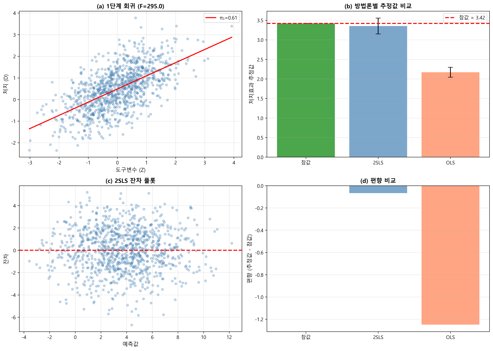
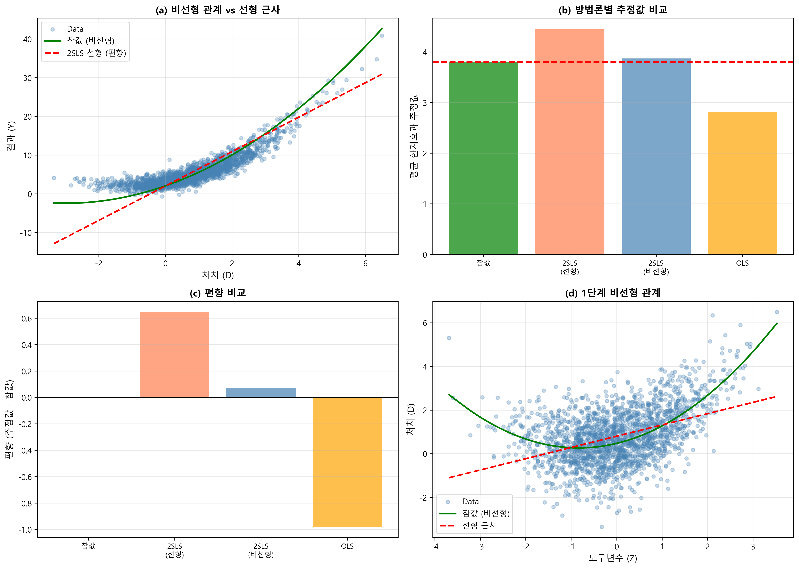
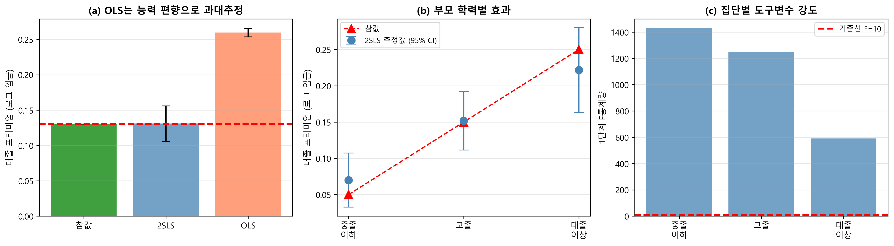

# 6장. 내생성과 도구변수(IV): 2SLS에서 DeepIV까지

**🎯 학습 목표**

- 내생성이 있을 때 OLS 계수가 어느 방향으로 얼마나 어긋나는지 실제 숫자로 확인한다.
- 도구변수의 3조건을 말하고, 각 조건이 깨지는 상황을 예로 든다.
- 2SLS의 1단계와 2단계가 각각 무엇을 계산하는지 출력값을 보고 읽는다.
- 1단계 F통계량을 계산하고, 10 미만이면 왜 추정을 멈춰야 하는지 설명한다.
- 2SLS가 잘 맞지 않는 세 경우(비선형·고차원·이질성)를 알고, 곡선일 때 먼저 무엇을 해 볼지 판단한다.
- 전용 패키지로 2SLS를 돌리고 제출용 결과표를 만든다.
- 실습 5개를 실행하고 출력 한 줄 한 줄을 문장으로 해석한다.

---

## 이 장 한 줄 요약

처치 D의 변동에는 숨은 원인 U와 상관된 부분이 섞여 있다. 도구변수 Z는 그중 **U와 무관한 부분만** 골라내고, 2SLS는 그 부분만으로 인과효과를 계산한다.

---

## 이 장을 읽는 방법

- **1부(6.1~6.9)**: 원리를 배운다. 수식은 세 개뿐이고, 각 수식에 실제 숫자를 대입해 따라간다.
- **2부(실습 5개)**: 코드를 돌린다. 출력 화면을 그대로 싣고, 숫자마다 무슨 뜻인지 설명한다.
- 1부를 읽고 바로 대응하는 실습으로 넘어가도 된다. 6.3을 읽었으면 실습 1을, 6.4를 읽었으면 실습 2를 돌리는 식이다.
- 이 장에 나오는 방법은 전부 `practice/chapter06/code/`에 코드가 있다. 코드가 없는 방법은 다루지 않는다.

---

---

# 1부. 이론과 방법

---

## 6.1 내생성: OLS 추정치가 어긋나는 조건

### 6.1.1 일상에서 먼저 보기

헬스장 회원권을 끊은 사람(D=1)과 안 끊은 사람(D=0)의 1년 뒤 체중 변화(Y)를 비교했더니, 회원권을 끊은 쪽이 평균 4kg 더 빠졌다고 하자.

여기서 "회원권의 효과가 4kg"이라고 말하면 틀린다. 회원권을 끊는 사람은 **원래 건강에 관심이 많은 사람**이다. 그 관심(U)은 식단 조절, 수면, 계단 이용에도 영향을 준다. 4kg 안에는 회원권 효과와 원래 성향의 효과가 섞여 있다.

같은 구조가 정책과 비즈니스 곳곳에 있다.

- 학원 수강(D) → 성적(Y), 숨은 원인 U = 학습 동기
- 직업훈련 참여(D) → 취업률(Y), 숨은 원인 U = 구직 의지
- 배달앱 쿠폰 사용(D) → 월 주문액(Y), 숨은 원인 U = 원래 배달을 자주 시키는 성향
- 대학 졸업(D) → 임금(Y), 숨은 원인 U = 능력·가정 배경

이 상황을 **내생성(endogeneity)** 이라고 부른다. 처치 D가 오차항에 들어간 숨은 원인 U와 함께 움직이는 상태다.

### 6.1.2 그림으로 보는 내생성


빨간 U에서 화살표가 **두 개** 나가는 것이 문제의 전부다. D와 Y가 동시에 U의 영향을 받으므로, D와 Y가 같이 움직여도 그것이 D 때문인지 U 때문인지 구분되지 않는다.

### 6.1.3 내생성이 생기는 세 가지 경로

| 경로 | 설명 | 일상 예 |
|------|------|---------|
| 생략변수 편향 | 관측 못 한 원인이 D와 Y 둘 다 움직임 | 건강 관심도가 헬스장 등록과 체중을 동시에 좌우 |
| 측정오차 | 실제 처치가 아니라 잘못 측정된 값을 씀 | 설문에서 "주당 운동시간"을 부풀려 답함 |
| 역인과·동시성 | Y가 D를 되밀어 결정함 | 손님이 몰리는 식당이 가격을 올림 |

세 경로를 더 풀어 보면 이렇다.

- **생략변수**: 학원에 다닌 학생의 성적이 높다고 학원 효과라 말하면, 원래 공부하려던 마음까지 학원 몫으로 계산된다.
- **측정오차**: "하루 몇 시간 공부했나"를 자기 기억으로 답하면 실제보다 늘려 적는 학생이 많다. 늘려 적는 습관 자체가 성적과도 얽혀 있어 계수가 어긋난다.
- **역인과**: 줄이 긴 맛집이 가격을 올린다. 가격이 높아서 손님이 몰린 것인지, 손님이 몰려서 가격이 오른 것인지 데이터만 보고는 못 가른다.

### 6.1.4 편향을 숫자로 계산해 보기

실습 데이터 `practice/chapter06/data/6-1-iv-data.csv`를 쓴다. 이 데이터는 참값(진짜 인과효과)이 **3.42**로 설정되어 있고, 관측 못 하는 U도 검증용으로 들어 있다.

편향의 크기는 곱셈 하나로 나온다.

```
OLS 편향 = (U가 Y를 바꾸는 크기) × (D가 U와 얼마나 붙어 있는지)
```

이 데이터에서 두 숫자를 실제로 재면 이렇다.

| 항목 | 값 | 재는 방법 |
|------|-----|-----------|
| U가 Y를 바꾸는 크기 | **-1.946** | `Y ~ D + X1 + X2 + U` 회귀에서 U 계수 |
| D가 U와 붙어 있는 정도 | **0.625** | `U ~ D + X1 + X2` 회귀에서 D 계수 |
| 예측 편향 | -1.946 × 0.625 = **-1.216** | 위 두 값의 곱 |
| 실제 편향 | 2.171 - 3.42 = **-1.249** | OLS 추정값 - 참값 |

예측 편향 -1.216과 실제 편향 -1.249가 거의 일치한다. **편향은 우연이 아니라 계산되는 값**이다.

직접 확인하려면 이 코드를 실행한다.

```python
import pandas as pd, statsmodels.formula.api as smf
df = pd.read_csv('practice/chapter06/data/6-1-iv-data.csv')

print(smf.ols('Y ~ D + X1 + X2 + U', data=df).fit().params['U'])   # -1.946
print(smf.ols('U ~ D + X1 + X2', data=df).fit().params['D'])       #  0.625
print(smf.ols('Y ~ D + X1 + X2', data=df).fit().params['D'])       #  2.171
```

여기서 눈여겨볼 점이 하나 더 있다. `Corr(D, U) = 0.527`로 **양수**인데 편향은 **음수**다. U의 계수가 음수(-1.946)이기 때문이다. "내생성이 있으면 과대추정된다"는 말은 틀렸다. **방향은 두 값의 부호 곱으로 정해진다.**

### 6.1.5 발견하기 어려운 이유

OLS는 오류 메시지를 내지 않는다. 표준오차 0.065, p값 0.000, 결정계수까지 전부 정상으로 나온다. 겉보기에 멀쩡한데 값만 36.5% 어긋나 있다.

**비유: 눈금이 어긋난 체중계**

체중계 눈금이 3kg 낮게 나오도록 어긋나 있다고 하자. 이 체중계는 고장 신호를 주지 않는다. 매번 소수점 첫째 자리까지 또렷하게 찍히고, 같은 사람을 열 번 재도 값이 거의 같다.

| 어긋난 체중계 | 내생성 있는 OLS |
|---------------|-----------------|
| 소수점까지 또렷한 눈금 | 작은 표준오차 0.065 |
| 열 번 재도 값이 같음 | 좁은 신뢰구간 [2.043, 2.298] |
| 고장 표시등이 없음 | 오류 메시지도 경고도 없음 |
| 항상 3kg 낮게 나옴 | 항상 1.249 낮게 나옴 |
| 저울에 표준 분동을 올려야 발견 | 도구변수를 써야 발견 |

일관되게 틀리는 도구는 흔들리며 틀리는 도구보다 알아채기 어렵다. 내생성이 위험한 까닭이 여기 있다.

---

## 6.2 도구변수: 처치의 일부만 골라 쓰는 방법

### 6.2.1 핵심 발상

D 전체는 믿을 수 없다. 그러면 D를 통째로 버리지 말고, **D 안에서 U와 무관하게 움직인 부분만** 골라내면 된다. 그 부분을 골라내는 장치가 도구변수 Z다.

헬스장 예로 돌아가자. 사람마다 헬스장 등록 여부는 건강 관심도(U)로 정해지지만, **집에서 헬스장까지의 거리**도 등록에 영향을 준다. 거리는 그 사람의 건강 관심도와 상관없이 정해진 조건이다. 그렇다면 "거리가 가까워서 등록한 사람들"의 등록 여부는 U와 무관한 변동이다. 이 부분만 쓰면 된다.


점선 화살표가 **없어야 한다**는 것이 IV의 가장 어려운 조건이다.

### 6.2.2 유효한 도구변수의 3조건

| 조건 | 뜻 | 데이터로 확인 | 헬스장 예 |
|------|-----|--------------|----------|
| 관련성(Relevance) | Z가 D를 실제로 움직인다 | **가능** (1단계 F통계량) | 거리가 가까우면 등록률이 높다 |
| 배제제약(Exclusion) | Z는 D를 통해서만 Y에 영향 | **불가능** (논리로 설득) | 거리 자체가 체중을 바꾸지는 않는다 |
| 외생성(Exogeneity) | Z가 U와 무관하다 | **부분적** | 거리가 건강 관심도와 무관해야 한다 |

세 조건 중 **하나만 데이터로 검증된다.** 나머지 둘은 제도·상식·맥락으로 설득해야 한다. IV 논문이 도구변수 설명에만 여러 쪽을 쓰는 이유가 이것이다.

### 6.2.3 각 조건이 깨지는 실제 상황

**관련성이 깨지는 경우**

- 거리와 등록률의 관계가 거의 없다면, 골라낼 변동 자체가 없다.
- 이때 추정치의 표준오차가 커지고 값이 크게 어긋난다. 6.4에서 판정 기준을 다룬다.

**배제제약이 깨지는 경우**

- 헬스장이 가까운 동네는 공원·산책로도 잘 갖춰져 있다. 그러면 거리는 등록을 거치지 않고도 체중에 직접 영향을 준다.
- 교육 사례로 옮기면: 대학까지의 거리를 도구변수로 쓸 때, 대학 근처 지역은 임금 수준 자체가 높을 수 있다.

**외생성이 깨지는 경우**

- 건강에 관심이 많은 사람이 애초에 헬스장 근처로 이사했다면, 거리는 U와 상관된다.
- 이 경우 Z는 도구변수가 아니라 U의 대리변수가 되어 버린다.

### 6.2.4 배제제약을 글로 설득하는 절차

배제제약은 증명할 수 없으므로, 좋은 연구는 다음 순서로 쓴다.

1. Z가 Y에 **직접** 갈 수 있는 경로를 먼저 나열한다. 숨기지 않는다.
2. 그 경로가 실제로 작동한다면 데이터에 어떤 흔적이 남을지 적는다.
3. 그 흔적이 보이지 않는다는 약한 증거를 제시한다.

3번에 쓰는 보조 점검은 세 가지다.

- **플라시보 결과변수**: 정책이 영향을 줄 이유가 없는 결과에도 효과가 나오면 위험 신호
- **플라시보 시점**: 정책 시행 이전 기간에도 효과가 보이면 위험 신호
- **대체 표본**: 직접 경로가 의심되는 집단을 빼도 결론이 유지되는지 확인

이 셋을 통과해도 배제제약이 증명된 것은 아니다. 다만 깨질 때는 대개 여기서 먼저 티가 난다.

---

## 6.3 2SLS: 두 번 회귀하는 이유

### 6.3.1 절차

2SLS(Two-Stage Least Squares)는 회귀를 두 번 돌린다.

**1단계**: Z와 X로 D를 예측한다.

```
D = π0 + π1·Z + π2·X + ν     →  예측값 D_hat
```

**2단계**: D 대신 D_hat으로 Y를 설명한다.

```
Y = β0 + β1·D_hat + β2·X + ε  →  β1이 인과효과 추정치
```


### 6.3.2 비유: 정수기 필터

2SLS의 1단계는 정수기 필터와 같은 역할을 한다. 다만 무엇이 무엇에 대응하는지 밝혀야 비유가 성립한다.

| 정수기 | 2SLS |
|--------|------|
| 수돗물 원수 | 원래 처치변수 D |
| 물에 섞인 불순물 | D 안에서 U와 상관된 변동 |
| 필터 | 1단계 회귀 `D ~ Z + X` |
| 필터를 통과한 물 | 예측값 D_hat |
| 필터 통과량 | 1단계 F통계량·부분 R² |
| 거른 물로 요리한 결과 | 2단계 회귀 계수 β1 |

이 대응이 실제로 맞는지는 숫자로 확인된다. 아래가 이 장에서 가장 중요한 두 줄이다.

```
Corr(D,     U) = 0.527   ← 원래 D는 U와 강하게 붙어 있다
Corr(D_hat, U) = 0.001   ← 1단계를 거친 D_hat은 U와 사실상 무관하다
```

불순물이 실제로 걸러졌다. 이것이 1단계가 하는 일의 전부다.

직접 확인하는 코드:

```python
import numpy as np, pandas as pd, statsmodels.formula.api as smf
df = pd.read_csv('practice/chapter06/data/6-1-iv-data.csv')
fs = smf.ols('D ~ Z + X1 + X2', data=df).fit()

print(np.corrcoef(df.D, df.U)[0, 1])              # 0.527
print(np.corrcoef(fs.fittedvalues, df.U)[0, 1])   # 0.001
```

### 6.3.3 걸러내면 잃는 것도 있다

D의 표준편차는 0.988인데 D_hat의 표준편차는 0.678이다. 변동의 약 47%만 남았다(1단계 R² = 0.471).

- 남은 47%는 깨끗하다.
- 버린 53%만큼 정보가 줄었다.

그래서 2SLS의 표준오차는 OLS보다 거의 항상 크다. 실습 6-1에서 OLS는 0.065, 2SLS는 0.103이다. **편향을 줄이는 대가로 정밀도를 내준다.**

### 6.3.4 실무에서는 전용 패키지를 쓴다

위 두 단계를 손으로 나눠 돌리면 2단계 표준오차가 틀리게 계산된다. 1단계에서 D_hat을 "추정했다"는 사실이 반영되지 않기 때문이다. 개념을 이해할 때는 손으로 나눠 보고, 보고서를 쓸 때는 전용 함수를 쓴다.

```python
from linearmodels.iv import IV2SLS
res = IV2SLS.from_formula('Y ~ 1 + X1 + X2 + [D ~ Z]', data=df).fit()
print(res.summary)
```

---

## 6.4 진단: 이 도구변수를 믿어도 되는가

### 6.4.1 1단계 F통계량

F통계량은 "Z가 D를 얼마나 확실히 움직이는가"를 하나의 숫자로 요약한다. 실무 기준은 **10**이다.

| F통계량 | 판정 | 다음 행동 |
|---------|------|----------|
| 10 미만 | 약한 도구변수 | 추정치를 신뢰하지 않는다. 다른 Z를 찾는다 |
| 10~30 | 보통 | 약한 IV에 강건한 신뢰구간을 함께 보고 |
| 30 초과 | 강함 | 통상적 추론 사용 가능 |

실습 6-1의 F통계량은 **295.05**로 매우 강하다.

### 6.4.2 F가 작으면 무슨 일이 생기는가

F가 기준선 아래로 내려가면 세 가지가 동시에 일어난다.

- 추정치의 표준오차가 커진다. 표본을 조금만 바꿔도 값이 크게 달라진다.
- 표본이 유한할 때 편향이 남는다. 표본을 늘려도 잘 줄지 않는다.
- 겉으로는 정상으로 보인다. 표준오차와 p값이 여전히 그럴듯한 숫자로 나온다.

세 번째가 문제다. 오류 표시가 없으므로 F를 직접 보지 않으면 알 수 없다.

**따라서 규칙은 하나다. F가 10 미만이면 그 추정치는 쓰지 않고, 다른 도구변수를 찾는다.** 억지로 해석하려 들면 OLS보다 나쁜 값을 보고하게 된다.

### 6.4.3 F를 확인하는 코드

```python
import statsmodels.formula.api as smf
first_stage = smf.ols('D ~ Z + X1 + X2', data=df).fit()
print(first_stage.tvalues['Z'] ** 2)      # 도구변수가 하나면 t의 제곱이 F다
```

도구변수가 하나면 위처럼 t값을 제곱하면 된다. 전용 패키지를 쓰면 부분 F와 부분 R²를 한 번에 받는다. 실습 2에서 확인한다.

### 6.4.4 함께 보는 진단 지표

- **부분 R²**: X를 통제한 뒤에도 Z가 추가로 설명하는 D의 변동. 실습 6-1에서 0.410으로 출력된다
- **표준오차 종류**: 지역·학교·기업처럼 묶인 단위가 있으면 클러스터 강건 표준오차를 쓰고, 무엇을 썼는지 표 아래에 적는다

---

## 6.5 LATE: 이 숫자는 누구의 효과인가

### 6.5.1 네 종류의 사람

쿠폰(Z)을 뿌려서 앱 구독(D)을 유도하고 이용시간(Y)을 본다고 하자. 사람은 넷으로 나뉜다.

| 유형 | 쿠폰 없을 때 | 쿠폰 있을 때 | 설명 |
|------|-------------|-------------|------|
| 순응자(complier) | 구독 안 함 | 구독함 | 쿠폰 때문에 행동이 바뀐 사람 |
| 항상수용자(always-taker) | 구독함 | 구독함 | 쿠폰과 무관하게 원래 구독할 사람 |
| 절대거부자(never-taker) | 구독 안 함 | 구독 안 함 | 쿠폰을 줘도 안 할 사람 |
| 반항자(defier) | 구독함 | 구독 안 함 | 쿠폰 때문에 오히려 안 함(보통 없다고 가정) |

Z가 바뀌어도 행동이 안 바뀌는 사람은 데이터에 인과 정보를 주지 못한다. 그러므로 **2SLS가 재는 것은 순응자의 평균 효과**다. 이것을 LATE(Local Average Treatment Effect)라고 부른다.

**비유: 그물코 크기가 정해진 어망**

어망을 던져 잡힌 물고기의 평균 무게를 재면, 그 값은 바다 전체 물고기의 평균 무게가 아니다. 그물코보다 작은 물고기는 빠져나가고, 그물을 찢을 만큼 큰 물고기는 애초에 걸리지 않는다.

| 어망 | 도구변수 |
|------|----------|
| 그물코 크기 | 도구변수 Z의 종류와 세기 |
| 그물에 걸린 물고기 | 순응자 |
| 코를 빠져나간 작은 물고기 | 절대거부자 |
| 그물을 찢고 나간 큰 물고기 | 항상수용자 |
| 잡힌 물고기의 평균 무게 | LATE 추정값 |
| 그물코를 바꾸면 평균도 바뀜 | 도구변수를 바꾸면 LATE도 바뀜 |

마지막 줄이 핵심이다. **도구변수를 바꾸면 추정값이 바뀌는 것이 정상이다.** 같은 교육 수익률을 재도 "대학까지 거리"를 쓴 연구와 "출생 분기"를 쓴 연구의 값이 다른 까닭이 여기 있다. 둘 중 하나가 틀린 것이 아니라, 걸린 물고기가 서로 다르다.

### 6.5.2 왜 이 구분이 중요한가

대학까지의 거리를 도구변수로 쓴 교육 수익률 연구를 생각하자. 여기서 순응자는 "대학이 가까워서 진학했지만, 멀었으면 진학 안 했을 사람"이다. 대체로 진학 여부가 아슬아슬했던 층이다.

- 이 추정치는 **전체 국민의 대학 효과가 아니다.**
- 성적이 아주 좋아 어디든 진학했을 사람에게는 적용되지 않는다.
- 따라서 "대학 정원을 늘리면"처럼 한계선상 학생을 움직이는 정책에는 잘 맞고, "모든 국민이 대학을 나오면"에는 맞지 않는다.

보고서에는 이 문장을 반드시 넣는다.

> **"이 추정치는 도구변수에 반응해 처치가 바뀐 집단의 효과다."**

---

## 6.6 2SLS가 잘 맞지 않는 세 경우

### 6.6.1 D와 Y의 관계가 곡선일 때

2SLS는 D와 Y의 관계가 직선이라고 가정한다. 현실은 자주 곡선이다.

| 굽은 길 측정 | 비선형 IV 문제 |
|--------------|----------------|
| 실제 도로(곡선) | 참 관계 `Y = 2 + 3D + 0.5D²` |
| 직선 자 | 선형 2SLS |
| 양 끝점 사이 직선 거리 | 하나의 평균 기울기 추정치 |
| 구간마다 다른 경사 | D 값에 따라 달라지는 한계효과 |

이 데이터에서 D가 1일 때 한계효과는 3 + 1 = 4, D가 3일 때는 3 + 3 = 6이다. 선형 2SLS는 이 차이를 하나의 숫자로 뭉갠다.

실습 6-2의 실제 결과다.

| 방법 | 추정값 | 참값 3.800 대비 |
|------|--------|-----------------|
| OLS | 2.821 | -25.8% |
| 선형 2SLS | 4.447 | **+17.0%** |
| 2SLS + D² 항 추가 | 3.870 | +1.8% |

내생성은 잡았는데(OLS보다 방향은 맞음) 곡선을 못 잡아 17% 어긋났다. **D² 항 하나만 넣어도 1.8%로 줄어든다.**

### 6.6.2 고차원: 사람이 항을 다 고를 수 없다

편의점 매출을 분석한다고 하자. 쓸 수 있는 변수가 날씨, 요일, 시간대, 기온, 강수량, 근처 행사, 경쟁점 거리, 유동인구… 이렇게 50개다. 그런데 매출은 변수 하나하나보다 조합에서 갈린다. "비 오는 금요일 저녁"은 비와 금요일과 저녁을 따로 더한 것과 다르다.

50개 변수에서 나오는 두 개짜리 조합은 50×49/2 = **1,225개**다. 표본이 500일치라면 추정할 항이 관측치보다 두 배 넘게 많다.

**비유: 재료 50가지로 시식회 열기**

| 요리 시식회 | 고차원 IV |
|-------------|-----------|
| 재료 50가지 | 공변량 50개 |
| 두 재료를 섞은 조합 1,225가지 | 2차 상호작용 항 1,225개 |
| 시식 기회 500번 | 표본 500개 |
| 요리사가 조합을 골라 냄 | 분석자가 항을 직접 선택 |
| 요리사 취향이 결과를 좌우 | 선택의 자의성이 추정치를 좌우 |
| 다 만들어 내면 맛이 뒤섞임 | 다 넣으면 과적합 |

- 사람이 항을 고르는 순간 자의성이 들어간다.
- 잘못 고르면 모형 오설정 편향이 생긴다.
- 다 넣으면 과적합된다.

머신러닝 기반 IV는 이 선택을 사람 손에서 데이터로 넘긴다.

### 6.6.3 이질성: 평균 하나로는 정책을 못 짠다

국비 지원 코딩 교육을 예로 들자. 수료생 전체의 취업률 상승분이 8%p로 나왔다고 해서, 이 값이 모든 참가자에게 해당하지는 않는다.

- 비전공 20대에게는 15%p 오를 수 있다.
- 이미 관련 경력이 있는 30대에게는 2%p에 그칠 수 있다.
- 50대 전직 희망자에게는 효과가 없을 수도 있다.

예산이 한정되어 있다면 어느 집단에 먼저 넣을지 정해야 한다. 전통 2SLS는 LATE 하나만 주므로 이 질문에 답하지 못한다. 평균 8%p라는 숫자는 "쓸까 말까"는 알려 주지만 "누구에게 먼저 쓸까"는 알려 주지 않는다.

---

## 6.7 DeepIV: 곡선 모양을 모를 때

6.6.1에서 확인했듯, 관계가 곡선이면 먼저 `D²` 항을 넣어 본다. 실습 6-2에서 오차가 17.0%에서 1.8%로 줄었다. 문제는 **곡선 모양을 짐작조차 못 할 때**다. 2차인지 3차인지, 어느 구간에서 꺾이는지 모르면 넣을 항을 고를 수 없다.

DeepIV는 그 항을 사람이 고르지 않고 데이터에서 찾게 한다. 2SLS의 1단계·2단계 뼈대는 그대로 두고, 직선 가정만 걷어낸다.

### 6.7.1 바꾼 부분은 1단계 하나

전통 1단계는 D의 **평균**만 2단계로 넘긴다. D가 두 무리로 갈라져 있으면 평균은 그 사이 빈 공간을 가리킨다.

어떤 지역의 주당 근무시간(D)이 주 20시간(시간제)과 주 45시간(전일제)으로 갈라져 있다고 하자. 평균은 32.5시간인데 실제로 32시간 일하는 사람은 거의 없다. 평균만 넘기면 아무도 해당하지 않는 값으로 효과를 계산하게 된다.

**비유: 배달앱의 도착 예정시간**

| 배달 도착시간 안내 | IV 1단계 |
|--------------------|----------|
| "35분"이라고 한 숫자만 표시 | 전통 2SLS가 넘기는 평균값 |
| "25~60분, 30분에 몰림" | DeepIV가 넘기는 범위 |
| 비 오는 날은 빠른 배달과 늦은 배달로 갈림 | 조건에 따라 D가 두 무리로 갈림 |
| 두 무리를 평균 내면 45분 | 아무도 해당 안 되는 값 |

기억할 문장은 하나다. **DeepIV는 "D의 평균"이 아니라 "D가 나올 법한 범위"를 배운다.**

### 6.7.2 쓰기 전에 확인할 것 세 가지

- **표본이 충분한가**: 신경망은 수천 개 이하에서 쉽게 과적합된다. 표본이 작으면 `D²` 항 쪽이 낫다.
- **1단계가 학습되는가**: 1단계가 무너지면 2단계도 함께 무너진다. 1단계 설명력을 먼저 본다.
- **2SLS 결과를 함께 두는가**: 방향이 크게 다르면 어느 쪽이 이상한지 따져야 한다. 실습 6-3에서 이 대조를 직접 한다.

---

## 6.8 IV 환경에서의 이질적 효과(CATE)

### 6.8.1 계산 방법

방법은 단순하다. 같은 사람에게 처치를 준 경우와 안 준 경우를 모형에 각각 넣어 보고, 두 예측값을 뺀다.

```python
def estimate_cate(model, X):
    n = X.shape[0]
    y1 = model.predict(np.ones((n, 1)), X)    # 모두 대학을 졸업했다고 가정
    y0 = model.predict(np.zeros((n, 1)), X)   # 모두 졸업하지 않았다고 가정
    return y1 - y0                             # 사람마다 다른 효과
```

실습 6-7이 이 계산을 부모 학력별로 나눠서 보여 준다.

### 6.8.2 자주 터지는 함정 세 개

- **외삽**: 데이터에 30~50세만 있었는데 20세의 효과를 뽑으면 근거가 없다
- **하위집단 약한 도구변수**: 전체 F통계량이 295여도 특정 지역만 떼면 3으로 떨어질 수 있다. 집단별로 1단계를 다시 돌린다
- **불확실성**: 집단별 효과는 폭이 넓다. 실습 6-7에서 세 집단의 차이가 0.010에 불과한데 신뢰구간이 없어 판단할 수 없는 상황이 나온다

---

## 6.9 방법 선택과 체크리스트

### 6.9.1 선택 흐름


### 6.9.2 제출 전 체크리스트

**설계**

- Z가 D를 움직이는 제도적 이유를 한 문장으로 쓸 수 있는가
- Z가 Y로 직접 갈 수 있는 경로를 세 개 이상 나열하고 각각 반박했는가

**진단**

- 1단계 F통계량, 부분 R², Z의 계수와 t값을 표에 넣었는가
- 관계가 곡선일 가능성을 RESET 검정으로 확인했는가
- 클러스터 구조가 있다면 표준오차 종류를 명시했는가

**해석**

- 순응자가 어떤 사람인지 한 문단으로 설명했는가
- 결론을 전체 평균이 아니라 순응자 효과로 서술했는가
- 2SLS와 다른 방법의 결과 방향이 일치하는지 보고했는가

---

---

# 2부. 실습

---

## 실습 준비

### 파일 지도

```
practice/chapter06/
├── code/
│   ├── 6-1-traditional-2sls.py            ← 실습 1: 2SLS 기본
│   ├── 6-2-iv-limitations.py              ← 실습 3: 비선형에서 깨지는 IV
│   ├── 6-3-deepiv-implementation.py       ← 실습 4: DeepIV
│   ├── 6-7-education-returns.py           ← 실습 5: 교육 수익률
│   └── 6-8-iv2sls-report.py               ← 실습 2: 전용 패키지로 2SLS
└── data/
    ├── 6-1-iv-data.csv
    ├── 6-2-nonlinear-iv-data.csv
    └── 6-7-education-returns.csv
```

### 실행 방법

```bash
cd practice/chapter06/code
python 6-1-traditional-2sls.py
```

### 실행 전 확인

```bash
python -c "import numpy, pandas, statsmodels, sklearn, matplotlib, linearmodels; print('ok')"
```

`ok`가 안 나오면 설치한다.

```bash
pip install numpy pandas scipy statsmodels scikit-learn matplotlib seaborn linearmodels
```

### 세 가지 주의사항

- **실습 6-1, 6-2, 6-8은 CSV를 읽는다.** 누구가 돌려도 아래 숫자가 그대로 나온다.
- **실습 6-3과 6-7은 스크립트 안에서 데이터를 새로 만든다.** 시드가 고정되어 있어 다시 돌리면 같은 값이 나오지만, 참값이 실습마다 다르다(6-1은 3.42, 6-3은 3.383, 6-7은 0.130). 서로 다른 실습의 숫자를 나란히 놓고 읽지 않는다.
- 한글 그래프가 깨지면 폰트를 바꾼다. 윈도우는 `Malgun Gothic`, macOS는 `AppleGothic`이다.

---

## 실습 1 (6-1). OLS와 2SLS의 추정값 차이 확인

### 목적

내생성이 있는 데이터에서 OLS와 2SLS의 차이를 숫자로 확인한다.

### 실행

```bash
python 6-1-traditional-2sls.py
```

### 실제 출력

```
[1단계] 데이터 로드
샘플 크기: 1000
참값 인과효과: 3.42
내생성 상관: Corr(D, U) = 0.527

[2단계] OLS 추정 (편향된 결과)
OLS 추정값: 2.171 (SE: 0.065)
참값과의 차이: -1.249 (-36.5%)
95% CI: [2.043, 2.298]

[3단계] 2SLS 추정
--- 1단계 (First Stage) ---
π₁ (Z → D): 0.610 (SE: 0.023, t: 26.31)
F-통계량: 295.05
부분 R²: 0.410
1단계 R²: 0.471
✓ 강한 도구변수 (F > 10)

--- 2단계 (Second Stage) ---
β₁ (D → Y): 3.353 (SE: 0.103)
t-통계량: 32.57, p-value: 0.0000
95% CI: [3.151, 3.555]
참값과의 차이: -0.067 (2.0%)
```

### 출력 해석

**`Corr(D, U) = 0.527`**
처치 D와 관측 못 하는 원인 U의 상관이 0.527이다. 실제 연구에서는 U를 볼 수 없다. 여기서는 교육용으로 U를 데이터에 넣어 두었다.

**`OLS 추정값: 2.171, 참값과의 차이 -36.5%`**
36.5% 어긋났다. 그런데 표준오차는 0.065로 작고, 95% 신뢰구간 [2.043, 2.298]은 참값 3.42를 **전혀 포함하지 않는다.** 신뢰구간이 좁다는 것이 정확하다는 뜻이 아니라는 사실을 보여 주는 장면이다.

**`π₁ (Z → D): 0.610, t: 26.31`**
Z가 1 늘면 D가 0.610 늘어난다. t값 26.31은 이 관계가 우연이 아님을 뜻한다.

**`F-통계량: 295.05`**
기준선 10을 크게 넘는다. 관련성 조건은 충족이다.

**`부분 R²: 0.410`**
X1과 X2를 통제한 뒤에도 Z가 D 변동의 41%를 추가로 설명한다.

**`1단계 R²: 0.471`**
D 변동의 47.1%가 D_hat으로 남고 나머지 52.9%는 버려진다. 쓸 수 있는 정보가 절반으로 줄었으니 표준오차도 그만큼 커진다.

**`β₁: 3.353 (SE: 0.103)`**
참값 3.42와의 차이가 2.0%다. 표준오차는 OLS의 0.065에서 0.103으로 **1.58배 커졌다.** 신뢰구간 [3.151, 3.555]는 참값을 포함한다.

### 세 숫자를 한 표로

| 방법 | 추정값 | 표준오차 | 참값(3.42) 대비 | 신뢰구간이 참값을 포함하는가 |
|------|--------|----------|------------------|-------------------------------|
| OLS | 2.171 | 0.065 | -36.5% | **아니오** |
| 2SLS | 3.353 | 0.103 | -2.0% | 예 |

**이 표의 결론**: 좁은 신뢰구간과 작은 p값은 정확성의 증거가 아니다. 식별전략이 틀리면 정밀하게 틀린 답이 나온다.

### 그래프 읽기



- **(a) 1단계 회귀**: 가로축 Z, 세로축 D. 점들이 오른쪽 위로 뚜렷하게 올라간다. 빨간 직선의 기울기가 0.61이다. 이 뚜렷함이 F=295로 나타난다.
- **(b) 추정값 비교**: 초록(참값 3.42)과 파랑(2SLS 3.35)의 높이가 거의 같다. 주황(OLS 2.17)만 확연히 낮다. 파랑 막대의 오차막대가 주황보다 긴 것이 정밀도를 내준 대가다.
- **(c) 잔차 플롯**: 점들이 0을 중심으로 위아래 고르게 퍼져 있다. 특정 방향으로 휘거나 부채꼴로 벌어지면 모형 오설정 신호인데, 여기서는 보이지 않는다.
- **(d) 편향 비교**: OLS 막대만 -1.25까지 내려간다.

### 확인 문제

1. OLS 신뢰구간 [2.043, 2.298]이 참값 3.42를 포함하지 않는데도 OLS가 "통계적으로 유의"한 이유는 무엇인가.
2. 1단계 R²가 0.471인데, 이 값이 0.9였다면 2SLS 표준오차는 커질까 작아질까.
3. `Corr(D, U)`가 0.527인데 편향이 음수인 이유를 6.1.4 표를 보고 설명하라.

---

## 실습 2 (6-8). 전용 패키지로 2SLS 돌리고 결과표 만들기

### 목적

실습 1에서 손으로 나눠 돌린 2SLS를 전용 패키지로 다시 돌린다. 추정값은 같은데 표준오차가 다르다는 사실을 확인하고, 제출용 결과표를 만든다. 기말 프로젝트에서 그대로 쓸 절차다.

### 왜 필요한가

손으로 2단계를 돌리면 1단계에서 D_hat을 **추정했다**는 사실이 2단계 표준오차에 반영되지 않는다. 그래서 표준오차가 실제보다 작게 나오고, 신뢰구간을 좁게 보고하게 된다.

### 실행

```bash
pip install linearmodels
python 6-8-iv2sls-report.py
```

### 실제 출력

```
[1단계] 손으로 나눠 돌린 2SLS
추정값: 3.3528
표준오차: 0.1029
95% 신뢰구간: [3.151, 3.555]

[2단계] linearmodels IV2SLS로 한 줄에 돌리기
공식 표기: 'Y ~ 1 + X1 + X2 + [D ~ Z]'
  대괄호 안이 '내생변수 ~ 도구변수'다. 나머지는 통제변수.

추정값: 3.3528
표준오차(robust): 0.1224
95% 신뢰구간: [3.113, 3.593]

[3단계] 추정값은 같고 표준오차는 다르다
추정값 차이: 0.000000  (사실상 0)
표준오차: 손으로 0.1029 vs 패키지 0.1224
손으로 계산한 표준오차가 15.9% 작다
신뢰구간 폭: 손으로 0.404 vs 패키지 0.480

[4단계] 1단계 진단 자동 출력
    First Stage Estimation Results
=====================================
                                    D
-------------------------------------
R-squared                      0.4705
Partial R-squared              0.4100
Shea's R-squared               0.4100
Partial F-statistic            732.40
P-value (Partial F-stat)       0.0000
========================== ==========
Z                              0.6096
                             (27.063)
-------------------------------------

[5단계] 제출용 결과표
  방법   추정값  표준오차  CI하한  CI상한  참값과의차이 CI가참값포함
 OLS 2.171 0.065 2.043 2.298  -1.249     아니오
2SLS 3.353 0.122 3.113 3.593  -0.067       예

결과표 저장: 6-8-results-table.csv
```

### 출력 해석

**공식 표기법이 이 실습의 핵심 도구다**

```python
IV2SLS.from_formula('Y ~ 1 + X1 + X2 + [D ~ Z]', data=df).fit(cov_type='robust')
```

| 부분 | 뜻 |
|------|-----|
| `Y ~` | 결과변수 |
| `1` | 절편 |
| `X1 + X2` | 통제변수 |
| `[D ~ Z]` | 대괄호 안이 내생변수와 도구변수 |
| `cov_type='robust'` | 이분산에 강건한 표준오차 |

도구변수가 두 개면 `[D ~ Z1 + Z2]`로 쓴다. 통제변수는 대괄호 밖에 그대로 이어 붙인다.

**`추정값 차이: 0.000000`**

손으로 돌리든 패키지로 돌리든 추정값은 완전히 같다. 2SLS의 계산 절차 자체는 실습 1에서 배운 그대로다. 패키지가 다른 계산을 하는 것이 아니다.

**`표준오차: 손으로 0.1029 vs 패키지 0.1224`**

여기가 다르다. 손으로 계산한 값이 15.9% 작다. 신뢰구간 폭으로 보면 0.404 대 0.480이다.

이 차이를 가볍게 보면 안 된다. 신뢰구간이 좁으면 "유의하다"는 결론이 더 쉽게 나온다. 실제보다 확신에 찬 보고서를 쓰게 된다. **손으로 나눈 2단계 결과를 그대로 보고서에 넣으면 안 되는 이유다.**

| 구분 | 손으로 나눠 돌림 | 전용 패키지 |
|------|------------------|-------------|
| 추정값 | 3.3528 | 3.3528 (같음) |
| 표준오차 | 0.1029 | 0.1224 |
| 신뢰구간 폭 | 0.404 | 0.480 |
| 용도 | 원리를 이해할 때 | 보고서에 실을 때 |

**`Partial R-squared: 0.4100`, `Partial F-statistic: 732.40`**

6.4에서 배운 1단계 진단이 자동으로 나온다. 따로 회귀를 돌릴 필요가 없다.

- 부분 R² 0.410: 통제변수를 뺀 뒤에도 Z가 D 변동의 41%를 설명한다
- 부분 F 732.40: 기준선 10을 크게 넘는다

실습 1에서 직접 계산했던 값(부분 R² 0.410)과 같다. `res.first_stage` 한 줄이면 된다.

**제출용 결과표**

`6-8-results-table.csv`가 저장된다. 엑셀에서 바로 열리고, 보고서 표로 붙여 쓸 수 있다. 표에 들어간 여섯 항목이 IV 결과 보고의 최소 단위다.

- 방법(OLS와 2SLS를 나란히)
- 추정값
- 표준오차
- 신뢰구간 하한·상한
- 참값과의 차이(실제 연구에서는 이 열이 없다)

표 아래에는 반드시 이 문장을 붙인다: **"1단계 F통계량은 732.40이며, 표준오차는 이분산에 강건한 방식으로 계산했다."**

### 그래프 읽기


- **(a)** 두 신뢰구간의 중심(점)은 같은 위치에 있는데 가로 막대 길이가 다르다. 아래쪽(패키지)이 더 길다. 같은 추정값에 다른 불확실성이 붙는다는 사실이 그림 하나로 보인다.
- **(b)** 보고서 표에 들어갈 내용이다. 빨간 점선(참값 3.42)을 2SLS 막대의 오차범위가 포함하고, OLS는 포함하지 못한다.

### 확인 문제

1. 손으로 계산한 표준오차가 더 작았다. 이 상태로 보고서를 쓰면 어떤 잘못된 결론을 내리기 쉬운가.
2. 도구변수가 `Z1`과 `Z2` 두 개이고 통제변수가 `X1`뿐이라면 공식 표기를 어떻게 쓰는가.
3. `cov_type='robust'` 대신 기본값을 쓰면 표준오차가 0.1171로 나온다. 어느 쪽을 보고할지 정하고 이유를 한 문장으로 쓰라.

---

## 실습 3 (6-2). 관계가 곡선이면 선형 2SLS는 어긋난다

### 목적

D와 Y의 관계가 곡선일 때 선형 2SLS가 얼마나 어긋나는지, 그리고 항 하나를 추가하면 얼마나 회복되는지 본다.

### 실행

```bash
python 6-2-iv-limitations.py
```

### 실제 출력

```
[1단계] 데이터 로드
샘플 크기: 2000
D와 Z의 비선형 관계: D = 0.5 + 0.5*Z + 0.3*Z²
Y와 D의 비선형 관계: Y = 2 + 3*D + 0.5*D²
실제 평균 한계효과: 3.800

[2단계] 선형 2SLS 추정
2SLS (선형) 추정값: 4.447
편향: 0.647 (17.0%)

[3단계] OLS 추정 (비교용)
OLS 추정값: 2.821
편향: -0.980 (-25.8%)

[4단계] 비선형 항 추가
D 계수: 3.125 (참값: 3.0)
D² 계수: 0.465 (참값: 0.5)
평균 한계효과: 3.870
편향: 0.070 (1.8%)

[5단계] RESET 검정 (함수 형태 오설정)
RESET F-통계량: 791.60
p-value: 0.0000
✓ 귀무가설 강하게 기각: 선형 모형 오설정 확인

[6단계] 고차원 시나리오
공변량 차원 (p): 50
표본 크기 (n): 500
p/n 비율: 0.10
가능한 2차 상호작용: 1225
과적합 위험: 높음
```

### 출력 해석

**`실제 평균 한계효과: 3.800`이 어디서 나왔나**
참 관계가 `Y = 2 + 3D + 0.5D²`이므로, D를 1 늘렸을 때의 효과는 `3 + D`다. 고정된 값이 아니라 D에 따라 달라진다. 데이터의 평균 D가 0.8이므로 평균 한계효과는 3 + 0.8 = 3.8이다.

즉 이 데이터에서 참값은 하나가 아니다.

| D 값 | 그 지점의 한계효과 |
|------|---------------------|
| 0 | 3.0 |
| 0.8 (평균) | 3.8 |
| 2 | 5.0 |
| 4 | 7.0 |

**`선형 2SLS: 4.447, 편향 +17.0%`**
내생성은 잡았지만 곡선을 못 잡았다. 방향이 **위쪽**인 점에 주의한다. Z 자체가 `0.3*Z²` 때문에 큰 값에서 D를 더 크게 밀어 올리므로, 도구변수가 만든 변동이 D가 큰 구간(한계효과가 큰 구간)에 몰린다. 그래서 평균보다 큰 값이 나온다.

**`OLS: 2.821, 편향 -25.8%`**
내생성 때문에 아래로 어긋났다. 절대값으로는 OLS(25.8%)가 선형 2SLS(17.0%)보다 더 나쁘다.

**`D² 항 추가 후: 3.870, 편향 +1.8%`**
`D` 계수 3.125(참값 3.0), `D²` 계수 0.465(참값 0.5) 모두 참값 근처다. 오차가 17.0%에서 1.8%로 줄었다. **항 하나 추가로 대부분이 해결된다.**

여기서 얻을 교훈이 중요하다. 곡선 문제를 만나면 무조건 딥러닝으로 가는 것이 아니라, **먼저 다항항을 넣어 본다.** 딥러닝은 어떤 형태인지 짐작조차 안 될 때 쓰는 도구다.

**`RESET F-통계량: 791.60, p < 0.001`**
RESET 검정은 "선형 모형이 맞는가"를 묻는다. F가 791.6이면 압도적으로 기각이다. **참값을 모르는 실제 연구에서도 이 검정은 돌릴 수 있다.** 실습 데이터가 아닌 현실 데이터에서 곡선을 의심할 근거로 쓴다.

```python
from statsmodels.stats.diagnostic import linear_reset
print(linear_reset(model, power=2, use_f=True))
```

**`가능한 2차 상호작용: 1225 vs 표본 500`**
공변량 50개에서 나오는 2차 상호작용은 50×49/2 = 1,225개다. 표본 500개로 1,225개 항을 추정할 수 없다. 이것이 6.6.2에서 말한 고차원 문제다.

### 그래프 읽기



- **(a) 비선형 관계 vs 선형 근사**: 초록 곡선이 참 관계, 빨간 점선이 선형 2SLS다. D가 0 근처에서는 빨간 점선이 초록보다 아래, D가 4를 넘으면 위로 어긋난다. 한 직선으로 곡선을 요약할 수 없다는 사실이 눈에 보인다.
- **(b) 추정값 비교**: 빨간 점선이 참값 3.8이다. 2SLS(선형)은 위로, OLS는 아래로 벗어나 있고, 2SLS(비선형)만 점선에 붙어 있다.
- **(d) 1단계 비선형 관계**: 가로축 Z, 세로축 D. Z가 음수 구간에서 D가 다시 올라가는 U자 모양이다. `0.3*Z²` 때문이다. 빨간 직선(선형 근사)은 이 모양을 전혀 따라가지 못한다. **1단계도 비선형일 수 있다**는 점을 보여 준다.

### 확인 문제

1. 선형 2SLS 편향이 양수(+17%), OLS 편향이 음수(-25.8%)다. 두 편향의 원인이 서로 다른데, 각각 무엇인가.
2. RESET 검정이 참값을 모르는 상황에서도 쓸 수 있는 이유는 무엇인가.
3. 참 관계가 `Y = 2 + 3D + 0.5D²`이고 평균 D가 2였다면, 참 평균 한계효과는 얼마인가.

---

## 실습 4 (6-3). DeepIV

### 목적

곡선 관계에서 신경망 기반 IV가 선형 2SLS보다 나은지 확인한다.

### 실행

```bash
python 6-3-deepiv-implementation.py
```

### 실제 출력

```
[1단계] 비선형 데이터 생성
샘플 크기: 2000
참값 ATE: 3.383

[2단계] Stage 1: 조건부 밀도 추정 (간소화됨)
Stage 1 R²: 0.360

[4단계] DeepIV 평가
DeepIV 추정값: 3.330
참값 ATE: 3.383
오차: 0.053 (1.6%)
RMSE: 1.83

[5단계] 전통적 2SLS 비교
2SLS 추정값: 4.180
오차: 0.797 (23.6%)
RMSE: 3.41
```

### 출력 해석

**`참값 ATE: 3.383`**
실습 6-1의 3.42와 다르다. 이 스크립트는 자체적으로 데이터를 만들며 관계도 다르다. **두 실습의 숫자를 직접 비교하면 안 된다.**

**`Stage 1 R²: 0.360`**
Z와 X로 D를 예측한 설명력이 36%다. 낮아 보이지만 IV에서는 이 값이 낮은 것이 정상이다. 100%에 가까우면 D가 사실상 Z의 함수라는 뜻이고, 그러면 D의 자체 변동이 없어 2단계가 성립하지 않는다.

**`DeepIV: 3.330, 오차 1.6%`, `2SLS: 4.180, 오차 23.6%`**
곡선 관계에서 DeepIV가 2SLS보다 정확하다. 6-2에서 본 것과 같은 현상이다.

**`RMSE: DeepIV 1.83 vs 2SLS 3.41`**
RMSE는 개별 예측이 실제 Y와 얼마나 떨어져 있는지를 잰다. 추정값 정확도와는 다른 지표다. 둘 다 DeepIV가 낫다.

### 주의: 이 코드는 진짜 DeepIV가 아니다

스크립트 상단에 명시되어 있듯 교육용 간소화 버전이다.

| 항목 | 원래 DeepIV | 이 실습 코드 |
|------|-------------|--------------|
| 1단계 | D가 나올 범위 전체를 학습 | 평균만 예측(`MLPRegressor`) |
| 2단계 | 범위에서 D를 여러 번 뽑아 학습 | 예측값 하나만 사용 |

이 코드가 보여 주는 것은 **"신경망을 쓰면 곡선을 잡는다"**까지다. 6.7.1에서 설명한 범위 학습은 들어 있지 않다. 정식 구현이 필요하면 EconML의 `DeepIV`를 쓴다.

### 확인 문제

1. Stage 1 R²가 0.99였다면 어떤 문제가 생기는가.
2. "DeepIV가 2SLS보다 항상 낫다"는 결론이 이 실습에서 나올 수 없는 이유는 무엇인가.

---

## 실습 5 (6-7). 교육 수익률 추정 — 전 과정을 한 번에

### 목적

앞의 세 실습에서 나눠 배운 절차(진단 → 추정 → 해석)를 실제 정책 문제 하나에 붙여서 끝까지 돌린다. 가상의 한국 대졸자 5만 명 데이터를 쓴다.

### 데이터 구조

| 역할 | 변수 | 설명 |
|------|------|------|
| 결과 Y | 로그 임금 | 로그를 취해 계수를 증가율로 읽는다 |
| 처치 D | 대학 졸업 여부 | 0 또는 1 |
| 도구변수 Z | 지역별 대학 정원 증가율(%) | 지역 1은 평균 5%, 지역 3은 평균 1% |
| 공변량 X | 연령·성별·부모학력·지역 | |
| 숨은 원인 U | 능력 | 진학과 임금 둘 다에 영향(관측 불가) |

**Z를 왜 이것으로 골랐는가**: 대학 정원은 학생 개인의 능력과 무관하게 정부·대학의 사정으로 정해진다. 정원이 늘어난 지역에서는 능력이 같아도 진학할 확률이 올라간다. 관련성이 성립하고, 정원 자체가 임금을 직접 올릴 이유는 찾기 어렵다.

### 실행

```bash
python 6-7-education-returns.py
```

`linearmodels`가 없으면 먼저 설치한다.

```bash
pip install linearmodels
```

### 실제 출력

```
[1단계] 데이터 생성
샘플 크기: 50000
대졸률: 56.6%
평균 대졸 프리미엄 (참값): 0.130 (임금 13.9% 증가)
부모 학력별 참값:
  중졸 이하: 0.050
  고졸: 0.150
  대졸 이상: 0.250

[2단계] OLS 추정 (능력 편향이 남아 있는 기준선)
OLS 대졸 프리미엄: 0.260 (임금 29.7% 증가)
참값 0.130 대비: +99.3%

[3단계] 1단계 진단 (도구변수가 진학을 움직이는가)
정원 증가율 계수: 0.0701 (t = 57.16)
1단계 F통계량: 3266.90
해석: 정원 증가율이 1%p 높은 지역에서 대졸 확률이 7.01%p 높다
판정: 강한 도구변수 (F > 10)

[4단계] 2SLS 추정
2SLS 대졸 프리미엄: 0.131 (SE: 0.013)
95% 신뢰구간: [0.106, 0.156]
임금 증가율: 14.0%
참값 0.130 대비: +0.5%
신뢰구간이 참값을 포함하는가: 예

[5단계] 부모 학력 집단별 효과
집단             1단계 F       추정값             95% 신뢰구간       참값
중졸 이하         1429.1     0.070 [  0.033,  0.107]    0.050
고졸            1246.8     0.152 [  0.111,  0.192]    0.150
대졸 이상          591.1     0.222 [  0.163,  0.280]    0.250
추정 순서가 참값 순서와 일치한다

[6단계] 정책 시뮬레이션: 정원 증가율을 1%p 올리면
현재 대졸률: 56.6%
  - 대졸률 변화: +7.0%p (1단계 계수 0.0701 x 1)
  - 예상 대졸률: 63.6%
  - 평균 임금 변화: +0.92%
```

### 출력 해석

**`평균 대졸 프리미엄 (참값): 0.130`**

로그 임금에서 계수 0.130은 임금이 약 13.9% 높다는 뜻이다. `exp(0.130) - 1 = 0.139`이기 때문이다. 로그를 쓴 회귀에서 계수를 백분율로 바꾸는 방법이다. 계수가 0.2 이하로 작으면 `0.130 → 약 13%`처럼 그냥 읽어도 오차가 크지 않다.

**`OLS: 0.260, 참값 대비 +99.3%`**

참값의 두 배다. 능력이 높은 사람이 대학도 가고 임금도 높으므로, 능력의 몫까지 대학 몫으로 계산된 결과다. 6.1에서 배운 생략변수 편향이 그대로 나타났다.

**`정원 증가율 계수: 0.0701`**

이 숫자는 그 자체로 정책적 의미가 있다. **정원 증가율이 1%p 높은 지역에서 대졸 확률이 7.01%p 높다.** 1단계 계수는 버리는 숫자가 아니라 "정책이 사람을 얼마나 움직이는가"를 재는 값이다. 6단계 시뮬레이션이 이 값을 그대로 쓴다.

**`1단계 F통계량: 3266.90`**

기준선 10을 크게 넘는다. 표본이 5만이고 도구변수가 강해서 나온 값이다.

**`2SLS: 0.131 (SE: 0.013), 95% CI [0.106, 0.156]`**

참값 0.130과 0.5% 차이다. 신뢰구간이 참값을 포함한다. OLS(0.260)는 이 구간 밖에 한참 있다.

| 방법 | 추정값 | 참값 0.130 대비 | 신뢰구간이 참값을 포함하는가 |
|------|--------|------------------|-------------------------------|
| OLS | 0.260 | +99.3% | 아니오 |
| 2SLS | 0.131 | +0.5% | 예 |

**부모 학력 집단별 효과**

| 부모 학력 | 1단계 F | 추정값 | 95% 신뢰구간 | 참값 |
|-----------|---------|--------|--------------|------|
| 중졸 이하 | 1429.1 | 0.070 | [0.033, 0.107] | 0.050 |
| 고졸 | 1246.8 | 0.152 | [0.111, 0.192] | 0.150 |
| 대졸 이상 | 591.1 | 0.222 | [0.163, 0.280] | 0.250 |

세 가지를 순서대로 읽는다.

- **집단마다 1단계 F를 다시 계산했다.** 전체 F가 3266이어도 집단을 나누면 표본이 줄어 F가 떨어진다. 대졸 이상 집단은 591로 가장 낮다. 6.8.2에서 말한 함정을 실제로 점검한 것이다.
- **추정 순서가 참값 순서와 일치한다.** 0.070 < 0.152 < 0.222, 참값도 0.050 < 0.150 < 0.250이다.
- **중졸 가정 [0.033, 0.107]과 대졸 가정 [0.163, 0.280]이 겹치지 않는다.** 그래서 "부모 학력이 높을수록 대졸 프리미엄이 크다"고 말할 수 있다. 겹쳤다면 순서를 말할 수 없다.

세 번째가 중요하다. **신뢰구간이 겹치면 추정값 순서가 어떻든 차이를 주장하면 안 된다.** 집단별 분석에서 가장 자주 어기는 규칙이다.

**정책 시뮬레이션**

```
평균 임금 변화 = (늘어난 대졸률) × (대졸 프리미엄)
              = 0.070 × 0.131
              = 0.0092 = 0.92%
```

정원 증가율을 1%p 올리면 대졸률이 7.0%p 오르고, 그 결과 평균 임금이 0.92% 오른다. 대졸 프리미엄 14%는 큰 값인데 전체 평균 효과는 1%도 안 된다.

**정책 효과는 "효과 크기"와 "실제로 영향받는 사람 수"의 곱이다.** 효과가 커도 움직이는 사람이 적으면 총효과는 작다. 이것이 정책 보고서에서 가장 자주 빠지는 계산이다.

여기서 두 숫자의 출처가 다른 점에 주목한다. 대졸률 변화 7.0%p는 **1단계**에서, 프리미엄 0.131은 **2단계**에서 나왔다. 두 단계를 다 돌려야 정책 시뮬레이션이 가능하다.

### 그래프 읽기



- **(a)** 초록(참값)과 파랑(2SLS)의 높이가 거의 같고, 주황(OLS)만 두 배 높다.
- **(b)** 파란 점이 2SLS 추정값, 세로 막대가 95% 신뢰구간, 빨간 삼각형이 참값이다. 세 집단 모두 신뢰구간 안에 참값이 들어 있고, 왼쪽에서 오른쪽으로 올라간다.
- **(c)** 집단별 1단계 F다. 빨간 기준선(F=10)을 세 집단 모두 크게 넘는다. 이 막대가 기준선 아래로 내려가면 그 집단의 (b) 결과를 쓰면 안 된다.

### 확인 문제

1. 로그 임금 회귀에서 계수 0.222를 백분율로 바꾸면 얼마인가. 계산 과정을 쓰라.
2. OLS가 참값의 두 배로 나온 이유를 6.1.4의 편향 계산 방식으로 설명하라.
3. 대졸 이상 집단의 1단계 F가 591로 가장 낮다. 이 집단의 신뢰구간이 가장 넓은 것과 어떤 관계가 있는가.
4. 정원 증가율을 1%p가 아니라 3%p 올린다면 평균 임금 변화는 얼마가 되는가. 이 계산에 어떤 가정이 숨어 있는가.

## 실습 정리: 자주 나는 오류 여섯 가지

| 오류 | 왜 문제인가 | 대신 할 것 |
|------|-------------|-----------|
| 1단계 F를 보고하지 않음 | 약한 IV면 결과 전체가 무의미 | F, 부분 R², Z의 t값을 표에 넣는다 |
| 손으로 2단계를 돌리고 표준오차를 그대로 씀 | 1단계 추정 불확실성이 빠짐 | `linearmodels.IV2SLS`를 쓴다 |
| LATE를 ATE처럼 말함 | 정책 대상이 달라짐 | "도구변수에 반응한 집단의 효과"를 명시 |
| 배제제약을 한 줄로 끝냄 | 독자가 가장 의심하는 지점 | 직접 경로를 3개 나열하고 각각 반박 |
| 신경망 결과만 제출 | 어디서 틀어졌는지 확인할 기준이 없음 | 2SLS 결과를 기준값으로 함께 싣는다 |
| 하위집단 분석에서 1단계 점검 생략 | 전체는 강해도 집단별로 약할 수 있음 | 집단별 F를 다시 계산 |

---

## 과제

**과제 1. 결과표 만들기**

실습 2(6-8)를 실행하고 저장된 `6-8-results-table.csv`를 연다. 표에 1단계 F통계량 열을 직접 추가하고, 표 아래에 붙일 주석 한 문장을 작성하라. 주석에는 F통계량 값과 표준오차 종류가 들어가야 한다.

**과제 2. 함수 형태 점검**

실습 3(6-2)의 `linear_reset` 검정을 실습 1(6-1) 데이터에도 적용하라. 두 데이터의 결과가 다르게 나온다. 왜 다른지, 그리고 이 검정을 참값을 모르는 실제 연구에서 쓸 수 있는 이유를 설명하라.

```python
from statsmodels.stats.diagnostic import linear_reset
```

**과제 3. 도구변수 설계**

자기 관심 분야에서 내생성이 의심되는 관계를 하나 고르고, 도구변수 후보를 하나 제안하라. 6.2.2의 3조건을 각각 한 문단씩 검토하되, 배제제약에서는 **직접 경로 두 개를 먼저 나열하고 각각 반박**하라.

---

---

## 6장 핵심 정리

```
1. 내생성 = 처치 D가 관측 안 되는 원인 U와 함께 움직이는 상태
   → OLS는 오류 표시 없이 어긋난다 (실습 6-1: 36.5% 차이)
   → 편향 = (U의 Y 효과) × (D와 U의 연결 강도) = -1.946 × 0.625 = -1.216

2. 도구변수 3조건 = 관련성 / 배제제약 / 외생성
   → 데이터로 검증되는 것은 관련성 하나뿐

3. 2SLS 1단계가 하는 일은 숫자 두 개로 확인된다
   → Corr(D, U) = 0.527  →  Corr(D_hat, U) = 0.001

4. 1단계 F가 10 미만이면 추정하지 않고 다른 도구변수를 찾는다
   → 표준오차가 커지고 편향이 남는데, 겉으로는 정상으로 보인다

5. 보고서에는 전용 패키지 결과를 쓴다
   → 손으로 나눈 2단계는 표준오차가 15.9% 작게 나온다 (실습 6-8)
   → 추정값은 같고 표준오차만 다르다

6. 2SLS가 재는 것은 LATE = 도구변수에 반응해 행동이 바뀐 사람들의 평균 효과

7. 2SLS가 잘 맞지 않는 세 경우 = 비선형 / 고차원 / 이질성
   → 곡선이면 먼저 다항항을 넣어 본다 (실습 6-2: 17.0% → 1.8%)

8. DeepIV는 곡선 모양을 짐작조차 못 할 때만 꺼낸다
   → 1단계·2단계 뼈대는 그대로, 직선 가정만 걷어낸다
   → 곡선 모양을 알면 D² 항이 더 빠르고 정확하다

9. 집단별 효과는 신뢰구간이 겹치지 않을 때만 순서를 말할 수 있다
   → 실습 6-7: 중졸 [0.033, 0.107] vs 대졸 [0.163, 0.280], 겹치지 않음
   → 집단마다 1단계 F를 다시 계산한다

10. 정책 효과 = 효과 크기 × 실제로 영향받는 사람 수
   → 실습 6-7: 프리미엄 14%인데 정원 1%p 확대의 평균 임금 효과는 0.92%
```

---

## 더 공부할 자료

**무료 교재 (영문, 온라인 전문 공개)**

- Causal Inference: The Mixtape — Chapter 7 Instrumental Variables. https://mixtape.scunning.com/
- The Effect: An Introduction to Research Design and Causality — Chapter 19 Instrumental Variables. https://theeffectbook.net/

**영상 강의**

- Marginal Revolution University, Mastering Econometrics (Angrist). 도구변수 편이 포함되어 있다. https://mru.org/courses/mastering-econometrics

**패키지 문서**

- linearmodels — `IV2SLS`로 2SLS를 한 줄에 돌리고 1단계 진단까지 받는다. https://bashtage.github.io/linearmodels/
- statsmodels — OLS, RESET 검정, 진단 도구. https://www.statsmodels.org/stable/index.html
- EconML (PyWhy) — `DeepIV`, `OrthoIV` 등 인과 ML 추정기. https://github.com/py-why/EconML

**원 논문**

- Hartford, J., Lewis, G., Leyton-Brown, K., & Taddy, M. (2017). Deep IV: A Flexible Approach for Counterfactual Prediction. *ICML*. https://proceedings.mlr.press/v70/hartford17a.html

> 위 URL은 2026년 8월 16일 기준 접속을 확인했다.

---

## 참고문헌

Angrist, J. D., & Krueger, A. B. (1991). Does Compulsory School Attendance Affect Schooling and Earnings? *Quarterly Journal of Economics*, 106(4), 979-1014.

Angrist, J. D., & Pischke, J. S. (2009). *Mostly Harmless Econometrics: An Empiricist's Companion*. Princeton University Press.

Card, D. (1995). Using Geographic Variation in College Proximity to Estimate the Return to Schooling. In *Aspects of Labour Market Behaviour*. University of Toronto Press.

Hartford, J., Lewis, G., Leyton-Brown, K., & Taddy, M. (2017). Deep IV: A Flexible Approach for Counterfactual Prediction. *ICML*.

Imbens, G. W., & Angrist, J. D. (1994). Identification and Estimation of Local Average Treatment Effects. *Econometrica*, 62(2), 467-475.

Staiger, D., & Stock, J. H. (1997). Instrumental Variables Regression with Weak Instruments. *Econometrica*, 65(3), 557-586.

