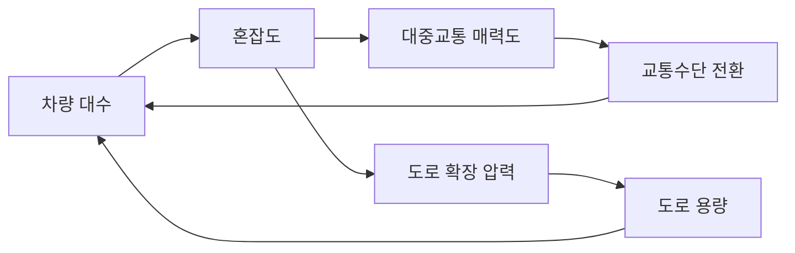

# 12장. 복잡계 이론과 비즈니스 시뮬레이션

## 이 장 한 줄 요약

앞의 열한 개 장은 데이터에서 효과를 추정하는 방법을 다뤘지만, 이 장은 데이터가 아직 없는 상황을 다룬다. 정책이나 전략이 시행된 뒤 서로 밀고 당기는 반응이 여러 번 돌아 나올 때, 그 과정을 컴퓨터 안에서 굴려 보고 나온 숫자를 어디까지 믿을 수 있는지 판정하는 것이 이 장의 내용이다.

---

## 학습 목표

- 회귀분석으로 답이 나오지 않는 문제의 세 가지 특징(피드백, 비선형, 창발)을 구체 상황으로 설명한다.
- 시스템 다이내믹스의 스톡과 플로우를 구분하고, 어느 변수가 어느 쪽인지 판정한다.
- 강화 루프와 균형 루프를 인과 루프 다이어그램에서 찾아내고, 정책이 어느 루프를 건드리는지 지목한다.
- 행위자 기반 모형에서 에이전트의 규칙·상호작용 구조·초기 조건이 결과를 어떻게 바꾸는지 실행 결과로 확인한다.
- 강화학습이 무엇을 학습하는지 말로 설명하고, 학습된 정책이 보상 함수의 설계에 따라 달라진다는 점을 판정 근거로 쓴다.
- 시뮬레이션 결과에 민감도 분석과 검증 지표를 붙여, 보고해도 되는 결과와 보고하면 안 되는 결과를 가른다.
- 시뮬레이션 보고서에 반드시 적어야 할 항목을 점검표로 확인한다.

---

## 이 장을 읽는 방법

- **1부(12.1~12.2)**: 회귀로 안 되는 문제가 어떤 모양인지 확인하고, 스톡·플로우 모형을 돌려 정책 강도별 장기 결과표를 얻는다. 이 파트가 끝나면 표 하나가 손에 남는다.
- **2부(12.3~12.5)**: 행위자 모형과 강화학습으로 결과를 두 개 더 만들고, 그 결과들을 검증 절차에 넣어 어디까지 보고할 수 있는지 판정한다.
- 실습 코드는 전부 `practice/chapter12/code/`에 있다. 이 장의 실습은 외부 데이터를 받아 오지 않으며, 코드 안에서 데이터를 만들어 쓴다.
- 이 장에서 가장 중요한 문장은 하나다. **시뮬레이션 결과는 관측된 사실이 아니라 가정의 산물이다.** 표에 찍힌 숫자는 데이터가 알려 준 값이 아니라, 우리가 코드에 적어 넣은 규칙이 되돌려 준 값이다. 2부의 12.5절 전체가 이 문장을 실행 절차로 바꾸는 데 쓰인다.

---
---

# 1부 (65분). 회귀가 답하지 못하는 문제를 확인하고 스톡·플로우 모형 돌리기

> **이 파트가 끝나면**: 정책 지원 강도를 여섯 단계로 바꿔 가며 장기 효율성을 비교한 표 하나와, 그 표를 만든 피드백 구조의 설명을 손에 넣는다.
> **다루는 절**: 12.1 ~ 12.2

---

## 12.1 회귀로 답이 나오지 않는 문제

### 12.1.1 왜 필요한가

도로가 막혀서 차선을 늘리는 사업을 검토한다고 하자. 3장부터 9장까지 배운 방식대로라면 차선을 늘린 구간과 늘리지 않은 구간을 비교해 통행 속도의 차이를 추정하면 된다. 실제로 확장 직후를 재면 속도가 올라가므로, 이중차분은 양의 효과를 보고한다.

문제는 그다음이다. 길이 뚫렸다는 소식이 퍼지면 원래 지하철을 타던 사람이 차를 몰고 나오고, 그 구간을 피해 돌아가던 차가 다시 들어온다. 몇 달이 지나면 통행량이 늘어 속도는 확장 전 수준으로 돌아간다. 이 현상을 **유도된 수요**(induced demand)라고 부른다. 확장 직후 한 시점만 보고 추정한 계수는 이 되돌아오는 반응을 담지 못한다.

여기서 회귀분석이 틀렸다고 말하는 것은 아니다. 회귀분석은 "얼마나"에 답하도록 만들어진 도구여서, 개입 시점 전후의 차이를 정확하게 재 준다. 반면 지금 필요한 답은 "왜 원래대로 돌아가는가"와 "이 반응이 몇 번 돌고 나면 어디에 멈추는가"이며, 이 질문은 한 번의 비교로는 닫히지 않는다.

이런 문제를 **복잡계**(complex systems)라고 부른다. 구성 요소가 여럿이고, 그 요소들이 서로 영향을 주고받으며, 그 결과가 다시 원래 요소로 돌아오는 시스템이다. 이 장에서 다루는 세 가지 도구(시스템 다이내믹스, 행위자 기반 모형, 강화학습)는 모두 이 되돌아오는 경로를 계산에 넣기 위해 만들어졌다.

### 12.1.2 복잡계의 세 가지 성질

복잡계인지 아닌지를 판정할 때 확인하는 성질은 셋이다.

1. **비선형성**(non-linearity) — 원인의 크기와 결과의 크기가 비례하지 않는다. 세율을 조금 올렸는데 시장 심리가 크게 흔들려 가격이 급등하는 경우가 있는가 하면, 대규모 공급 대책을 내놓아도 가격이 거의 움직이지 않는 경우도 있다. 회귀식의 계수는 "1단위 늘리면 얼마"라는 비례 관계를 전제하므로, 이런 상황에서는 계수 하나로 전체 구간을 대표할 수 없다(Lorenz, 1963).
2. **경로의존성**(path dependency) — 지금의 상태가 과거에 어느 길로 왔는지에 따라 달라진다. 한국의 건강보험이 단일보험자 체계로 자리 잡은 것은 1980년대의 선택이 이후의 선택지를 좁혔기 때문이며, 한번 들어선 경로에서 벗어나는 비용이 커지는 현상을 **잠금 효과**(lock-in effect)라고 한다.
3. **적응성**(adaptability) — 대상이 정책에 맞춰 행동을 바꾼다. 양도소득세를 무겁게 매기면 보유자들은 법인 명의로 돌리거나 증여하는 방식을 찾아내며, 이 반응은 정책이 시행된 뒤에 생겨나므로 시행 전 데이터에는 들어 있지 않다(Holland, 1995).

세 성질이 겹치면 **창발**(emergence)이 나타난다. 창발은 개별 구성원의 규칙만 들여다봐서는 예측되지 않는 전체 수준의 패턴을 뜻한다. 시장 가격이 대표적인 예로, 파는 사람과 사는 사람은 각자의 이익만 계산하는데 아무도 정하지 않은 가격이 전체 수준에서 만들어진다(Holland, 1998).

### 12.1.3 창발을 코드로 확인하기

말로만 들으면 창발은 신비한 현상처럼 들린다. 실제로는 아주 단순한 규칙 몇 줄에서도 나오며, 코드로 열 줄 안에 재현할 수 있다.

에이전트 100명을 원형으로 세우고, 각자 0 또는 1의 상태를 갖게 한다. 규칙은 하나다. 양옆 두 이웃의 평균 상태가 임계값보다 크면 자기 상태를 1로 바꾸고, 아니면 0으로 바꾼다. 전체를 지휘하는 주체는 없고, 각자는 이웃 둘만 본다.

```python
def simulate_emergence(n_agents=100, steps=50, threshold=0.3, seed=42):
    np.random.seed(seed)
    states = np.random.choice([0, 1], n_agents)     # 초기 상태: 무작위
    history = []
    for step in range(steps):
        new_states = states.copy()
        for i in range(n_agents):                    # 각자 이웃 둘만 본다
            neighbors = [states[(i - 1) % n_agents], states[(i + 1) % n_agents]]
            new_states[i] = 1 if np.mean(neighbors) > threshold else 0
        states = new_states
        history.append(np.mean(states))              # 전체 평균 = 거시 패턴
    return history
```

_전체 코드는 practice/chapter12/code/12-1-emergence.py 참고_

### 12.1.4 결과를 읽는 법

이 모형에서 이웃 둘의 평균이 가질 수 있는 값은 세 개뿐이다. 둘 다 0이면 0, 하나만 1이면 0.5, 둘 다 1이면 1이다. 따라서 임계값을 어디에 두느냐가 규칙 전체의 의미를 바꾼다.

- **임계값 0.3**일 때는 0.5도 1도 임계값을 넘으므로, 이웃 중 하나만 1이어도 활성화된다. 1인 칸이 하나라도 있으면 매 단계 양옆으로 한 칸씩 번지므로 전체가 1로 채워진다.
- **임계값 0.6**으로 올리면 둘 다 1일 때만 활성화된다. 고립된 1은 다음 단계에서 사라지고, 1이 붙어 있는 덩어리만 살아남는다.
- **임계값 1.0**이면 어떤 경우도 조건을 넘지 못하므로 전체가 0으로 꺼진다.

**판정 기준**은 여기서 나온다. 세 경우의 거시 패턴은 완전히 다르지만, 데이터도 에이전트 수도 초기 상태도 그대로다. 달라진 것은 코드에 적어 넣은 임계값 하나다.

- 시뮬레이션 결과가 크게 달라지는 파라미터를 찾았다면, 그 파라미터는 결론과 함께 반드시 보고한다. "확산된다"가 아니라 "임계값 0.3에서 확산된다"가 보고 가능한 문장이다.
- 파라미터를 바꿔도 결과가 거의 그대로면, 그 결과는 파라미터가 아니라 구조에서 나온 것이므로 상대적으로 더 신뢰할 수 있다. 어느 쪽인지 확인하는 절차가 12.5절의 민감도 분석이다.
- 임계값의 근거를 자료에서 대지 못하면, 그 시뮬레이션 결과를 정책 근거로 인용하지 않는다. 이 경우 시뮬레이션은 "이런 구조라면 이런 일이 생긴다"는 조건부 서술까지만 할 수 있다.

### 12.1.5 회귀와 시뮬레이션 가운데 무엇을 고르는가

두 접근은 경쟁 관계가 아니라 답하는 질문이 다르다. 아래 표는 어느 질문에 어느 도구를 쓰는지 정리한 것이다.

| 구분 | 회귀분석 | 시스템 다이내믹스 |
|---|---|---|
| 답하는 질문 | 얼마나 | 왜, 어떻게 |
| 시간 관점 | 특정 시점의 비교 | 시간 흐름에 따른 변화 |
| 인과 구조 | 단방향, 선형 | 양방향, 순환 |
| 피드백 | 다루지 못함 | 핵심 대상 |
| 비선형 관계 | 제곱항 추가로 부분 대응 | 기본 전제 |
| 시나리오 비교 | 제한적 | 핵심 기능 |
| 결과 해석 | 계수 하나로 읽음 | 전체 구조를 봐야 읽힘 |
| 데이터 요구 | 관측치가 많아야 함 | 질적 정보로도 구성 가능 |
| 통계적 검증 | p값, 신뢰구간 | 메커니즘 타당성 중심 |

고르는 순서는 다음과 같다. 먼저 피드백이 중요한지 묻는다. 중요하지 않고 상관관계 크기만 알면 되며 데이터가 충분하면 회귀분석을 쓴다. 피드백이 중요하고 시간에 따른 변화를 봐야 하면 시스템 다이내믹스를 쓴다. 피드백은 중요한데 개별 행위자마다 반응이 다른 것이 핵심이면 행위자 기반 모형을 쓴다. 어느 하나로 부족하면 두 단계로 나눠 붙인다.

실무에서는 붙여 쓰는 경우가 가장 많다. 1단계에서 회귀분석으로 주요 변수 간 관계와 효과 크기를 추정하고, 2단계에서 그 추정치를 시뮬레이션 모형의 파라미터로 넣어 장기 동태를 본다. 탄소세를 예로 들면, 회귀분석은 "탄소세 인상 시 단기 배출 감소" 크기를 재고, 시스템 다이내믹스는 그 값을 받아 기업비용 증가와 녹색기술 투자로 이어지는 장기 경로와 중소기업 폐업으로 이어지는 악순환을 함께 굴린다.

---

## 12.2 시스템 다이내믹스: 스톡과 플로우

### 12.2.1 왜 필요한가

앞 절의 도로 확장 문제로 돌아간다. 이 문제를 그림으로 그리면 화살표가 한 방향으로 뻗지 않고 원을 그린다.



이 그림에서 원을 이루는 경로를 **피드백 루프**(feedback loop)라고 한다. 여기에는 두 개가 있다.

- **균형 루프**: 차량이 늘어 혼잡해지면 대중교통이 상대적으로 매력적이 되어 일부가 갈아타고, 그만큼 차량이 줄어든다. 변화를 되돌리는 방향으로 작동하므로 시스템을 안정시킨다.
- **강화 루프**: 혼잡이 심해지면 도로를 넓히라는 압력이 커지고, 용량이 늘면 다시 차량이 들어온다. 변화를 키우는 방향으로 작동한다.

루프의 종류는 세는 방법이 정해져 있다. 루프를 한 바퀴 돌면서 "원인이 늘 때 결과가 주는" 관계가 몇 번 나오는지 세고, 홀수 개면 균형 루프, 짝수 개이거나 없으면 강화 루프다.

도로 확장 정책이 실패하는 이유가 이 그림에 있다. 확장은 강화 루프에 힘을 실어 주는 개입이며, 균형 루프는 건드리지 않는다. 그래서 단기 효과는 나오지만 장기에는 원래대로 돌아간다. 혼잡통행료처럼 균형 루프를 강하게 하는 개입을 함께 넣어야 방향이 바뀐다.

출산율 정책도 같은 구조를 갖는다. 출산율이 떨어지면 노동인구가 줄고, 1인당 부양 부담이 커지고, 양육 비용 부담이 커져 출산율이 더 떨어지는 강화 루프가 돌아간다. 동시에 정부 지원이 늘면 양육 부담이 줄어 출산율이 오르고, 그만큼 재정 부담이 커져 지원이 제약되는 균형 루프도 돌아간다. 재정 지원만으로 문제가 풀리지 않는 이유가 이 두 루프의 공존에 있다.

### 12.2.2 무엇을 계산하는가: 스톡과 플로우

피드백 구조를 숫자로 굴리려면 변수를 두 종류로 나눠야 한다.

- **스톡**(stock, 저량)은 특정 시점에 쌓여 있는 양이다. 인적자본, 사회적 신뢰, 도로 용량, 부채, 기업의 재무 건전성이 여기 속한다.
- **플로우**(flow, 유량)는 단위 시간당 드나드는 양이다. 교육 투자율, 기술 노후화율, 신뢰 형성률, 인구 이동률이 여기 속한다.

**비유: 욕조.** 스톡과 플로우의 관계는 욕조에 물을 받는 상황과 같은 구조다. 대응은 이렇게 짝지어진다.

- 욕조에 담긴 물의 양 ↔ 스톡
- 수도꼭지에서 나오는 물 ↔ 유입 플로우
- 배수구로 빠지는 물 ↔ 유출 플로우
- 물이 늘지도 줄지도 않는 상태 ↔ 유입과 유출이 같은 균형 상태

정확한 서술로 옮기면 이렇다. 스톡의 변화율은 유입 플로우에서 유출 플로우를 뺀 값이며, 스톡의 현재 값은 과거 변화율을 시간에 걸쳐 누적한 값이다. 정책 개입은 대부분 플로우를 조절하는 방식으로 이루어지고, 그 효과가 스톡에 나타나기까지는 시간이 걸린다. 교육 투자를 늘려도 인적자본이 쌓여 생산성으로 나타나기까지 몇 년이 걸리는 이유가 이것이다.

**이 비유가 깨지는 지점**은 피드백이다. 욕조에서는 물이 얼마나 찼든 수도꼭지의 유량이 달라지지 않지만, 사회 시스템에서는 스톡의 현재 값이 플로우를 바꾼다. 신뢰가 낮으면 신뢰 형성 속도 자체가 느려지고, 부채가 많으면 이자 부담이 커져 부채 증가 속도가 빨라진다. 이 되먹임이 있어서 시스템 다이내믹스가 필요하며, 없다면 단순한 누적 계산으로 충분하다.

### 12.2.3 코드로 해 보기

실습 모형은 정부 지원이 기업의 장기 효율성에 미치는 영향을 다룬다. 스톡은 세 개다. 기업 건강도, 혁신 수준, 효율성이다. 각 스톡의 변화율을 함수 하나에 적어 두고, 이 함수를 시간에 대해 반복 적용하면 50년 궤적이 나온다.

```python
class PolicyFeedbackModel:
    def __init__(self, innovation_capacity='high'):
        rates = {'high': (0.3, 0.2, 0.05), 'low': (0.05, 0.02, 0.4)}
        self.innovation_rate, self.efficiency_gain, self.dependency_rate = rates[innovation_capacity]

    def dynamics(self, state, t, policy_support):
        health, innovation, efficiency = state
        innovation_fb = self.innovation_rate * health * (1 - innovation)   # 강화 루프
        dependency_fb = -self.dependency_rate * policy_support * innovation  # 의존성 경로
        return [
            self.efficiency_gain * efficiency + policy_support - 0.1 * health,
            innovation_fb + dependency_fb,
            0.15 * innovation * health - 0.05 * efficiency,
        ]
```

_전체 코드는 practice/chapter12/code/12-2-system-dynamics.py 참고_

코드에서 확인할 부분은 두 줄이다. `innovation_fb`는 건강도가 높을수록 혁신이 더 빨리 오르는 강화 경로이며, `(1 - innovation)`이 붙어 있어 혁신이 1에 가까워지면 증가 속도가 줄어든다. `dependency_fb`는 지원 강도와 현재 혁신 수준의 곱에 음의 부호를 붙인 항으로, 지원을 받을수록 혁신 동기가 깎이는 경로를 나타낸다. 두 항의 크기 관계가 기업 유형별로 뒤집히도록 `rates`에 서로 다른 값을 넣어 두었다.

### 12.2.4 결과를 읽는 법

고혁신 역량 기업과 저혁신 역량 기업 각각에 대해 정책 지원 강도를 0.0에서 1.0까지 바꿔 가며 50년 뒤 도달하는 효율성을 측정한 결과다. 아래 값은 `12-2-system-dynamics.py`의 실행 결과다.

| 정책 지원 강도 | 고혁신 기업 효율성 | 저혁신 기업 효율성 | 격차 |
|---|---|---|---|
| 0.0 (무지원) | 44.37 | 0.14 | 44.23 |
| 0.2 | 165.05 | 3.56 | 161.49 |
| 0.4 | 286.61 | 7.05 | 279.56 |
| 0.6 | 408.42 | 10.53 | 397.89 |
| 0.8 | 530.34 | 14.00 | 516.34 |
| 1.0 (최대지원) | 652.32 | 17.48 | 634.84 |

읽는 순서는 다음과 같다.

- **왼쪽 열을 세로로 본다.** 고혁신 기업은 지원이 없어도 44.37을 유지하며, 최대 지원에서 652.32까지 약 14.7배로 올라간다. 지원이 자체 혁신 역량과 맞물려 계속 커지는 경로가 살아 있다는 뜻이다.
- **가운데 열을 세로로 본다.** 저혁신 기업은 무지원에서 0.14, 최대 지원에서도 17.48에 그친다. `dependency_fb` 항이 `innovation_fb`보다 크게 설정된 결과이며, 지원이 혁신으로 전환되지 않고 소모되는 구조를 나타낸다.
- **가로로 같은 행을 본다.** 최대 지원에서 격차는 634.84이며, 이는 저혁신 기업 효율성의 약 36배다. 같은 재정을 투입해도 대상에 따라 결과가 이만큼 갈린다.

**판정 기준**을 정리하면 이렇다.

- 지원 강도를 올렸는데 한쪽 집단만 반응하고 다른 집단이 평평하면, 획일적 지원이 아니라 선별적 지원을 검토한다. 반응하지 않는 집단에는 재정 지원 대신 역량 강화 수단을 먼저 놓는다.
- 무지원 상태의 값이 이미 상당하면, 그 집단의 성과 중 상당 부분이 지원 때문이 아니라는 뜻이다. 지원 효과를 보고할 때는 무지원 기준선과의 차이로 말한다.
- **이 표를 정책 근거로 인용하기 전에 반드시 확인할 것이 있다.** 표의 숫자는 실제 기업 데이터에서 나온 값이 아니라, 위 코드의 `rates` 값이 되돌려 준 값이다. 0.3과 0.05, 0.05와 0.4라는 네 숫자를 우리가 정했고, 표는 그 선택의 결과다. 이 숫자들을 실제 기업 자료에서 추정하지 않았다면 표는 "이런 구조라면 이런 격차가 난다"까지만 말할 수 있고, "실제로 36배 차이가 난다"고 말할 수 없다.

### 12.2.5 사례: 한계기업 지원 정책

앞의 모형이 왜 이런 구조로 짜였는지는 실제 사례를 보면 이해된다. **한계기업**은 이자보상배율(영업이익을 이자비용으로 나눈 값)이 1 미만인 상태가 3년 이상 이어지는 기업을 뜻하며, 영업이익으로 이자도 못 내는 상태가 지속되는 기업이다. KDI 경제정보센터의 분석에 따르면 2023년 기준 한국 전체 기업의 42.3%가 이 범주로 분류되어, 일반적으로 위기 신호로 보는 10% 기준을 크게 넘어섰다(KDI, 2015).

이 정책의 피드백 구조에는 방향이 반대인 두 루프가 함께 있다. 재정 지원이 늘면 기업 생존율이 오르고, 실업 위험이 줄고, 정치적 안정이 확보되어 추가 지원이 정당화되는 강화 루프가 단기에 작동한다. 동시에 지원이 구조조정을 늦추고, 저생산성 기업이 시장에 남고, 산업 전체 생산성이 떨어지고, 성장률이 둔화되어 재정 여력이 줄어드는 악순환도 함께 돌아간다. KDI 연구는 정부 재정 지원이 중소기업의 생존율은 높이지만 생산성은 오히려 낮춘다는 결과를 보고했다(KDI, 2016).

시간 지연이 이 문제를 더 어렵게 만든다. 구조조정의 비용인 실업 증가와 지역경제 침체는 곧바로 나타나지만, 이익에 해당하는 자원 재배분과 산업 생산성 향상은 몇 년 뒤에 나타난다. 결정권자 입장에서는 눈앞의 비용을 피하고 문제를 뒤로 미루는 쪽이 합리적 선택이 되므로, 한계기업 비중이 계속 늘어나는 경로가 만들어진다. 한국금융연구원은 개별 기업 지원이 해당 기업에는 이익이지만 산업 전체에는 부정적 외부효과를 낳는다고 지적했다(한국금융연구원, 2021).

---

## 1부 정리

지금까지 만든 것은 다음 세 가지다.

- 창발이 어떻게 생기는지 보여 주는 최소 모형. 임계값 하나를 0.3에서 0.6, 1.0으로 바꾸면 전체 패턴이 확산·부분 존속·소멸로 완전히 갈린다는 사실을 확인했다.
- 회귀와 시뮬레이션의 선택 기준표. 피드백이 중요한지, 시간에 따른 변화를 봐야 하는지, 개별 행위자의 이질성이 핵심인지 세 질문으로 도구를 고른다.
- 정책 지원 강도별 장기 효율성 표. 최대 지원에서 고혁신 기업 652.32, 저혁신 기업 17.48로 약 36배 차이가 났고, 이 차이가 코드에 적어 넣은 네 개의 파라미터에서 나왔다는 점도 함께 확인했다.

2부로 넘길 질문은 세 가지다. 첫째, 행위자마다 반응이 다를 때는 어떻게 모형을 짜는가. 둘째, 행위자가 규칙을 따르는 것이 아니라 경험으로 규칙을 바꿔 갈 때는 어떻게 하는가. 셋째, 이렇게 만든 숫자를 어디까지 보고서에 쓸 수 있는가.

---
---

# 2부 (65분). 행위자 모형과 강화학습, 그리고 결과를 어디까지 믿을 것인가

> **이 파트가 끝나면**: 확산 시뮬레이션 결과표, 강화학습 학습 단계표, 그리고 시뮬레이션 결과를 보고하기 전에 확인할 검증 체크리스트를 갖는다.
> **다루는 절**: 12.3 ~ 12.5

---

## 12.3 행위자 기반 모형

### 12.3.1 왜 필요한가

12.2의 모형은 기업 전체를 "고혁신"과 "저혁신" 두 덩어리로 나눠 각각 하나의 궤적을 계산했다. 이 방식은 집단 안이 균질할 때는 잘 맞지만, 집단 안에서 반응이 갈릴 때는 답을 흐린다.

지방자치단체 100곳에 새 정책을 확산시키는 상황을 생각한다. 어떤 지자체는 이웃 두세 곳만 도입해도 따라 하고, 어떤 지자체는 주변 대부분이 도입해야 움직인다. 평균을 내면 "이웃의 절반이 도입하면 따라 한다"가 되지만, 이 평균값으로 계산한 확산 곡선은 실제와 다르게 나올 수 있다. 몇몇 앞선 지자체가 먼저 움직여 임계값이 낮은 이웃을 건드리면 연쇄가 시작되는데, 평균 하나로는 이 연쇄의 시작점을 표현할 수 없다.

**행위자 기반 모형**(Agent-Based Model, ABM)은 이 문제를 개체 단위로 푼다. 집계 변수 사이의 관계를 적는 대신, 개체 하나하나의 속성과 행동 규칙을 적고, 그들이 서로 영향을 주고받게 한 다음, 전체 패턴이 저절로 나오게 한다. 위에서 아래로 내려오는 계산이 아니라 아래에서 위로 올라오는 계산이다(Epstein & Axtell, 1996).

### 12.3.2 무엇을 계산하는가

ABM을 짜려면 세 가지를 정해야 한다.

1. **에이전트의 속성** — 각 개체가 갖는 값이다. 실습 모형에서는 채택 여부와 채택 임계값 두 개를 준다. 임계값이 0.7인 지자체는 이웃의 70% 이상이 채택해야 따라 하고, 0.3인 지자체는 30%만 채택해도 따라 한다.
2. **행동 규칙** — 각 개체가 매 단계 무엇을 보고 무엇을 결정하는지다. 실습에서는 이웃 중 채택한 비율을 세고, 그 비율이 자기 임계값을 넘으면 채택으로 바꾼다. 한 번 채택하면 되돌리지 않는다.
3. **상호작용 구조** — 누가 누구의 이웃인지다. 지리적 인접성으로 정할 수도 있고, 명시적인 네트워크로 정할 수도 있으며, 모두가 서로 연결되어 있다고 둘 수도 있다.

실습에서는 상호작용 구조를 세 가지로 바꿔 비교한다. **무작위 네트워크**는 연결을 무작위로 뿌린 구조이고, **작은 세계 네트워크**는 대부분 가까운 이웃과 연결되지만 먼 곳으로 가는 지름길이 몇 개 섞인 구조이며, **척도 없는 네트워크**는 연결이 아주 많은 소수의 허브와 연결이 적은 다수로 이루어진 구조다.

### 12.3.3 코드로 해 보기

에이전트 클래스는 열 줄이면 끝난다. 속성 세 개와 규칙 하나가 전부다.

```python
class PolicyAgent:
    def __init__(self, agent_id, innovation_threshold=0.5):
        self.id = agent_id
        self.adopted = False
        self.threshold = innovation_threshold
        self.neighbors = []

    def update(self):
        if not self.adopted:
            adoption_rate = sum(n.adopted for n in self.neighbors) / len(self.neighbors)
            if adoption_rate > self.threshold:      # 이웃 채택 비율이 내 임계값을 넘으면
                self.adopted = True
                return True
        return False
```

_전체 코드는 practice/chapter12/code/12-3-agent-based-model.py 참고_

확산 절차는 다음과 같다. 100개 에이전트 중 5%를 초기 채택자로 정하고, 매 단계 모든 에이전트가 `update()`를 한 번씩 실행하며, 새로 채택한 곳이 하나도 없으면 반복을 멈춘다. 최대 50단계까지 돌린다.

### 12.3.4 결과를 읽는 법

먼저 임계값을 0.5로 고정하고 네트워크 구조만 바꾼 결과다. 아래 값은 `12-3-agent-based-model.py`의 실행 결과다.

| 네트워크 유형 | 최종 채택률 | 50% 도달 | 90% 도달 | 확산 패턴 |
|---|---|---|---|---|
| 무작위 네트워크 | 6% | 미달성 | 미달성 | 초기 정체 |
| 작은 세계 네트워크 | 5% | 미달성 | 미달성 | 초기 정체 |
| 척도 없는 네트워크 | 5% | 미달성 | 미달성 | 초기 정체 |

다음은 네트워크를 작은 세계로 고정하고 임계값만 바꾼 결과다.

| 혁신 성향 | 채택 임계값 | 최종 채택률 | 확산 완료 | 특징 |
|---|---|---|---|---|
| 보수적 | 0.7 | 5% | 0단계 | 확산 실패 |
| 중도적 | 0.5 | 5% | 0단계 | 확산 실패 |
| 진보적 | 0.3 | 100% | 2단계 | 완전 확산 |

두 표를 나란히 읽으면 결론이 하나 나온다. 네트워크 구조를 세 가지로 바꿔도 결과는 5~6%에서 움직이지 않지만, 임계값을 0.5에서 0.3으로 내리자 2단계 만에 100%가 된다. 이 모형에서 확산을 결정한 것은 연결 구조가 아니라 개별 에이전트의 수용 문턱이다.

**판정 기준**은 이렇게 세운다.

- 확산이 초기값 근처에서 멈추면, 개입 지점을 네트워크가 아니라 수용 조건에 둔다. 홍보 채널을 늘리는 대신 도입 비용이나 절차 부담을 낮추는 쪽이 먼저다.
- 두 조건 사이에 5%와 100%처럼 극단적인 차이가 나면, 그 사이 구간을 더 촘촘히 돌려 본다. 0.3과 0.5 사이 어딘가에 결과가 뒤집히는 지점이 있으며, 그 지점을 모르면 "임계값을 낮추면 된다"는 권고를 할 수 없다.
- **표와 어긋나는 서술은 표를 따른다.** 확산 이론에서는 채택률이 20~30%를 넘으면 자기강화가 시작되는 **임계 질량**(critical mass)이 자주 언급되지만, 위 실행 결과에서는 어느 조건에서도 채택률이 그 구간에 도달하지 못했다. 이 실행만으로는 임계 질량의 존재를 확인했다고 쓸 수 없으며, 확인하려면 임계값을 더 촘촘히 바꾸고 초기 채택자 비율도 함께 움직여 다시 돌려야 한다. 문헌에 나오는 일반론을 자기 실행 결과인 것처럼 붙여 쓰는 것이 시뮬레이션 보고에서 가장 흔한 오류다.
- 이 결과의 강건성을 확인하려면 임계값(0.3, 0.5, 0.7)과 네트워크 크기(50, 100, 200개)를 바꿔 가며 민감도 분석을 하고, 무작위성이 결과를 얼마나 흔드는지 보려면 시드를 바꿔 여러 번 반복해 분포를 본다. 한 번 돌린 결과 하나로 결론을 쓰지 않는다.

### 12.3.5 창발한 수요를 정책으로 옮긴 사례

ABM의 사고방식이 실제 정책에 쓰인 예로 서울시 심야버스 '올빼미버스'가 있다. 전통적인 노선 설계는 전문가가 예상 수요를 추정해 노선을 그리는 방식이었지만, 서울시는 개별 시민의 실제 이동 기록을 모아 수요가 어디서 만들어지는지를 먼저 확인했다.

2013년 4월 시범 운영을 거쳐 9월 정식 출범한 이 사업은 KT와 협약을 맺고 30억 건의 통화 데이터와 7일간의 택시 승하차 데이터를 분석한 결과를 바탕으로 설계되었다. 자정부터 새벽 4시까지의 유동 인구를 집계하니 약 34만 2천 명의 이동 수요가 확인되었고, 강남·홍대·동대문·신림·종로 등 상업 업무 지구에서 밀도가 높게 나왔다. 이 노선은 출범 이후 연간 310만 명을 수송했고 9년 동안 누적 2,800만 명이 이용했다(서울정책아카이브, 2013).

여기서 ABM과 겹치는 부분은 수요를 다루는 방식이다. 수요를 집계 수준에서 미리 주어진 값으로 보지 않고, 개별 시민의 미시적 선택(어디서 출발해 어디로 가는가)이 공간적으로 쌓이면서 만들어진 거시 패턴으로 봤다. 창발한 패턴을 먼저 관측하고 그 패턴에 맞춰 공급을 설계한 것이다.

같은 흐름을 작은 실습으로 재현할 수 있다. `12-6-owlbus-emergent-demand.py`는 통신·택시 데이터를 그대로 쓰기 어렵다는 점을 감안해 합성 출발-도착 데이터를 만들고, 시간대별 수요 급증 구간을 탐지한 뒤, 수요가 큰 거점을 이어 노선 후보를 제안한다. 아래는 시드 42, 15분 구간당 기본 이동 120건, 01:00~01:45 구간에 40건씩 추가한 조건에서의 실행 결과다.

| 항목 | 값 | 해석 |
|---|---|---|
| 합성 이동량 | 2,372건 | 00:00~04:00 전체 출발-도착 합계 |
| 버스트 구간 | 01:00~01:45, 총 120건 | 특정 시간대에 귀가 수요가 몰림 |
| 상위 경로 | 홍대→강서 105, 홍대→노원 63, 홍대→신림 59 | 상업 거점에서 주거지로 향하는 흐름 |
| 변동성 상위 경로 | 홍대→강서 2.51, 홍대→노원 2.05, 홍대→잠실 2.04 | 시간 변동이 큰 경로, 우선 관측 대상 |
| 노선 후보 | 홍대→종로→동대문→건대→잠실→강남 | 수요 상위 거점을 이은 결과 |
| 커버리지 | 649건(27.4%), 버스트 24건(20.0%) | 노선이 담아내는 수요 비중 |

**판정 기준**은 커버리지에서 나온다. 노선 후보 하나가 전체 이동의 27.4%, 급증 구간 수요의 20.0%를 담는다. 나머지 70% 이상은 이 노선으로 처리되지 않으므로, 한 노선으로 끝낼지 두 번째 노선을 추가할지는 이 비율과 운행 비용을 함께 놓고 결정한다. 커버리지가 목표에 못 미치면 노선을 늘리는 대신 거점 선정 기준을 바꿔 보고, 두 방식의 커버리지를 비교한다. 다만 이 수치는 합성 데이터에서 나온 값이므로 실제 노선 결정의 근거가 되지 못하며, 절차를 익히는 용도로만 쓴다.

---

## 12.4 강화학습으로 정책을 탐색하기

### 12.4.1 왜 필요한가

12.3의 에이전트는 규칙이 고정되어 있었다. 임계값 0.5인 지자체는 처음부터 끝까지 0.5로 판단하며, 결과가 좋든 나쁘든 기준을 바꾸지 않는다.

실제 행위자는 그렇게 움직이지 않는다. 세율을 올려 봤더니 세수는 늘었지만 성장이 꺾였다면, 다음에는 덜 올린다. 이 조정을 여러 번 반복하면서 어느 수준이 가장 나은지 찾아간다. 이렇게 시행착오로 규칙 자체를 바꿔 가는 과정을 계산에 넣는 방법이 **강화학습**(Reinforcement Learning)이다.

**비유: 자전거를 배우는 과정.** 대응은 이렇게 짝지어진다.

- 페달을 밟고 핸들을 꺾는 동작 ↔ 행동
- 넘어지거나 균형이 잡히는 결과 ↔ 보상
- 넘어졌던 동작을 덜 쓰고 균형이 잡혔던 동작을 더 쓰는 조정 ↔ 학습
- 반복 끝에 굳어진 몸의 요령 ↔ 학습된 정책

정확한 서술로 옮기면 이렇다. 강화학습 에이전트는 현재 상태를 관측하고, 가능한 행동 중 하나를 고르고, 그 결과로 보상과 다음 상태를 받는다. 이 경험을 반복하면서 "어느 상태에서 어느 행동을 하면 앞으로 받을 보상의 합이 가장 큰가"를 나타내는 값을 갱신해 나간다(Sutton & Barto, 2018).

**이 비유가 깨지는 지점**은 보상의 출처다. 자전거를 탈 때 넘어지는 아픔은 물리 법칙이 주는 것이어서 배우는 사람이 정할 수 없지만, 정책 강화학습에서는 보상 함수를 분석가가 직접 적어 넣는다. 성장과 복지에 각각 얼마의 가중치를 줄지는 코드에 쓰인 숫자이고, 이 숫자를 바꾸면 학습된 정책도 바뀐다. 12.4.4의 판정 기준이 여기서 나온다.

### 12.4.2 무엇을 계산하는가

강화학습 문제는 다섯 가지를 정하면 정의가 끝난다.

| 구성 요소 | 실습 모형에서의 내용 |
|---|---|
| 상태 | 현재 GDP, 복지 수준, 세율 |
| 행동 | 세율을 얼마나 올리거나 내릴지 |
| 전이 | 세율을 바꿨을 때 GDP와 복지가 어떻게 변하는지 |
| 보상 | 성장률과 복지 비중을 가중합한 점수 |
| 할인율 | 미래 보상을 현재 가치로 얼마나 쳐 줄지 |

여기서 **정책**(policy)은 "이 상태에서는 이 행동을 한다"는 대응 규칙이며, 학습의 목표는 이 규칙을 좋게 만드는 것이다. 규칙을 좋게 만들려면 각 행동이 얼마나 좋은지 알아야 하므로, 상태와 행동의 쌍마다 "이 행동을 하면 앞으로 받을 보상의 합이 얼마쯤 되는가"를 나타내는 값을 표로 들고 다닌다. 이 표를 갱신하는 방식이 **Q-러닝**(Q-learning)이다.

갱신 절차는 수식 없이도 세 단계로 설명된다.

1. 지금 상태에서 행동 하나를 골라 실행하고, 받은 보상과 도착한 다음 상태를 기록한다.
2. 다음 상태에서 가능한 행동 중 가장 값이 큰 것을 찾아, "받은 보상 + 할인율 × 그 값"을 계산한다. 이것이 이번 경험이 알려 준 목표값이다.
3. 목표값과 지금 표에 적힌 값의 차이를 구하고, 그 차이의 일부(학습률만큼)를 표에 반영한다.

즉 예측이 실제보다 낮았으면 값을 조금 올리고, 높았으면 조금 내린다. 이 조정을 수천 번 반복하면 표의 값이 안정되고, 각 상태에서 가장 값이 큰 행동을 고르는 것이 학습된 정책이 된다.

한 가지 더 정할 것이 있다. 학습 중에 항상 지금까지 가장 좋았던 행동만 고르면, 아직 시도해 보지 않은 더 나은 행동을 영영 찾지 못한다. 그래서 일정 확률로 무작위 행동을 섞는데, 이 방식을 **ε-greedy**라고 하고 그 확률이 ε이다. 실습에서는 ε을 0.1로 두어 열 번에 한 번꼴로 새로운 행동을 시도한다.

### 12.4.3 코드로 해 보기

환경은 세율 조정에 따라 성장과 복지가 어떻게 변하는지를 정의한다.

```python
class PolicyEnvironment:
    def __init__(self):
        self.gdp, self.welfare, self.tax_rate = 100, 50, 0.3

    def step(self, action):
        self.tax_rate = np.clip(self.tax_rate + action, 0.1, 0.5)  # 세율은 10~50%로 제한
        growth = 0.05 * (1 - self.tax_rate) - 0.02                 # 세율이 높을수록 성장 둔화
        self.gdp *= (1 + growth)
        self.welfare = self.tax_rate * self.gdp
        reward = 0.6 * growth + 0.4 * (self.welfare / self.gdp)    # 성장 6 : 복지 4
        return (self.gdp, self.welfare, self.tax_rate), reward
```

에이전트는 Q값 표를 들고 다니며 위의 세 단계를 반복한다.

```python
    def update(self, state, action_idx, reward, next_state):
        best_next_action = np.argmax(self.q_table[next_state])
        td_target = reward + self.discount_factor * self.q_table[next_state, best_next_action]
        td_error = td_target - self.q_table[state, action_idx]
        self.q_table[state, action_idx] += self.learning_rate * td_error
```

_전체 코드는 practice/chapter12/code/12-4-reinforcement-learning.py 참고_

`td_error`가 2단계에서 말한 "목표값과 지금 값의 차이"이고, 마지막 줄이 3단계의 "차이의 일부만 반영"에 해당한다. 학습률이 0.1이므로 한 번의 경험으로 값이 크게 흔들리지 않는다.

### 12.4.4 결과를 읽는 법

에이전트를 1,000 에피소드 동안 학습시키고, 구간을 셋으로 나눠 평균 보상과 세율을 비교한 결과다. 아래 값은 `12-4-reinforcement-learning.py`의 실행 결과다.

| 학습 단계 | 평균 보상 | 세율 | 특징 |
|---|---|---|---|
| 초기 (1~200 에피소드) | 1.25 | 0.10 ± 0.01 | 무작위 탐색 |
| 중기 (201~600 에피소드) | 1.41 | 0.13 ± 0.03 | 정책 개선 |
| 후기 (601~1000 에피소드) | 1.94 | 0.21 ± 0.05 | 최적 정책 수렴 |

읽는 순서는 다음과 같다.

- **보상 열을 세로로 본다.** 1.25에서 1.94로 0.69만큼 올라갔다. 학습이 진행되면서 에이전트가 더 나은 행동을 고르게 되었다는 뜻이며, 이 값이 오르지 않으면 학습이 되지 않은 것이므로 학습률이나 에피소드 수를 조정한다.
- **세율 열을 세로로 본다.** 0.10에서 0.21로 이동했다. 세율을 너무 낮추면 단기 성장률은 높지만 복지 재원이 부족해 보상의 두 번째 항이 작아지고, 너무 높이면 성장이 꺾여 첫 번째 항이 작아진다. 에이전트는 양쪽을 절충하는 지점을 찾아간 것이다.
- **표준편차를 본다.** 0.01에서 0.05로 커졌다. 초기에는 세율이 하한선 근처에 붙어 있어 흩어질 여지가 없었고, 후기에는 균형점 주변을 탐색하면서 폭이 생겼다. 표준편차가 학습 후기에도 계속 커지기만 하면 수렴하지 않은 것이므로 더 돌려 본다.

**판정 기준**에서 가장 중요한 항목은 세율 21%라는 값 자체가 아니다.

- 이 21%는 데이터가 알려 준 최적 세율이 아니라, `reward = 0.6 * growth + 0.4 * (welfare / gdp)`라는 한 줄이 되돌려 준 값이다. 가중치를 0.4 대 0.6으로 뒤집으면 학습 결과도 바뀐다. 강화학습 결과를 보고할 때는 학습된 정책과 함께 **보상 함수 전체를 반드시 함께 싣는다.** 보상 함수 없이 결론만 인용된 강화학습 결과는 읽는 사람이 검증할 수 없다.
- 성장률이 세율의 함수로 어떻게 정해지는지도 코드에 우리가 적은 가정이다. `0.05 * (1 - tax_rate) - 0.02`라는 식이 실제 경제를 얼마나 반영하는지는 이 실습에서 검증하지 않았으므로, 21%를 정책 권고로 옮기지 않는다.
- 보상이 오르지 않거나 세율이 하한·상한에 붙어 움직이지 않으면, 학습 실패이거나 행동 범위 설정이 잘못된 경우다. 이때는 결과를 해석하지 않고 설정을 먼저 고친다.

상태가 몇 개 안 되면 위처럼 표로 관리할 수 있지만, 상태를 GDP·실업률·물가·환율로 늘리면 조합이 수백만 개가 되어 표가 감당하지 못한다. 이때는 표 대신 신경망이 값을 예측하게 하는데, 이것이 **심층 강화학습**(Deep RL)이다. 대표적인 방법인 DQN은 과거 경험을 저장했다가 무작위로 꺼내 학습해 연속된 경험의 쏠림을 줄이고, 갱신 목표를 일정 기간 고정해 목표가 계속 흔들리는 문제를 완화한다(Mnih et al., 2015). 최근 널리 쓰이는 PPO는 한 번의 갱신 폭을 제한해 학습이 급격히 흔들리는 것을 막는 방식이며, DeepSeek-R1은 대규모 강화학습으로 수학 문제 정답률을 15.6%에서 71.0%까지 올린 사례로 보고되었다(DataRoot Labs, 2025).

---

## 12.5 시뮬레이션 결과를 어디까지 믿을 것인가

### 12.5.1 왜 필요한가

지금까지 세 개의 표를 만들었다. 정책 지원 강도별 효율성, 임계값별 확산률, 학습 단계별 세율이다. 세 표 모두 소수점까지 찍혀 있어 관측된 사실처럼 보이지만, 셋 다 우리가 코드에 적어 넣은 규칙이 되돌려 준 값이다.

이 구분을 놓치면 두 가지 오류가 생긴다. 하나는 시뮬레이션 결과를 실증 결과처럼 인용하는 것이고, 다른 하나는 파라미터를 바꾸면 결론이 뒤집힌다는 사실을 확인하지 않은 채 보고하는 것이다. 12.1.4에서 임계값 하나가 확산과 소멸을 갈랐던 사례가 두 번째 오류의 전형이다.

그래서 시뮬레이션 보고에는 결과표 말고도 세 가지가 더 필요하다. 어느 파라미터가 결과를 좌우하는지(민감도 분석), 모형이 알려진 사실을 재현하는지(검증 지표), 그리고 모형이 답할 수 없는 질문이 무엇인지(한계 명시)다.

### 12.5.2 민감도 분석: 어느 가정이 결과를 좌우하는가

민감도 분석은 파라미터를 범위 안에서 흔들어 보고 결과가 얼마나 따라 흔들리는지 재는 절차다. 어떤 파라미터를 고정했을 때 결과의 분산이 크게 줄어든다면, 그 파라미터가 결과를 좌우하고 있다는 뜻이다.

```python
for param_name in param_names:
    conditional_variances = []
    for fixed_value in np.linspace(low, high, 10):     # 이 파라미터만 고정
        outcomes_fixed = []
        for _ in range(n_samples // 10):
            params = {p: np.random.uniform(*rng) for p, rng in param_ranges.items()}
            params[param_name] = fixed_value            # 나머지는 계속 무작위
            outcomes_fixed.append(np.mean(model_func(params).simulate()[-20:]))
        conditional_variances.append(np.var(outcomes_fixed))
    first_order_indices[param_name] = 1 - np.mean(conditional_variances) / total_variance
```

_전체 코드는 practice/chapter12/code/12-5-validation.py 참고_

**결과를 읽는 법**은 지수 값의 크기로 정한다. 이 지수는 전체 분산 중 해당 파라미터가 설명하는 몫이며, 0에 가까울수록 결과와 무관하고 1에 가까울수록 결과를 혼자 좌우한다.

- 지수가 큰 파라미터가 나오면, 그 값을 자료에서 추정했는지 먼저 확인한다. 추정하지 않고 임의로 정한 값이라면 결론을 보고하지 않고 그 값부터 근거를 마련한다.
- 지수가 큰 파라미터의 값을 자료에서 추정했다면, 추정치의 신뢰구간 양 끝을 넣어 각각 돌리고 결론이 뒤집히는지 확인한다. 뒤집히지 않으면 결론을 구간과 함께 보고하고, 뒤집히면 "구간 안에서 결론이 갈린다"고 보고한다.
- 모든 파라미터의 지수가 고르게 작으면 결과가 구조에서 나온 것이므로, 파라미터 값보다는 모형 구조 자체의 타당성을 검토 대상으로 삼는다.

**몬테카를로 분석**은 같은 발상을 결과 쪽에서 본다. 파라미터를 범위 안에서 무작위로 뽑아 모형을 수백에서 수천 번 돌리고, 나온 결과의 분포를 본다. 이렇게 하면 결과를 점 하나가 아니라 구간으로 보고할 수 있다. 시뮬레이션 결과는 원래 점 예측에 적합하지 않으므로, 분포와 구간으로 말하는 편이 정확하다.

### 12.5.3 검증 지표: 모형이 알려진 사실을 재현하는가

파라미터가 안정적이라도 모형이 현실과 동떨어져 있으면 소용이 없다. 과거 데이터가 있다면 모형이 그 기간을 얼마나 재현하는지 재고, 없다면 알려진 정성적 패턴을 재현하는지 확인한다.

```python
mae = np.mean(np.abs(model_outcomes - observed_data))
rmse = np.sqrt(np.mean((model_outcomes - observed_data) ** 2))
r_squared = 1 - np.sum((observed_data - model_outcomes) ** 2) / np.sum(
    (observed_data - np.mean(observed_data)) ** 2)
theil_u = np.sqrt(np.mean((model_outcomes - observed_data) ** 2)) / (
    np.sqrt(np.mean(model_outcomes ** 2)) + np.sqrt(np.mean(observed_data ** 2)))
```

_전체 코드는 practice/chapter12/code/12-5-validation.py 참고_

네 지표를 읽는 법은 다음과 같다.

- **MAE**(평균절대오차)는 예측이 평균적으로 얼마나 빗나갔는지를 원래 단위로 알려 준다. 단위가 그대로 남아 있어 실무 감각으로 판단하기 쉽다.
- **RMSE**(평균제곱근오차)는 큰 오차에 더 큰 벌점을 준다. MAE보다 RMSE가 눈에 띄게 크면 특정 구간에서만 크게 빗나가고 있다는 뜻이므로, 그 구간을 따로 확인한다.
- **R²**(결정계수)는 관측값의 변동 중 모형이 설명한 몫이다. 0이면 관측값의 평균으로 예측한 것과 다를 바 없고, 음수면 평균보다 못하다는 뜻이므로 모형을 다시 짠다.
- **타일의 U**(Theil's U)는 0에 가까울수록 예측이 관측과 일치한다. 0이면 완전 일치이고, 값이 커질수록 어긋난다.

여기에 두 가지 검정을 더한다. **위약 검정**(placebo test)은 정책이 시행되지 않은 시기나 지역에 가짜 정책 변수를 넣어 돌려 보는 것으로, 이때도 효과가 나오면 모형이 정책이 아니라 다른 무언가를 잡고 있다는 뜻이다. **표본 외 예측**은 학습에 쓰지 않은 기간으로 예측 성능을 재는 것이며, 시계열이면 앞 기간으로 학습하고 뒤 기간으로 검증한다.

한 가지 주의할 점이 있다. 복잡계 모형에서는 점 예측의 정확도보다 정성적 패턴의 재현이 더 중요한 경우가 많다. 확산 곡선이 S자 모양을 그리는지, 개입 후 일시적으로 개선되었다가 되돌아오는지 같은 패턴이 맞으면, 값이 조금 어긋나도 모형의 구조는 쓸 만한 것으로 본다(Fagiolo et al., 2019).

### 12.5.4 시뮬레이션 검증 체크리스트

새로 만든 시뮬레이션 결과를 보고서에 싣기 전에 아래 항목을 순서대로 확인한다. 하나라도 통과하지 못하면 그 결과를 결론으로 쓰지 않는다.

1. **결과의 성격을 명시했는가** — 표 제목이나 주석에 "시뮬레이션 결과"임을 적었는지 확인한다. 실측값과 시뮬레이션 값을 같은 표에 섞지 않는다.
2. **파라미터 출처를 적었는가** — 각 파라미터가 자료에서 추정한 값인지, 문헌에서 가져온 값인지, 임의로 정한 값인지 항목마다 표시한다. 임의로 정한 값이 결론을 좌우하면 결론을 내리지 않는다.
3. **민감도 분석을 했는가** — 주요 파라미터를 범위 안에서 흔들었을 때 결론이 유지되는지 확인한다. 뒤집히는 지점이 있으면 그 지점을 함께 보고한다.
4. **무작위성의 영향을 쟀는가** — 시드를 바꿔 여러 번 반복하고 결과의 분포를 본다. 한 번 실행한 결과 하나로 결론을 쓰지 않는다.
5. **초기 조건을 바꿔 봤는가** — 초기값을 다르게 주었을 때도 같은 결론이 나오는지 확인한다. 경로의존적 시스템에서는 초기 조건이 결과를 크게 바꾼다.
6. **알려진 사실을 재현하는가** — 과거 데이터가 있으면 MAE·RMSE·R²·타일의 U로 재고, 없으면 알려진 정성적 패턴이 재현되는지 확인한다.
7. **위약 검정을 통과했는가** — 개입이 없었던 시기나 대상에 가짜 개입을 넣었을 때 효과가 나오지 않아야 한다.
8. **표본 외에서도 작동하는가** — 학습이나 보정에 쓰지 않은 구간으로 예측 성능을 확인한다.
9. **본문 서술이 표와 일치하는가** — 문헌에서 가져온 일반론을 자기 실행 결과인 것처럼 쓰지 않았는지 확인한다. 12.3.4의 임계 질량 사례가 여기에 해당한다.
10. **재현 정보를 적었는가** — 시드, 반복 횟수, 파라미터 값, 코드 버전, 실행 일자를 적는다. 이 정보가 없으면 다른 사람이 같은 표를 다시 만들 수 없다.
11. **답할 수 없는 질문을 밝혔는가** — 이 모형이 다루지 않은 요인과 그 요인이 결론을 어느 방향으로 바꿀 수 있는지 적는다.

### 12.5.5 모형이 원리적으로 답하지 못하는 것

체크리스트를 다 통과해도 남는 한계가 있다. 절차로 해결되는 문제가 아니므로 보고서에 명시하는 것 말고는 다룰 방법이 없다.

첫째, 복잡계에는 원리적으로 예측되지 않는 부분이 있다. 초기 조건의 미세한 차이가 시간이 지나면 크게 벌어지는 성질 때문에, 장기 시점의 정확한 값은 계산 능력을 아무리 키워도 나오지 않는다. 따라서 복잡계 모형의 목표는 정확한 미래 예측이 아니라 가능한 시나리오의 범위를 그려 보는 것이다.

둘째, 모형을 어떻게 짤지에 연구자의 판단이 개입한다. 에이전트의 행동 규칙, 상호작용 구조, 파라미터 값을 무엇으로 정하느냐에 따라 다른 결과가 나오며, 어느 명세가 옳은지 자료만으로 가려지지 않는 경우가 많다.

셋째, 거시 패턴을 재현했다고 해서 미시 가정이 옳다는 보장이 없다. 서로 다른 미시 규칙이 같은 거시 패턴을 만들 수 있으므로, 패턴이 맞았다는 사실은 "옳은 이유로 맞았다"의 근거가 되지 못한다.

넷째, 계산 자원이 제약이 된다. 대규모 행위자 모형에서 파라미터 공간 전체를 훑고 몬테카를로를 충분히 돌리려면 많은 시간이 들며, 그래서 검증을 일부만 하고 넘어가는 일이 자주 생긴다.

기술 외적인 장애도 있다. 복잡계 접근이 정책 현장에서 잘 쓰이지 않는 이유는 방법의 문제라기보다 조건의 문제라는 분석이 있다(Wulff et al., 2025). 부처 간 협력과 적응적 관리를 전제하는 방법이지만 실제 조직은 칸막이 구조와 경직된 규정으로 움직이고, 장기 시스템 변화를 목표로 하는 방법이지만 결정권자는 단기 성과를 요구하며, 불확실성을 인정하는 방법이지만 정치 과정은 확실한 답을 요구한다.

윤리 쟁점도 함께 짚는다. 학습 데이터에 들어 있던 사회적 편향이 모형에 그대로 학습되어 차별적 권고로 나올 수 있고, 신경망 기반 강화학습이나 대규모 행위자 모형은 왜 그 결론이 나왔는지 설명하기 어려워 민주적 책임성과 충돌한다. 모형을 다룰 수 있는 소수에게 결정 권한이 몰리면 시민 참여의 공간이 줄어든다는 지적도 있다. 대응 원칙은 세 가지로 정리된다. 모형 명세와 데이터 출처와 파라미터 설정을 공개하고, 불확실성을 결론과 함께 명시적으로 전달하며, 모형 결과를 결정의 유일한 근거가 아니라 여러 입력 중 하나로 다룬다.

---

## 결과를 어떻게 읽는가

이 장에서 나온 출력은 종류가 다르고 읽는 방식도 다르다. 한자리에 모으면 이렇다.

| 출력 | 무엇을 재는가 | 값이 크면 | 판정 |
|---|---|---|---|
| 창발 모형의 평균 상태 | 전체 중 활성 상태의 비율 | 패턴이 전체로 퍼짐 | 임계값을 함께 적지 않으면 해석할 수 없다 |
| 정책 강도별 효율성 | 50년 뒤 도달하는 스톡 수준 | 장기 성과가 높음 | 파라미터에서 나온 값이므로 실측값으로 인용하지 않는다 |
| 집단 간 효율성 격차 | 같은 개입에 대한 반응 차이 | 대상별 차이가 큼 | 격차가 크면 획일 지원 대신 선별 지원을 검토한다 |
| 최종 채택률 | 확산이 도달한 지점 | 널리 퍼짐 | 초기 채택자 비율 근처에서 멈추면 수용 조건을 손본다 |
| 확산 완료 단계 수 | 확산에 걸린 시간 | 오래 걸림 | 0단계면 확산이 시작조차 못 한 것이다 |
| 노선 커버리지 | 후보 노선이 담는 수요 비중 | 많이 담음 | 목표 비중과 운행 비용을 함께 놓고 결정한다 |
| 학습 곡선의 평균 보상 | 학습이 진행된 정도 | 정책이 개선됨 | 오르지 않으면 결과를 해석하지 않고 설정을 고친다 |
| 학습된 정책값 | 에이전트가 고른 행동 | — | 보상 함수를 함께 싣지 않으면 인용할 수 없다 |
| 민감도 지수 | 결과 분산 중 그 파라미터의 몫 | 결과를 좌우함 | 값의 근거가 없으면 결론을 보고하지 않는다 |
| R², 타일의 U | 모형과 관측의 일치 정도 | R²는 높을수록, U는 낮을수록 일치 | R²가 음수면 평균보다 못하므로 모형을 다시 짠다 |

세 개의 시뮬레이션에서 반복해 확인된 사실이 하나 있다. 결과를 바꾼 것은 데이터가 아니라 코드에 적힌 숫자였다. 창발 모형에서는 임계값 하나가, 확산 모형에서는 채택 임계값이, 강화학습에서는 보상 가중치가 결론을 갈랐다. 시뮬레이션 결과를 읽을 때 가장 먼저 찾아야 할 것은 표의 숫자가 아니라 그 숫자를 만든 가정이다.

---

## 실무 적용 점검표

새 과제에 시뮬레이션을 붙일 때 순서대로 확인한다.

1. **도구 선택** — 피드백이 중요한지, 시간에 따른 변화를 봐야 하는지, 개별 행위자의 이질성이 핵심인지 세 질문에 먼저 답한다. 셋 다 아니면 회귀분석으로 충분하다.
2. **경계 설정** — 모형에 넣을 변수와 뺄 변수를 목록으로 적는다. 뺀 변수가 결론을 어느 방향으로 바꿀 수 있는지도 함께 적는다.
3. **스톡·플로우 구분** — 변수마다 쌓이는 양인지 드나드는 양인지 표시한다. 이 구분이 틀리면 모형 전체가 잘못된 방향으로 움직인다.
4. **루프 식별** — 인과 루프를 그리고 각 루프가 강화인지 균형인지 표시한다. 검토 중인 정책이 어느 루프를 건드리는지 지목한다.
5. **파라미터 출처 표기** — 값마다 추정치인지 문헌값인지 임의값인지 적는다. 임의값이 몇 개인지 세어 둔다.
6. **기준선 실행** — 개입이 없는 경우를 먼저 돌려 기준선을 만든다. 개입 효과는 절대값이 아니라 기준선과의 차이로 말한다.
7. **민감도 분석** — 주요 파라미터를 흔들어 결론이 유지되는지 확인하고, 뒤집히는 지점을 찾아 함께 보고한다.
8. **반복 실행** — 시드를 바꿔 여러 번 돌리고 결과 분포를 본다. 한 번 실행 결과로 결론을 쓰지 않는다.
9. **검증** — 과거 데이터가 있으면 MAE·RMSE·R²·타일의 U를 재고, 위약 검정과 표본 외 예측을 붙인다. 데이터가 없으면 정성적 패턴 재현으로 대체하고 그 사실을 명시한다.
10. **서술 대조** — 본문의 모든 주장이 실행 결과표에서 나온 것인지 한 문장씩 대조한다. 문헌의 일반론과 자기 실행 결과를 섞지 않는다.
11. **재현 정보** — 시드, 반복 횟수, 파라미터 값, 코드 경로, 실행 일자를 보고서에 적는다.
12. **한계 명시** — 모형이 답하지 못하는 질문과 그 이유를 결론 바로 옆에 적는다. 부록으로 미루지 않는다.

---

## 핵심 정리

- 피드백이 돌아 나오는 문제에서는 한 시점의 비교가 장기 결과를 알려 주지 못한다. 도로 확장이 단기에 속도를 올리고 장기에 원래대로 돌아가는 것이 그 예이며, 이때 필요한 답은 "얼마나"가 아니라 "왜 되돌아오는가"다.
- 스톡은 쌓여 있는 양이고 플로우는 드나드는 양이다. 정책은 대개 플로우를 건드리므로 효과가 스톡에 나타나기까지 시간이 걸리며, 이 시간 지연이 단기 평가와 장기 평가를 갈라놓는다.
- 강화 루프는 변화를 키우고 균형 루프는 변화를 되돌린다. 정책이 어느 루프를 건드리는지 확인하지 않으면, 강화 루프에 힘을 실어 놓고 균형을 기대하는 설계가 나온다.
- 행위자 기반 모형은 개체의 규칙에서 전체 패턴이 나오게 하는 방법이다. 실습에서는 네트워크 구조를 세 가지로 바꿔도 결과가 5~6%에서 움직이지 않았고, 채택 임계값을 0.5에서 0.3으로 내리자 2단계 만에 100%가 되었다. 개입 지점을 구조에 둘지 수용 조건에 둘지는 이런 비교로 정한다.
- 강화학습은 시행착오로 규칙 자체를 바꿔 가는 과정을 계산에 넣는다. 학습된 정책은 보상 함수의 산물이므로, 결론만 인용하고 보상 함수를 싣지 않은 강화학습 보고는 검증할 수 없다.
- 시뮬레이션 결과는 관측된 사실이 아니라 가정의 산물이다. 이 장의 세 표에서 결과를 갈라놓은 것은 모두 코드에 적힌 숫자였고, 데이터가 아니었다.
- 민감도 분석은 어느 가정이 결론을 좌우하는지 찾는 절차다. 결론을 좌우하는 파라미터의 근거를 대지 못하면 그 결론은 보고하지 않는다.
- 문헌의 일반론을 자기 실행 결과처럼 쓰지 않는다. 본문의 주장과 실행 결과표가 어긋나면 표를 따르고, 표가 부족하면 다시 돌린다.

---

## 연습 문제

1. 어느 지자체가 주차난 해소를 위해 공영주차장을 대폭 늘리는 사업을 검토하며 "확장 직후 주차 대기 시간이 줄었다"는 이중차분 결과를 근거로 제시했다. 12.1.1과 12.2.1을 근거로 이 결정의 어디가 취약한지 지적하고, 인과 루프를 그렸을 때 어떤 루프가 나타날지 두 개 이상 적어라. 이 사업을 승인하기 전에 추가로 확인할 것이 무엇인지도 밝혀라.

2. 어느 보고서가 "시뮬레이션 결과 지원을 최대로 하면 고혁신 기업의 효율성이 652.32에 도달하므로 지원 예산을 최대로 편성해야 한다"고 결론지었다. 12.2.4의 판정 기준을 근거로 이 결론이 성립하지 않는 이유를 쓰고, 이 표에서 실제로 끌어낼 수 있는 정책 함의가 무엇인지 답하라.

3. 12.3.4의 두 표에서 네트워크 구조를 바꿔도 채택률이 5~6%에 머물렀다. 어느 분석가가 이 결과를 두고 "네트워크 구조는 정책 확산과 무관하다"고 일반화했다. 이 일반화가 성립하지 않는 이유를 두 가지 적고, 네트워크 구조의 효과를 제대로 확인하려면 어떤 조건에서 다시 돌려야 하는지 제안하라.

4. 두 연구팀이 같은 세율 최적화 문제에 강화학습을 적용했는데, A팀은 최적 세율 21%를, B팀은 34%를 보고했다. 두 결과가 갈릴 수 있는 원인 가운데 12.4.4가 지목한 것이 무엇인지 쓰고, 어느 쪽이 옳은지 판정하기 위해 두 팀에게 무엇을 요구해야 하는지 답하라.

5. 어느 시뮬레이션 보고서가 결과표와 함께 "파라미터는 선행 연구를 참고하여 설정하였음"이라고만 적어 두었다. 12.5.4의 체크리스트 가운데 이 보고서가 통과하지 못한 항목을 세 개 이상 고르고, 각 항목에 대해 저자에게 무엇을 요구할지 한 문장씩 쓰라.

---

## 참고문헌

KDI 경제정보센터. (2015). 끔찍한 좀비기업 문제, 어떻게 해결할까? 「나라경제」. https://eiec.kdi.re.kr/publish/naraView.do?cidx=10281

KDI 경제정보센터. (2016). 투자 대비 고용·생산 부문 등에서 효과 떨어지는 좀비기업. 「나라경제」. https://eiec.kdi.re.kr/publish/naraView.do?cidx=10280

서울정책아카이브. (2013). 빅데이터를 이용한 교통계획: 심야버스와 사고줄이기. Seoul Solution. https://seoulsolution.kr/ko/content/빅데이터를-이용한-교통계획-심야버스와-사고줄이기

한국금융연구원. (2021). 좀비기업과 구조조정. 「금융연구」. https://kiss.kstudy.com/Detail/Ar?key=4030111

DataRoot Labs. (2025). The state of reinforcement learning in 2025. https://datarootlabs.com/blog/state-of-reinforcement-learning-2025

De Wolf, T., & Holvoet, T. (2005). Emergence versus self-organisation: Different concepts but promising when combined. In _Engineering Self-Organising Systems_ (pp. 1-15). Springer.

Epstein, J. M., & Axtell, R. (1996). _Growing Artificial Societies: Social Science from the Bottom Up_. MIT Press.

Fagiolo, G., Guerini, M., Lamperti, F., Moneta, A., & Roventini, A. (2019). Validation of agent-based models in economics and finance. In _Computer Simulation Validation_ (pp. 763-787). Springer.

Forrester, J. W. (1961). _Industrial Dynamics_. MIT Press.

Holland, J. H. (1995). _Hidden Order: How Adaptation Builds Complexity_. Addison-Wesley.

Holland, J. H. (1998). _Emergence: From Chaos to Order_. Oxford University Press.

Lorenz, E. N. (1963). Deterministic nonperiodic flow. _Journal of the Atmospheric Sciences_, 20(2), 130-141.

Mitchell, M. (2009). _Complexity: A Guided Tour_. Oxford University Press.

Mnih, V., et al. (2015). Human-level control through deep reinforcement learning. _Nature_, 518(7540), 529-533.

Sutton, R. S., & Barto, A. G. (2018). _Reinforcement Learning: An Introduction_ (2nd ed.). MIT Press.

Waldrop, M. M. (1992). _Complexity: The Emerging Science at the Edge of Order and Chaos_. Simon & Schuster.

Wilkinson, I. F., et al. (2024). Complex system policy modelling approaches for policy advice – comparing systems thinking, system dynamics and agent-based modelling. _Policy Design and Practice_, 7(3), 387-438. https://www.tandfonline.com/doi/full/10.1080/2474736X.2024.2387438

Wulff, J. N., et al. (2025). The soft underbelly of complexity science adoption in policy practice. _Policy Sciences_, 58, 594. https://link.springer.com/article/10.1007/s11077-025-09594-5
