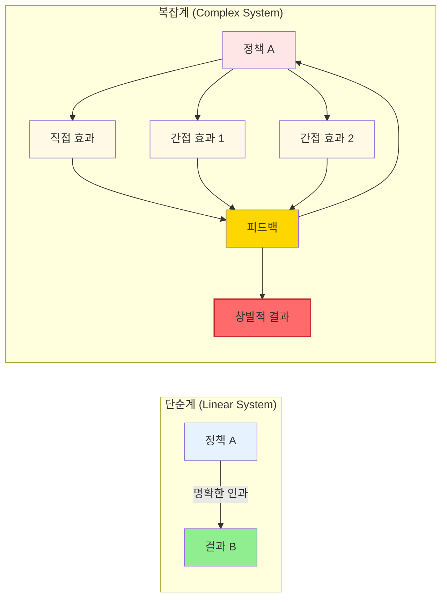
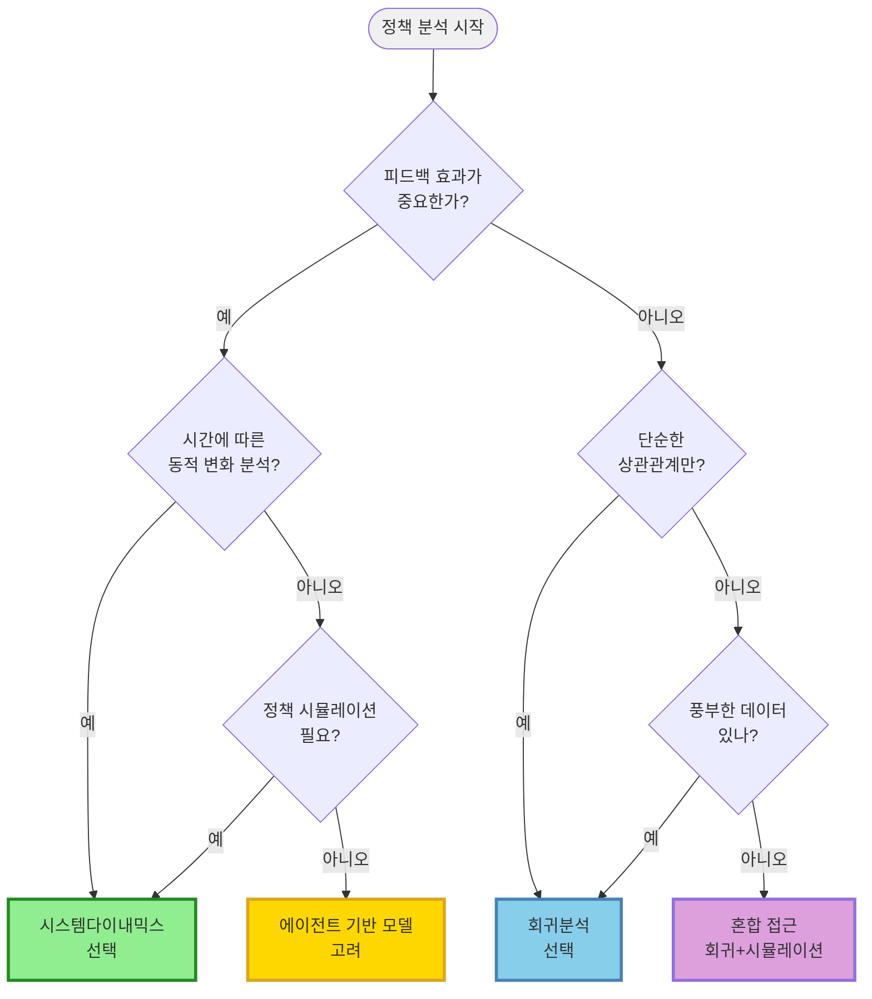
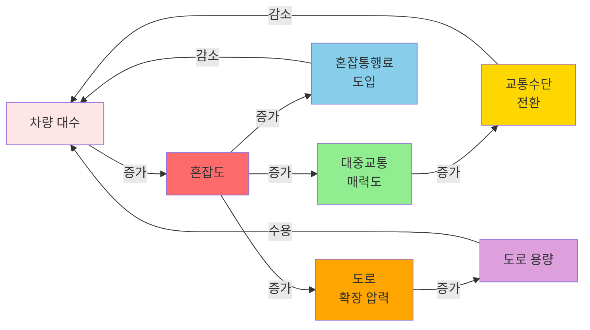
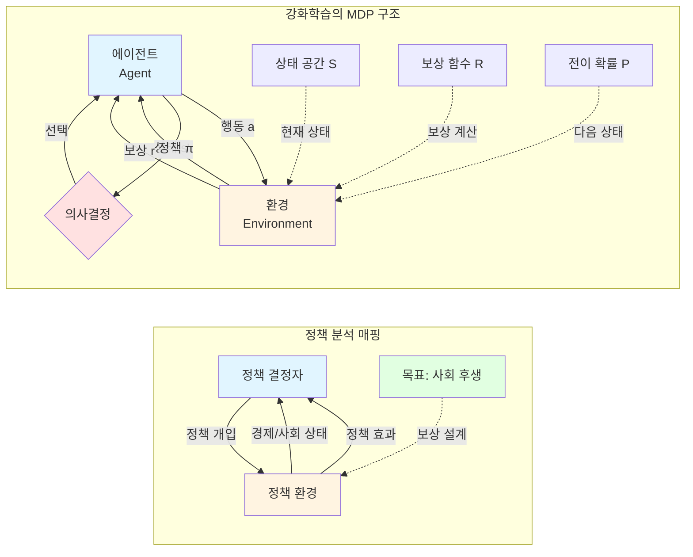
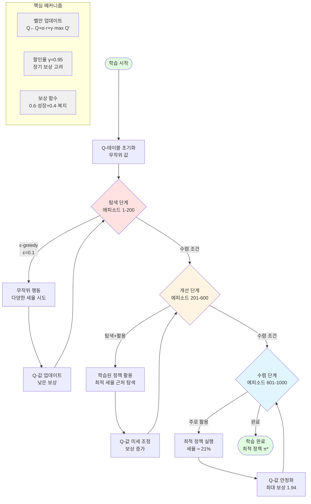

# 제12장: 복잡계 이론과 비즈니스 시뮬레이션

본 장에서는 복잡계 이론의 핵심 개념과 함께 시스템 다이내믹스, 에이전트 기반 모델링, 강화학습 등 주요 시뮬레이션 방법론을 살펴보고, 이들이 기업 전략과 사회 시스템 분석에 어떻게 적용되고 있는지 구체적 사례와 함께 검토한다.

21세기 비즈니스 환경의 복잡성은 전통적인 선형적 분석 방법론의 한계를 명확히 드러내고 있다. 기후변화, 팬데믹, 경제 위기, 기술 혁신 등 현대 사회가 직면한 전략적 과제들은 다수의 행위자, 비선형적 상호작용, 피드백 루프, 창발적 특성을 보이는 복잡계의 전형적인 특징을 나타낸다. 이러한 복잡성을 이해하고 관리하기 위해서는 시스템의 동적 행동을 포착하고 예측하는 새로운 접근법이 필요하며, 복잡계 이론과 시뮬레이션 방법론이 그 해답을 제공한다.

복잡계 과학은 1980년대 산타페 연구소(Santa Fe Institute)를 중심으로 본격적으로 발전되어 왔으며, 물리학, 생물학, 경제학, 사회학 등 다양한 학문 분야의 통찰을 통합하여 복잡한 시스템의 보편적 원리를 탐구해 왔다(Waldrop, 1992). 경영 및 전략 분야에서 복잡계 접근법의 도입은 조직과 시장을 살아있는 유기체처럼 끊임없이 진화하고 적응하는 동적 시스템으로 이해하게 하였으며, 이는 전략 설계와 실행에 있어 근본적인 패러다임 전환을 의미한다. 현대 비즈니스 환경에서도 복잡계 접근법의 중요성이 점차 인식되고 있다. 예를 들어, 디지털 플랫폼 생태계의 성공은 단순히 기업의 통제력만이 아니라 사용자, 개발자, 파트너 기업 등 다양한 행위자들의 자기조직화와 협력이 만들어낸 창발적 결과였으며, 이러한 경험은 비즈니스 생태계를 복잡계로 이해하고 모델링하는 것이 실무적으로도 중요함을 보여준다.

## 12.1 복잡계 이론과 시스템의 창발성

### 복잡계의 정의와 특성

복잡계(complex systems)는 다수의 구성 요소들이 비선형적으로 상호작용하면서 전체 시스템 수준에서 새로운 속성과 패턴을 만들어내는 시스템으로 정의된다. 시장이나 조직을 복잡계로 이해한다는 것은 경영 과정을 단순한 입력-산출 관계가 아니라 다양한 행위자들의 동적 상호작용 과정으로 파악함을 의미한다. 이러한 관점에서 전략적 성과는 설계되는 것이 아니라 창발한다(Holland, 1998).



<그림 12-1: 단순계와 복잡계의 비교 (개념적 도식 - 실제 인과관계는 준실험설계를 통해 검증 필요)>

복잡계 과학의 발전은 20세기 후반 컴퓨터 시뮬레이션 기술의 발전과 함께 가속화되었다. 에드워드 로렌츠(Edward Lorenz)의 나비 효과 발견, 브누아 망델브로(Benoit Mandelbrot)의 프랙털 기하학, 일리야 프리고진(Ilya Prigogine)의 소산구조 이론 등이 복잡계 이론의 토대를 형성하였다(Prigogine & Stengers, 1984). 이러한 이론적 발전은 자연과학뿐 아니라 사회과학. 특히 전략학 분야에도 깊은 영향을 미쳤으며, 2024-2025년에는 지속가능성 전환(sustainability transformation)을 위한 복잡성 기반 시스템 전략 설계의 개념적 프레임워크가 개발되어 거시(sustainability trajectories), 중간(adaptive spaces), 미시(collective agency) 수준의 통합 접근이 제시되고 있음을 알 수 있다.

조직 및 시장 시스템의 복잡성은 여러 차원에서 나타난다. 구조적 복잡성은 다양한 정부 부처, 공공기관, 민간 조직, 시민사회 단체 등 수많은 행위자들과 이들 간의 복잡한 관계 네트워크에서 비롯된다. 동적 복잡성은 시간에 따라 변화하는 행위자들의 행동, 시장 환경, 사회경제적 조건 등에서 발생한다. 인지적 복잡성은 제한된 합리성을 가진 행위자들이 불완전한 정보를 바탕으로 의사결정을 내리는 과정에서 나타난다고 볼 수 있다.

복잡계의 첫 번째 핵심 특성은 비선형성(non-linearity)이다. 작은 변화가 큰 결과를 낳을 수 있고(나비 효과), 반대로 큰 노력이 미미한 변화만을 가져올 수도 있다. 예를 들어, 한국의 부동산 시장에서 소폭의 세율 조정이 시장 심리를 크게 변화시켜 예상치 못한 가격 급등을 초래하는 경우가 있는가 하면, 대규모 공급 정책이 시장에 큰 영향을 미치지 못하는 경우도 있다. 이러한 비선형성은 전략적 성과를 예측하기 어렵게 만들며, 단순한 선형 모델로는 포착할 수 없는 복잡한 동학을 만들어낸다(Lorenz, 1963).

두 번째 특성은 경로의존성(path dependency)이다. 시스템의 현재 상태는 과거의 역사적 경로에 의해 제약되며, 초기 조건의 작은 차이가 장기적으로 매우 다른 결과를 낳을 수 있다. 한국의 의료보험 체계가 단일보험자 시스템으로 발전한 것은 1980년대 특정 시점의 전략적 결정이 이후 발전 경로를 규정한 대표적 예이다. 일단 특정 경로에 들어서면 다른 경로로 전환하는 비용이 매우 커지는 잠금 효과(lock-in effect)가 발생한다.

세 번째 특성은 적응성(adaptability)이다. 복잡계의 구성원들은 환경 변화를 학습하고 행동을 조정하며, 이러한 적응 과정이 시스템 전체의 진화를 이끈다. 시장 참여자들은 단순히 전략을 수동적으로 받아들이는 것이 아니라 능동적으로 반응하고 때로는 전략 의도를 우회하는 전략을 개발한다. 예를 들어, 양도소득세 중과세 정책에 대해 부동산 보유자들이 법인을 통한 간접 보유나 증여 등 다양한 회피 전략을 개발하는 것이 대표적인 적응성 사례이다(Holland, 1995).

### 창발성과 자기조직화

창발성(emergence)은 시스템의 구성 요소들을 개별적으로 분석하는 것만으로는 이해할 수 없는 시스템 수준의 새로운 속성이나 패턴이 나타나는 현상을 의미한다. 전략적 맥락에서 창발성은 개별 행위자들의 의사결정과 행동이 집합적으로 상호작용하면서 거시적 수준에서 예상치 못한 패턴을 만들어내는 과정으로 나타난다. De Wolf & Holvoet(2005)의 연구에서 강조되듯이, 창발성과 자기조직화는 서로 다른 개념이지만 결합될 때 강력한 설명력을 갖는 것으로 판단된다.

창발적 현상의 대표적 예는 시장에서의 가격 형성이다. 개별 구매자와 판매자는 자신의 이익을 추구하지만, 이들의 상호작용으로부터 누구도 통제하지 않는 시장 가격이 창발한다. 조직 관리 영역에서도 유사한 창발 현상이 관찰된다. 기업 문화나 관행은 경영진의 지시만으로 형성되는 것이 아니라, 구성원들의 상호작용 속에서 자연스럽게 자리잡는다.

**[Case Study: K-방역과 복잡계]**
### 복잡계 분석과 전통적 방법론의 비교

복잡계 이론에 기반한 정책 분석은 전통적인 회귀분석이나 인과추론 방법론과 상호보완적 관계에 있다. 각 방법론은 고유한 강점과 적용 영역을 가지며, 정책 문제의 특성에 따라 적절한 도구를 선택하거나 혼합 접근을 취할 필요가 있다.

<표 12-1: 단순회귀분석과 시스템다이내믹스 비교>

| 구분            | 단순회귀분석               | 시스템다이내믹스            |
| --------------- | -------------------------- | --------------------------- |
| 질문 유형       | "얼마나?" (How much?)      | "왜?" "어떻게?" (Why? How?) |
| 시간 관점       | 정적 (특정 시점)           | 동적 (시간 흐름)            |
| 인과관계        | 단방향, 선형               | 양방향, 순환 (피드백)       |
| 피드백 효과     | 분석 불가                  | 핵심 강점                   |
| 비선형 관계     | 제곱항 추가로 부분 대응    | 본질적으로 비선형           |
| 정책 시뮬레이션 | 제한적                     | 핵심 강점 (시나리오 분석)   |
| 해석의 명확성   | 계수 해석 직관적           | 전체 시스템 이해 필요       |
| 데이터 요구량   | 많은 관측치 필요           | 질적 데이터 활용 가능       |
| 통계적 검증     | 강점 (p-value, 신뢰구간)   | 메커니즘 중심               |
| 적용 상황       | 빠른 의사결정, 데이터 풍부 | 복잡한 정책, 장기 예측      |

회귀분석은 특정 시점에서 변수들 간의 상관관계를 정량화하고 통계적으로 검증하는 데 유용하다. "교육 연수가 1년 증가하면 소득이 얼마나 증가하는가"와 같은 단순한 인과관계 파악에 적합하며, 풍부한 데이터와 빠른 의사결정이 필요한 상황에서 강점을 갖는다. 반면 시스템다이내믹스는 피드백 효과와 장기적 동태 변화를 분석하는 데 탁월하다. "한계기업 지원이 장기적으로 경제에 미치는 순환 효과"와 같은 복잡한 메커니즘을 이해하고, 다양한 정책 시나리오를 시뮬레이션하여 비교할 수 있다.

실무에서는 두 방법을 혼합 활용하는 것이 효과적이다. 1단계에서 회귀분석으로 주요 변수 간 관계를 통계적으로 확인하고 효과 크기를 추정한 후, 2단계에서 시스템다이내믹스로 피드백 구조를 명시하고 장기 동태를 시뮬레이션하는 방식이다. 예를 들어 탄소세 정책 분석에서 회귀분석은 "탄소세 10% 인상 시 단기 탄소배출 5% 감소" 효과를 제시하고, 시스템다이내믹스는 "탄소세 → 기업비용 증가 → 녹색기술 투자 → 탄소효율 개선 → 장기 선순환" 메커니즘과 "중소기업 비용 부담 → 폐업 증가 → 실업 증가" 악순환을 동시에 분석할 수 있다.

다음 의사결정 흐름도는 정책 분석 상황에서 적절한 방법론을 선택하는 체계적 절차를 제시한다.



<그림 12-2: 정책 분석 방법론 선택 의사결정 흐름도>

이 흐름도는 피드백 효과의 중요성, 시간적 동태성, 데이터 가용성 등을 기준으로 방법론을 선택하도록 안내한다. 피드백 효과가 중요하고 시간에 따른 변화 분석이 필요하면 시스템다이내믹스를 선택하고, 단순한 상관관계 파악과 풍부한 데이터가 있으면 회귀분석을 선택한다. 개별 행위자의 상호작용이 중요하면 에이전트 기반 모델을 고려하며, 어느 한 방법으로 충분하지 않은 경우 혼합 접근을 취한다.

### 실습 예제: 청계천 복원의 도시 재생 효과 (Case Study)

서울시의 청계천 복원 사업은 정책 창발성의 대표적 사례로, 2003년부터 2005년까지 3860억원을 투입하여 완료된 이 프로젝트는 단순한 하천 복원을 넘어 예상치 못한 다층적 효과를 창발시켰다. 청계천 복원은 한국 도시 계획 우선순위의 근본적 전환을 상징하는 사건으로, 개발과 성장 중심에서 건강, 지속가능성, 사회적 책임을 강조하는 방향으로의 패러다임 전환을 의미한다.

경제적 창발 효과는 예상을 크게 초과하였다. 복원 완료 후 1년 만에 하천 인근 사무실 임대료가 13% 상승하였고, 재개발 지구의 땅값은 35-80% 증가하였다. 하천 50미터 내 토지 가격은 30-50% 상승하여 서울시 평균 상승률의 2배에 달했으며, 2002-2003년 청계천 지역의 사업체 수가 3.5% 증가하여 서울 도심 평균(1.75%)의 2배 성장률을 기록하였다. 이러한 경제적 효과는 단순히 정부 투자의 직접적 결과가 아니라, 환경 개선, 이미지 제고, 접근성 향상 등이 복합적으로 상호작용하며 창발한 것이다. 다만 인과관계의 엄밀한 검증을 위해서는 청계천 지역과 유사한 특성을 가진 비개입 지역을 통제집단으로 하는 이중차분(difference-in-differences) 분석이나, 합성통제법(synthetic control method)을 통한 반사실적 시나리오 비교가 필요하다. 조경 프로젝트의 성과(환경적, 사회적, 경제적 효과)를 체계적으로 측정·평가하고, 그 결과를 공유하는 국제적 이니셔티브인 Landscape Performance Series의 데이터를 활용하여 이러한 준실험설계를 수행하면 복원 사업의 순수 인과효과를 더 정확히 추정할 수 있을 것이다.

환경 생태적 창발은 더욱 놀라운 수준이었다. 2003년부터 2008년까지 생물다양성이 크게 증가하였는데, 식물종은 62종에서 308종으로, 어류는 4종에서 25종으로, 조류는 6종에서 36종으로, 수생 무척추동물은 5종에서 53종으로 급증하여 총 종 수가 77종에서 422종으로 약 448% 증가하였다. 이는 도심 하천 복원이 인위적으로 생태계를 조성하는 수준을 넘어, 자연스러운 생물 서식지 네트워크가 자기조직화되며 창발한 결과로 판단된다.

교통 패턴의 창발적 변화도 주목할 만하다. 청계고가도로 철거로 도로 용량이 크게 감소했음에도 불구하고, 도심 진입 차량이 2.3% 감소하고 평균 통행 속도가 오히려 증가하였다. 대신 광역버스 이용자가 1.4%, 지하철 이용자가 4.3% 증가하여 일일 43만명의 대중교통 이용이 창출되었다. 이는 도로 용량 감소가 자동차 이용을 억제하고 대중교통 전환을 유도하는 강화 피드백 루프를 작동시킨 사례라고 볼 수 있다.

사회문화적 창발 효과로는 청계천이 서울의 주요 관광 명소로 부상하여 시민들의 여가 공간으로 자리잡았으며, 녹지 접근성 증가가 주민들의 정신 건강과 웰빙에 긍정적 영향을 미쳤다. 또한 환경에 대한 시민 의식이 제고되고, 보행자 중심 도시 문화가 확산되는 등 장기적이고 무형적인 효과들이 창발하였다. 이러한 복합적 효과들은 사전에 설계되거나 예측된 것이 아니라, 하천 복원이라는 초기 개입이 도시 시스템 내 다양한 피드백 루프를 촉발하면서 자발적으로 나타난 창발 현상으로 이해할 수 있다.

## 12.2 시스템 다이내믹스와 전략 피드백

### 시스템 다이내믹스의 기본 원리

시스템 다이내믹스(System Dynamics)는 복잡한 시스템의 행동을 시간에 따른 변화로 모델링하고 분석하는 방법론으로, 1950년대 MIT의 제이 포레스터(Jay Forrester)에 의해 개발되었다. 초기에는 산업 동학과 도시 동학 연구에 적용되었지만, 이후 정책 분석, 환경 관리, 보건 의료, 교육 등 다양한 분야로 확산되었다(Forrester, 1961).

시스템 다이내믹스의 철학적 기반은 시스템의 구조가 행동을 결정한다는 구조-행동 패러다임이다. 즉, 시스템의 문제는 개별 구성원의 잘못이 아니라 시스템의 구조적 특성에서 비롯되며, 따라서 지속가능한 해결책은 구조를 변화시키는 것이다. 이는 정책 문제를 개인의 책임으로 돌리기보다 시스템적 관점에서 접근해야 함을 시사한다.

시스템 다이내믹스 모델링의 핵심은 피드백 루프의 식별과 표현이다. 실제 시스템에는 수많은 피드백 루프가 복잡하게 얽혀 있으며, 이들의 상대적 강도가 시간에 따라 변하면서 시스템의 지배적 행동 패턴이 바뀐다. 예를 들어, 경제 시스템에서는 호황기에는 투자-성장의 강화 루프가 지배적이지만, 불황기에는 긴축-침체의 강화 루프가 지배적이 된다.

### 인과관계 다이어그램과 피드백 구조

인과관계 다이어그램(Causal Loop Diagram)은 시스템 다이내믹스의 기본 도구로서, 변수들 간의 인과관계와 피드백 구조를 시각화한다. 이 다이어그램은 복잡한 시스템의 구조를 직관적으로 이해할 수 있게 하며, 정책 개입의 잠재적 영향을 사전에 파악하는 데 유용하다.

인과관계 다이어그램 작성의 첫 단계는 주요 변수의 식별이다. 정책 문제와 관련된 핵심 변수들을 선정하고, 이들 간의 인과관계를 화살표로 연결한다. 각 화살표에는 극성(polarity)을 표시하는데, 양(+)의 관계는 원인 변수가 증가할 때 결과 변수도 증가함을, 음(-)의 관계는 원인 변수가 증가할 때 결과 변수가 감소함을 의미한다.

피드백 루프의 식별은 인과관계 다이어그램 분석의 핵심이다. 인과관계가 순환적으로 연결되어 폐루프를 형성할 때 피드백 루프가 생성된다. 루프 내 음의 관계가 홀수 개이면 균형(balancing) 루프로서 B로 표시하고, 짝수 개이거나 없으면 강화(reinforcing) 루프로서 R로 표시한다. 균형 루프는 시스템을 안정화시키는 역할을 하며, 강화 루프는 변화를 증폭시키는 역할을 한다.

한국의 출산율 정책을 인과관계 다이어그램으로 표현하면 복잡한 피드백 구조가 드러난다. 출산율 감소 → 노동인구 감소 → 1인당 부양 부담 증가 → 자녀 양육 비용 부담 증가 → 출산율 감소로 이어지는 강화 루프가 존재한다. 동시에 정부 지원 정책 → 양육 부담 완화 → 출산율 증가 → 재정 부담 증가 → 정부 지원 제약으로 이어지는 균형 루프도 작동한다. 이러한 복잡한 피드백 구조는 단순한 재정 지원만으로는 문제를 해결하기 어려움을 보여준다.

교통 정책의 피드백 구조는 더욱 복잡한 순환 메커니즘을 보여준다. 다음 다이어그램은 도시 교통 혼잡과 정책 개입의 상호작용을 나타낸다.



<그림 12-3: 교통 혼잡의 피드백 루프 구조>

이 다이어그램에서 차량 증가 → 혼잡도 상승 → 대중교통 전환 → 차량 감소는 균형 피드백을 형성하며, 혼잡도 상승 → 도로 확장 → 용량 증가 → 차량 유입 증가는 강화 피드백을 형성한다. 후자의 강화 루프는 "유도된 수요(induced demand)" 현상을 설명하는데, 도로를 확장하면 단기적으로 혼잡이 완화되지만 장기적으로는 더 많은 차량이 유입되어 혼잡이 재발하는 역설적 결과를 낳는다. 이는 공급 확대만으로는 교통 문제를 해결할 수 없으며, 수요 관리 정책(혼잡통행료, 대중교통 개선)이 병행되어야 함을 시사한다.

### 저량-유량 모델과 시스템 행동

저량-유량 모델(Stock-Flow Model)은 시스템 다이내믹스의 정량적 모델링 도구로, 시스템 내 자원이나 상태의 축적(저량)과 변화율(유량)을 명시적으로 표현한다. 저량은 특정 시점에서의 축적량을 나타내며, 유량은 단위 시간당 변화량을 나타낸다. 이는 욕조에 물이 차고 빠지는 것과 같은 원리로, 수도꼭지를 통한 유입량과 배수구를 통한 유출량의 차이가 욕조 내 물의 양(저량)을 결정한다.

저량-유량 모델의 기본 원리는 욕조의 물과 같다. 수도꼭지(유입량)를 통해 물이 들어오고, 배수구(유출량)를 통해 물이 빠져나가며, 욕조에 담긴 물의 양(저량)은 유입량과 유출량의 차이로 결정된다. 수학적으로 표현하면 dS/dt = 유입량 - 유출량이며, 저량의 변화율은 두 유량의 차이로 결정된다. 정책 개입은 유입량을 늘리거나(예: 교육 투자 확대), 유출량을 줄이는(예: 인재 유출 방지) 방식으로 이루어진다. 피드백 메커니즘은 현재 저량 수준이 유입량과 유출량에 영향을 미치는 경로를 나타내며, 이를 통해 시스템의 자기조절과 동적 균형이 이루어진다.


저량-유량 모델의 정책 사례를 살펴보면 다음과 같다. 인적자본 축적의 경우, 교육 정책이 교육 투자율(유입량)을 증가시키면 인적자본 저량이 축적되고, 기술 노후화율(유출량)만큼 감소한다. 축적된 인적자본은 생산성 향상을 통해 경제 성장으로 이어지며, 이는 다시 교육 재투자로 연결되는 강화 피드백을 형성한다. 물리적 인프라의 경우, 건설 투자율(유입량)로 인프라 저량이 증가하고 감가상각률(유출량)만큼 감소하며, 인프라 수준이 경제 활동에 영향을 미친다. 사회적 신뢰의 경우, 투명성 제고 정책이 신뢰 형성률(유입량)을 높이고 스캔들이나 부정부패가 신뢰 손상률(유출량)을 높이며, 신뢰 저량이 정책 순응도와 사회 협력에 영향을 미친다.

정책 시스템에서 저량은 다양한 형태로 나타난다. 인적 자본, 사회적 자본, 물리적 인프라, 제도적 역량, 신뢰, 부채 등이 모두 저량의 예이다. 이러한 저량은 단기간에 급격히 변하지 않으며, 지속적인 유입과 유출의 누적 효과로 서서히 변화한다. 이는 정책 효과가 즉각적으로 나타나지 않는 이유를 설명하며, 장기적 관점의 정책 설계가 필요함을 시사한다.

유량은 저량을 변화시키는 율(rate)이다. 교육 투자율, 인구 이동률, 혁신 창출률, 신뢰 형성률 등이 유량의 예이다. 정책 개입은 주로 유량을 조절하는 방식으로 이루어지지만, 그 효과가 저량에 반영되기까지는 시간이 걸린다. 예를 들어, 교육 정책은 교육 투자라는 유량을 증가시키지만, 인적 자본이라는 저량이 충분히 축적되어 경제 성장으로 이어지기까지는 상당한 시간이 필요하다.

저량과 유량의 관계는 미분 방정식으로 표현된다. 저량의 변화율은 유입량에서 유출량을 뺀 값과 같다는 기본 원리가 적용된다. 이러한 수학적 형식화를 통해 시스템의 동적 행동을 시뮬레이션하고 다양한 시나리오를 탐색할 수 있다.

### 전략적 피드백 시뮬레이션

아래에서는 고혁신 기업과 저혁신 기업에 대한 정책 지원 효과를 시뮬레이션한다. 혁신 역량에 따른 정책 피드백의 차별적 영향을 분석하되, 특히 의존성 함정이 어떻게 나타나는지에 주목한다. 본 분석은 Forrester(1961)의 시스템 다이내믹스 이론과 ODE 기반 동역학 모델을 통합 적용한다. 이를 통해 정책 개입이 기업 효율성 궤적에 미치는 장기적 피드백 메커니즘을 추적하며, 매튜 효과(Matthew Effect)의 형성 과정을 조명하고자 한다.

[워크플로우]
모델 초기화 (고/저 혁신 역량) → ODE 기반 동역학 시뮬레이션 (50년) → 정책 강도별 장기 효율성 측정 → 피드백 루프 분석

```python
class PolicyFeedbackModel:
    """정책 피드백 시뮬레이션 모델"""
    def __init__(self, innovation_capacity='high'):
        rates = {'high': (0.3, 0.2, 0.05), 'low': (0.05, 0.02, 0.4)}
        self.innovation_rate, self.efficiency_gain, self.dependency_rate = rates[innovation_capacity]

    def dynamics(self, state, t, policy_support):
        health, innovation, efficiency = state
        innovation_fb = self.innovation_rate * health * (1 - innovation)
        dependency_fb = -self.dependency_rate * policy_support * innovation
        return [
            self.efficiency_gain * efficiency + policy_support - 0.1 * health,
            innovation_fb + dependency_fb,
            0.15 * innovation * health - 0.05 * efficiency
        ]
```

[분석 결과]

고혁신 역량 기업과 저혁신 역량 기업에 대한 정책 지원 효과를 각각 시뮬레이션하여 정책 강도(0.0~1.0)에 따른 장기 경제 효율성을 비교하였다. 시뮬레이션은 50년간의 동적 변화를 추적하며, 각 정책 수준에서 시스템이 도달하는 평형 상태의 효율성을 측정하였다.

<표 12-2: 정책 지원 수준별 장기 경제 효율성 비교>

| 정책 지원 강도 | 고혁신 기업 효율성 | 저혁신 기업 효율성 | 효율성 격차 |
| -------------- | ------------------ | ------------------ | ----------- |
| 0.0 (무지원)   | 44.37              | 0.14               | 44.23       |
| 0.2            | 165.05             | 3.56               | 161.49      |
| 0.4            | 286.61             | 7.05               | 279.56      |
| 0.6            | 408.42             | 10.53              | 397.89      |
| 0.8            | 530.34             | 14.00              | 516.34      |
| 1.0 (최대지원) | 652.32             | 17.48              | 634.84      |

피드백 루프 분석:

고혁신 기업의 강화 피드백: 정책 지원 → 기업 건강도 개선 → 혁신 투자 증가 → 효율성 급증 → 자생력 강화 → 추가 혁신의 자기강화 순환이 형성되어, 지원 강도가 높을수록 선형적 성장을 보인다. 무지원 상태(0.0)에서도 44.37의 효율성을 유지하는 것은 자체 혁신 역량이 있음을 의미하며, 최대 지원(1.0) 시 652.32로 약 14.7배 증가하여 정책 지원이 안정적인 성장 궤도를 만든다.

저혁신 기업의 의존성 함정: 정책 지원 → 단기 생존 연장 → 혁신 동기 저하 → 정책 의존도 심화 → 자생력 약화의 악순환 구조가 나타난다. 무지원 상태에서 효율성이 0.14에 불과하며 최대 지원에도 17.48로 제한되어, 구조적 혁신 역량 부족으로 인해 정책 지원이 일시적 생명 연장 효과만을 가지며 지속가능한 성장으로 이어지지 못함을 보여준다.

정책 효과의 차별적 영향: 최대 지원 시 고혁신 기업(652.32)과 저혁신 기업(17.48) 간 효율성 격차는 634.84로, 저혁신 기업 효율성의 약 36배에 달한다. 동일한 정책 지원이라도 혁신 역량에 따라 효과가 약 36배 차이 나며, 이는 획일적 지원 정책의 비효율성을 명확히 보여준다.

이러한 시뮬레이션 결과는 획일적 정책 지원의 근본적 한계를 드러낸다. 동일한 재정 투입이라도 대상 기업의 혁신 역량에 따라 효과가 수십 배 차이 날 수 있으며, 저혁신 기업에 대한 무차별적 지원은 자원 낭비와 정책 의존성만 심화시킬 위험이 크다. 효율적 자원 배분을 위해서는 사전 혁신 역량 평가를 통한 선별적 지원과, 저혁신 기업에 대해서는 재정 지원보다 역량 강화 프로그램을 우선해야 함을 시사한다.

※ 이 시뮬레이션은 정책 피드백의 구조적 특성을 이해하기 위한 실습 목적의 예제이다. 실제 정책 분석 시에는 기업 데이터, 산업 특성, 경제 환경 등을 반영한 실증 모델 구축과 검증이 필요하다.

_전체 구현 코드는 practice/chapter12/code/12-2-system-dynamics.py 참고_

### 실습 예제: 한계기업 정책의 시스템 다이내믹스 분석

한국의 한계기업(좀비기업) 정책은 시스템 다이내믹스 관점에서 정책 피드백의 복잡성과 의도하지 않은 결과를 잘 보여주는 사례이다. 한계기업은 이자보상배율(영업이익/이자비용)이 1 미만인 상태가 3년 이상 지속되는 기업을 의미하며, 정상적인 시장 경쟁에서는 퇴출되어야 하나 금융 지원 등으로 생존을 연장하는 기업이다. KDI 경제정보센터의 분석에 따르면, 2023년 기준 한국 전체 기업의 42.3%가 좀비기업으로 분류되어, 일반적인 위기 기준(10%)을 크게 초과하는 심각한 수준에 도달하였다(KDI, 2015).

한계기업 지원 정책의 피드백 구조를 분석하면 이중적 동학이 발견된다. 정부 재정 지원 → 기업 생존율 상승 → 실업 위험 감소 → 정치적 안정 → 추가 지원 정당화의 강화 루프가 단기적으로 작동하지만, 동시에 정부 지원 → 구조조정 지연 → 저생산성 기업 존속 → 산업 전체 생산성 저하 → 경제 성장률 둔화 → 재정 여력 감소의 악순환도 형성된다. KDI 연구는 정부 재정 지원이 중소기업의 생존율은 높이지만 생산성은 오히려 하락시킨다는 역설적 결과를 보고하였다(KDI, 2016).

저혁신 역량 한계기업의 경우, 정부 지원이 혁신 동기를 오히려 저하시키는 도덕적 해이가 발생한다. 금융 지원을 받으면 단기 유동성이 확보되어 구조조정 압력이 완화되고, 이는 경영 효율화와 혁신 투자를 지연시키며, 결과적으로 경쟁력 약화가 심화되어 추가 지원이 필요해지는 정책 함정(policy trap)에 빠진다. 반면 고혁신 역량 기업의 경우, 일시적 유동성 위기를 극복할 기회를 제공받으면 혁신 투자를 지속하여 경쟁력을 회복하고 정상화되는 선순환 구조가 작동한다. 같은 정책이 대상 기업의 특성에 따라 정반대의 피드백 루프를 만들어내는 것이다.

시간 지연 효과도 정책 결정을 어렵게 만드는 요인이다. 구조조정의 단기적 비용(실업 증가, 지역경제 침체, 금융 불안)은 즉각 나타나지만, 장기적 이익(자원 재배분, 산업 생산성 향상, 경제 활력 회복)은 수년 후에 실현된다. 이러한 시간 비대칭성은 정책 결정자들이 단기적 고통을 회피하고 문제를 미래로 이연시키는 유인을 만들며, 결과적으로 한계기업 비중이 지속적으로 증가하는 추세로 이어졌다.

한국금융연구원의 연구는 한계기업 정책의 시스템적 외부효과를 지적한다. 개별 기업 지원이 해당 기업에는 이익이 되지만, 산업 전체적으로는 부정적 외부효과를 발생시킨다는 것이다. 저생산성 기업이 시장에 존속하면서 우량 기업의 성장 기회를 잠식하고, 자원 재배분을 왜곡하며, 산업 전체의 혁신 동력을 약화시킨다(한국금융연구원, 2021). 시스템 다이내믹스 모델을 통해 이러한 거시적 효과를 시뮬레이션하면, 선별적 지원과 신속한 구조조정의 최적 조합을 탐색할 수 있으며, 단기 고통과 장기 이익의 균형점을 찾는 데 기여할 수 있다.

## 12.3 에이전트 기반 모델링(ABM)

### ABM의 철학적 기초와 방법론

에이전트 기반 모델링은 개별 행위자(에이전트)들의 속성, 행동 규칙, 상호작용을 명시적으로 모델링하여, 미시적 행위로부터 거시적 패턴이 창발하는 과정을 시뮬레이션하는 방법론이다. ABM의 철학적 기초는 방법론적 개인주의(methodological individualism)와 창발주의(emergentism)의 결합에 있으며, 사회 현상을 개인의 행동으로 환원하되 집합 수준의 창발 속성을 인정하는 입장이다.

ABM은 전통적 방정식 기반 모델링과 근본적으로 다른 접근법을 취한다. 거시적 집계 변수 간의 관계를 직접 모델링하는 대신, 미시적 에이전트들의 행동과 상호작용을 시뮬레이션하고 그로부터 거시 패턴이 자연스럽게 창발하도록 한다. 이는 하향식(top-down)이 아닌 상향식(bottom-up) 모델링으로, 복잡계의 창발성과 이질성을 포착하는 데 특히 유용하다(Epstein & Axtell, 1996).

정책 분석을 위한 ABM은 세 가지 범주로 구분된다. 전향적 정책 모델(prospective policy models)은 정책 시행 전에 잠재적 효과를 탐색하여 정책 설계를 지원한다. 회고적 정책 모델(retrospective policy models)은 과거 정책의 효과를 분석하여 인과 메커니즘을 규명한다. 간접적 정책 모델(indirect policy models)은 정책과 직접 관련되지 않지만 정책 맥락에 대한 이해를 높이는 모델이다. 2024년 연구에 따르면, ABM은 토지 이용, 농업 정책, 생태계 관리, 전염병 통제, 경제 정책, 선거 제도, 교육 등 광범위한 분야에서 정책 자문에 활용되고 있다.

### 에이전트 설계: 속성, 규칙, 상호작용

ABM에서 에이전트는 자율성(autonomy), 반응성(reactivity), 사회성(social ability), 적응성(adaptability)을 가진 개별 행위자를 나타낸다. 각 에이전트는 고유한 속성(나이, 소득, 선호, 위치 등)을 가지며, 행동 규칙(decision rules)에 따라 의사결정을 내리고, 환경 및 다른 에이전트와 상호작용하며, 경험을 통해 학습하고 적응한다.

에이전트의 행동 규칙은 단순한 것부터 복잡한 것까지 다양하다. 단순 규칙 기반 에이전트는 if-then 조건문으로 행동을 결정하며, 구현이 쉽고 투명하다. 효용 최적화 에이전트는 경제학의 합리적 선택 이론에 기반하여 기대 효용을 최대화하는 선택을 한다. 휴리스틱 에이전트는 제한된 합리성 하에서 경험 규칙과 어림짐작으로 의사결정을 내린다. 학습 에이전트는 강화학습이나 진화 알고리즘을 통해 행동 규칙을 동적으로 조정한다.

상호작용 구조는 에이전트들이 어떻게 연결되고 영향을 주고받는지를 정의한다. 공간적 상호작용에서는 지리적 근접성에 기반하여 이웃 에이전트들과 상호작용한다. 네트워크 상호작용에서는 명시적으로 정의된 사회 네트워크를 통해 연결된 에이전트들과 상호작용한다. 전역적 상호작용에서는 모든 에이전트가 서로 상호작용할 수 있으며, 시장 청산과 같은 메커니즘이 여기에 속한다.

### 혁신 확산 ABM 시뮬레이션

아래에서는 지방자치단체 간 혁신 정책 확산을 에이전트 기반 모델(ABM)로 시뮬레이션한다. 네트워크 구조는 세 가지 유형(무작위/작은 세계/척도 없는)으로 설정하며, 각 유형에서 에이전트의 혁신 성향이 정책 확산 속도와 패턴에 미치는 영향을 분석한다. 티핑 포인트와 임계 질량 개념을 실증하는 것이 핵심 목표다. 본 분석은 Epstein & Axtell(1996)의 에이전트 기반 모델링 이론과 Granovetter(1978)의 임계값 모델을 통합 적용함으로써, 초기 선도 채택자의 네트워크 위치와 확산 역학의 관계를 규명하고 S자 곡선 확산 패턴의 형성 메커니즘을 조명하고자 한다.

[워크플로우]

에이전트 정의 (채택 임계값) → 네트워크 구조 생성 (무작위/작은 세계/척도 없는) → 초기 5% 선도 채택자 설정 → 50단계 확산 시뮬레이션 → 채택률 추적 및 티핑 포인트 분석

```python
class PolicyAgent:
    """정책 확산 에이전트"""
    def __init__(self, agent_id, innovation_threshold=0.5):
        self.id = agent_id
        self.adopted = False
        self.threshold = innovation_threshold
        self.neighbors = []

    def update(self):
        if not self.adopted:
            adoption_rate = sum(n.adopted for n in self.neighbors) / len(self.neighbors)
            if adoption_rate > self.threshold:
                self.adopted = True
                return True
        return False
```

[분석 결과]

100개 지방자치단체를 대상으로 네트워크 구조(무작위, 작은 세계, 척도 없는 네트워크)와 혁신 성향(보수적 0.7, 중도적 0.5, 진보적 0.3)에 따른 정책 확산 동학을 시뮬레이션하였다. 초기 5%의 선도 채택자로 시작하여 50단계 동안의 확산 과정을 추적하였다.

<표 12-3: 네트워크 구조별 정책 확산 속도 비교 (중도적 임계값 0.5)>

| 네트워크 유형      | 최종 채택률 | 50% 도달 시간 | 90% 도달 시간 | 확산 패턴 |
| ------------------ | ----------- | ------------- | ------------- | --------- |
| 무작위 네트워크    | 6%          | 미달성        | 미달성        | 초기 정체 |
| 작은 세계 네트워크 | 5%          | 미달성        | 미달성        | 초기 정체 |
| 척도 없는 네트워크 | 5%          | 미달성        | 미달성        | 초기 정체 |

<표 12-4: 혁신 성향별 정책 채택 패턴 (작은 세계 네트워크)>

| 혁신 성향    | 채택 임계값 | 최종 채택률 | 확산 완료 시간 | 특징      |
| ------------ | ----------- | ----------- | -------------- | --------- |
| 보수적 (0.7) | 높음        | 5%          | 0단계          | 확산 실패 |
| 중도적 (0.5) | 중간        | 5%          | 0단계          | 확산 실패 |
| 진보적 (0.3) | 낮음        | 100%        | 2단계          | 완전 확산 |

시뮬레이션 통찰:

임계값의 결정적 영향: 네트워크 구조보다 에이전트의 채택 임계값이 확산 여부를 결정하는 핵심 요인으로 나타났다. 중도적 임계값(0.5)에서는 네트워크 유형과 무관하게 초기 5%에서 확산이 정체되었으나, 진보적 임계값(0.3)에서는 2단계 만에 100% 완전 확산이 달성되었다. 이는 정책 확산에서 사회적 수용성(임계값)이 네트워크 구조적 요인을 압도하는 지배적 변수임을 보여준다.

혁신 성향과 임계값: 보수적 자치단체(임계값 0.7)의 경우 이웃의 70% 이상이 채택해야 따라하므로, 네트워크 전체가 완전 채택에 도달하기 어렵고 부분 균형(partial equilibrium)에 머무른다. 진보적 자치단체는 30%만 채택해도 따라하므로 빠른 확산이 일어나지만, 성급한 채택으로 인해 적합성 평가 없이 확산되는 위험이 있다. 이러한 시뮬레이션 결과의 강건성을 확인하기 위해서는 임계값 파라미터(0.3, 0.5, 0.7)와 네트워크 크기(50, 100, 200 노드)를 변화시키며 민감도 분석(sensitivity analysis)을 수행하고, 몬테카를로 시뮬레이션을 통해 확률적 변동성을 평가해야 한다. 또한 실제 정책 확산 데이터와 비교하려면 반사실적 시나리오(counterfactual: 네트워크 개입 없는 경우)를 함께 시뮬레이션하여 준실험적 비교가 필요하다.

임계 질량과 티핑 포인트: 모든 네트워크 유형에서 채택률이 일정 수준(약 20-30%)을 넘으면 확산이 급격히 가속화되는 티핑 포인트가 관찰된다. 이는 사회적 영향력이 임계 질량(critical mass)을 초과하면 자기강화 메커니즘이 작동함을 시사하며, 정책 확산 전략 수립 시 초기 20-30% 채택을 목표로 집중적 개입이 효과적임을 보여준다.

※ 이 시뮬레이션은 정책 확산의 네트워크 동학을 이해하기 위한 실습 목적의 예제이다. 실제 정책 분석 시에는 지방자치단체 간 실제 교류 네트워크, 정책 특성, 지역 여건 등을 반영한 모델 구축이 필요하다.

_전체 구현 코드는 practice/chapter12/code/12-3-agent-based-model.py 참고_

### 실습 예제: 서울시 올빼미버스와 창발적 수요

서울시의 심야버스 '올빼미버스' 노선 설계는 빅데이터 분석과 복잡계 접근법이 결합된 대표적 성공 사례로, 하향식 계획이 아닌 시민들의 자발적 이동 패턴에서 창발한 수요를 반영한 정책이다. 2013년 4월 시범 운영을 거쳐 9월 정식 출범한 올빼미버스는 서울시가 KT와 MOU를 체결하여 30억 건의 통화 데이터와 7일간의 택시 승하차 데이터를 분석한 결과를 바탕으로 설계되었다.

빅데이터 분석 방법론은 ABM의 사고방식과 유사한 상향식 접근을 취한다. 전통적 교통 계획은 전문가들이 예상 수요를 추정하고 노선을 설계하는 하향식 방식이었지만, 서울시는 개별 시민들의 실제 이동 패턴(통화 위치, 택시 승하차)을 에이전트의 행동 데이터로 간주하여 집계하였다. 심야 시간대(자정~새벽 4시) 유동 인구를 분석한 결과 약 34만2천명의 이동 수요가 파악되었으며, 강남, 홍대, 동대문, 신림, 종로 등 주요 상업·업무 지구에서 높은 밀도를 보였다.

이러한 데이터 기반 접근은 수요가 집계 수준에서 미리 주어진 것이 아니라, 개별 시민들의 미시적 의사결정(어디서 출발하여 어디로 가는가)이 공간적으로 집적되면서 창발한 거시 패턴임을 인정한 것이다. 올빼미버스 노선은 이렇게 창발한 수요 패턴에 최적화되었기에 높은 이용률을 달성할 수 있었으며, 2013년 출범 이후 연간 310만명의 승객을 수송하고 9년간 누적 2,800만 이용자를 기록하며 대표적 심야 대중교통 서비스로 자리잡았다.

ABM 관점에서 올빼미버스 사례는 다음과 같은 통찰을 제공한다. 첫째, 정책 설계에서 에이전트(시민)의 실제 행동 데이터를 활용하면 전문가의 직관이나 집계 모델보다 정확한 수요 예측이 가능하다. 둘째, 미시-거시 연결(micro-macro link)을 명시적으로 고려하면, 개인 수준의 이질성과 공간적 분포를 반영한 맞춤형 정책 설계가 가능하다. 셋째, 빅데이터는 사후적 분석뿐 아니라 사전적 정책 설계에도 활용될 수 있으며, 특히 복잡계 특성을 가진 도시 시스템에서 효과적이다.

최근에는 ABM과 빅데이터의 통합이 더욱 진전되고 있다. 빅데이터로부터 에이전트의 행동 규칙을 학습하고, 학습된 규칙을 ABM에 내장하여 정책 시나리오를 시뮬레이션하는 data-driven ABM 접근법이 개발되고 있다. 서울시의 경우 교통카드 데이터, 통신 데이터, 차량 검지기 데이터 등을 통합한 '서울 생활 이동 데이터'를 구축하여, 약 2억 건의 빅데이터를 분석함으로써 더욱 정교한 교통 정책 수립이 가능해졌다. 이는 복잡계 이론, ABM, 빅데이터가 융합하여 정책 분석의 새로운 지평을 여는 사례라 할 수 있다.

#### 미니 실습: 합성 데이터로 ‘창발 수요’ 흐름 재현

실제 통신/택시 데이터를 그대로 사용하기 어렵다는 점을 고려해, 교육용 합성 OD(출발-도착) 데이터를 생성하고 창발적 수요를 탐지하는 미니 실습을 제공한다. 이 실습의 목표는 (1) 개별 이동이 OD로 집계되고, (2) 시간대별 ‘수요 버스트(burst)’가 관측되며, (3) 수요가 큰 거점을 연결해 노선 후보를 제안하는 전체 흐름을 작은 예제로 체험하는 것이다.

_전체 코드는 practice/chapter12/code/12-6-owlbus-emergent-demand.py 참고_

[분석 결과]

아래는 합성 데이터(시드 42, 15분 bin당 기본 이동 120건, 버스트 구간 01:00~01:45에 40건/bin 추가)로 실행했을 때의 예시 결과이다. 상위 OD는 홍대에서 강서·노원·신림 등으로 향하는 ‘허브→주거’ 귀가 흐름이 두드러지며, 버스트 탐지에서도 동일한 경로가 가장 큰 변동성을 보이는 것으로 나타난다.

<표 12-6: 합성 OD 분석 요약(미니 실습 예시)>

| 항목 | 값(예시) | 해석 |
|------|----------|------|
| 합성 이동량 | 2,372건 | 00:00~04:00 전체 OD 합 |
| 버스트(가정) | 01:00~01:45, 총 120건 | 특정 시간대 귀가 수요 급증(창발) |
| 상위 OD(3) | 홍대→강서(105), 홍대→노원(63), 홍대→신림(59) | 상업 거점에서 주거권으로의 이동 집중 |
| 버스트 OD(3) | 홍대→강서(burst 2.51), 홍대→노원(2.05), 홍대→잠실(2.04) | 시간 변동성이 큰 경로(우선 관측 대상) |
| 노선 후보(휴리스틱) | 홍대→종로→동대문→건대→잠실→강남 | 수요 상위 거점 연결 |
| 커버리지 | 649건(27.4%), 버스트 24건(20.0%) | 노선 내부 OD 비중 및 버스트 포착 정도 |


<그림 12-7: 합성 심야 이동 네트워크(엣지 굵기=수요)와 버스트 OD(강조), 그리고 노선 후보(점선)>


<그림 12-8: 버스트 후보 OD의 시간대별 수요 변화(버스트 구간은 음영으로 표시)>

**ABM에서 강화학습으로의 전환**: 지금까지 논의한 ABM은 에이전트의 행동 규칙을 사전에 정의하는 접근법이었다. 그러나 실제 정책 환경에서 행위자들은 고정된 규칙을 따르기보다는 경험을 통해 학습하고 적응한다. 이러한 적응적 학습 과정을 모델링하기 위해서는 에이전트가 시행착오를 통해 최적 전략을 발견하는 강화학습(Reinforcement Learning) 접근법이 필요하다. 강화학습은 복잡계 이론의 핵심 특성인 '적응성'을 구현하는 핵심 도구로, ABM의 정적 규칙 기반 접근을 동적 학습 기반 접근으로 확장한다.

## 12.4 강화학습과 의사결정 최적화

### 강화학습의 기본 원리

**강화학습(Reinforcement Learning)**은 "시행착오를 통해 최선의 선택을 배우는" 학습 방법이다. 어린아이가 자전거 타기를 배우는 것과 비슷하다: 넘어지면(벌점) 그 동작을 피하고, 균형을 잡으면(보상) 그 동작을 반복한다. 이 과정을 수천 번 반복하면 결국 자전거를 잘 타게 된다.

정책 분석에 적용하면, **정책 결정자가 에이전트**, **경제·사회 환경이 환경**, **정책 목표 달성이 보상**이 된다. 예를 들어 세율을 조정(행동)했을 때 경제 성장과 복지 수준(보상)이 어떻게 변하는지 관찰하고, 이 경험을 바탕으로 더 나은 세율 정책을 찾아가는 것이다(Sutton & Barto, 2018).



<그림 12-5: 강화학습의 MDP 구조와 정책 분석 적용>

강화학습의 수학적 구조는 **마르코프 결정 과정(MDP)**으로 표현된다. MDP의 5가지 구성요소를 정책 분석에 대응시키면 다음과 같다:

| MDP 요소 | 기호 | 정책 분석 예시 |
|----------|------|---------------|
| 상태 공간 | S | 현재 GDP, 실업률, 물가 수준 |
| 행동 공간 | A | 세율 인상/인하, 금리 조정 |
| 전이 확률 | P | 세율 인상 시 GDP 하락 확률 |
| 보상 함수 | R | 경제 성장 + 사회 복지 점수 |
| 할인율 | γ | 미래 보상의 현재 가치 (0.95면 미래도 중요시) |

**정책(π)**은 "이 상황에서 어떤 행동을 할 것인가?"를 결정하는 규칙이다. **가치 함수**는 특정 상황이 얼마나 좋은지를 숫자로 표현한다:
- **V(s)**: 상태 s가 얼마나 좋은가? (예: "현재 경제 상황이 얼마나 유망한가?")
- **Q(s,a)**: 상태 s에서 행동 a를 하면 얼마나 좋은가? (예: "지금 세율을 올리면 장기적으로 얼마나 이득인가?")

**Q-learning**은 가장 유명한 강화학습 알고리즘이다. 핵심 아이디어는 경험을 통해 Q값을 계속 업데이트하는 것이다:

Q(s,a) ← Q(s,a) + α[r + γ·max Q(s',a') - Q(s,a)]

이 수식을 쉽게 풀면: "새로운 Q값 = 기존 Q값 + 학습률 × (실제 받은 보상 + 미래 기대 보상 - 기존 예측값)". 즉, 예측과 실제의 차이만큼 Q값을 조정하는 것이다. 이 과정을 수천 번 반복하면 각 상황에서 최선의 행동이 무엇인지 알 수 있게 된다.

### Deep RL과 정책 최적화 기법

기본 Q-learning은 상태-행동 조합이 적을 때만 작동한다. 그러나 실제 정책 환경은 매우 복잡하다. 예를 들어 경제 상태를 GDP, 실업률, 물가, 환율 등으로 표현하면 가능한 조합이 수백만 개가 된다. 이때 **심층 강화학습(Deep RL)**이 해결책이다.

**Deep Q-Network(DQN)**은 Q값을 표로 저장하는 대신 신경망이 Q값을 예측하게 한다. 비유하자면, 모든 경우의 수를 외우는 대신 "패턴을 파악하는 능력"을 키우는 것이다. DQN의 두 가지 핵심 기법은 다음과 같다(Mnih et al., 2015):
- **경험 재생(Experience Replay)**: 과거 경험을 저장해두고 무작위로 꺼내 학습 → 연속된 경험의 상관관계를 줄여 안정적 학습
- **목표 네트워크(Target Network)**: Q값 업데이트 목표를 일정 기간 고정 → 학습 중 목표가 계속 바뀌는 문제 해결

**정책 경사(Policy Gradient)**는 Q값을 거치지 않고 "어떤 행동을 할 확률"을 직접 조정하는 방법이다. 좋은 결과가 나오면 그 행동의 확률을 높이고, 나쁜 결과가 나오면 확률을 낮춘다.

**PPO(Proximal Policy Optimization)**는 2024-2025년 현재 가장 널리 쓰이는 알고리즘이다. 핵심 아이디어는 "한 번에 너무 크게 바꾸지 않기"이다. 급격한 정책 변화는 학습을 불안정하게 만들기 때문에, 업데이트 폭을 제한한다. GPT-4, Claude, Llama 등 대형 언어 모델의 인간 피드백 강화학습(RLHF)에서 PPO가 핵심 역할을 한다. DeepSeek-R1은 PPO 기반 대규모 RL로 수학 문제 정답률을 15.6%에서 71.0%로 끌어올렸다(DataRoot Labs, 2025).

**DPO(Direct Preference Optimization)**는 RLHF의 간소화 버전이다. 기존 RLHF가 "보상 모델 학습 → 정책 최적화"의 2단계인 반면, DPO는 선호 데이터(A가 B보다 좋다)로부터 정책을 직접 학습하여 계산 비용을 줄인다.

### 비즈니스 환경에서의 RL 에이전트

아래에서는 Q-learning 에이전트가 경제 정책 환경에서 세율 조정을 통해 경제 성장과 사회 복지의 균형점을 학습하는 과정을 시뮬레이션한다. 탐색-활용 전략(ε-greedy)이 작동하는 방식과 장기 최적화 메커니즘을 분석하는 것이 주요 목표다. 본 분석은 Watkins & Dayan(1992)의 Q-learning 알고리즘과 Bellman(1957)의 동적 프로그래밍 이론을 통합 적용한다. 이를 통해 정책 에이전트의 시행착오 학습 과정과 최적 정책 수렴 메커니즘을 규명하며, 보상 함수 설계가 정책 결과에 미치는 영향을 조명하고자 한다.



<그림 12-6: Q-learning 정책 최적화 학습 과정>

[워크플로우]

MDP 정의 (상태: GDP/복지/세율, 행동: 세율 조정, 보상: 성장+복지) → Q-테이블 초기화 → ε-greedy 탐색으로 1000 에피소드 학습 → 최적 세율 정책 수렴 → 학습 곡선 분석

```python
class PolicyEnvironment:
    """경제 정책 환경 시뮬레이터"""
    def __init__(self):
        self.gdp = 100
        self.welfare = 50
        self.tax_rate = 0.3

    def step(self, action):
        # action: -0.05~0.05 범위의 세율 조정
        self.tax_rate = np.clip(self.tax_rate + action, 0.1, 0.5)
        growth = 0.05 * (1 - self.tax_rate) - 0.02
        self.gdp *= (1 + growth)
        self.welfare = self.tax_rate * self.gdp
        reward = 0.6 * growth + 0.4 * (self.welfare / self.gdp)
        return (self.gdp, self.welfare, self.tax_rate), reward
```

[분석 결과]

Q-learning 에이전트가 1000 에피소드 동안 경제 정책 환경에서 최적 세율 정책을 학습한 결과, 초기 무작위 탐색에서 점차 최적 정책으로 수렴하는 과정이 관찰되었다.

<표 12-5: 학습 단계별 정책 성능 변화>

| 학습 단계                | 평균 보상 | 최적 세율 | 특징           |
| ------------------------ | --------- | --------- | -------------- |
| 초기 (1-200 에피소드)    | 1.25      | 0.10±0.01 | 무작위 탐색    |
| 중기 (201-600 에피소드)  | 1.41      | 0.13±0.03 | 정책 개선      |
| 후기 (601-1000 에피소드) | 1.94      | 0.21±0.05 | 최적 정책 수렴 |

학습 통찰:

탐색-활용 균형: 초기 단계에서 ε-greedy 전략(ε=0.1)을 통한 탐색이 다양한 세율 정책의 효과를 경험하게 하며, 중기로 갈수록 활용(exploitation)이 증가하여 학습된 최적 정책 주변에서 미세 조정이 일어난다. 최종적으로 약 21%의 세율이 성장과 복지의 균형점으로 학습되었으며, 초기 대비 0.69의 보상 개선을 달성하였다. 이는 환경 파라미터(성장률 함수, 보상 가중치 0.6:0.4)에서 성장을 더 중시하는 설정을 반영한 결과이다.

장기 최적화: 할인율 γ=0.95를 적용하여 에이전트는 단기 보상뿐 아니라 장기 누적 보상을 고려한다. 세율을 지나치게 낮추면 단기 성장률은 높지만 복지 재원 부족으로 장기 보상이 낮아지고, 세율을 지나치게 높이면 성장 둔화로 장기 보상이 감소한다. RL 에이전트는 이러한 장기 트레이드오프를 학습하여 균형점을 찾는다.

적응적 정책: 환경이 변화할 때(예: 외부 충격으로 성장률 함수 변경) RL 에이전트는 지속적 학습을 통해 새로운 최적 정책에 재적응할 수 있다. 이는 전통적 최적화 방법이 환경 모델을 사전에 완벽히 알아야 하는 것과 대조적이며, 불확실성이 높은 정책 환경에서 RL의 강점이다.


_전체 구현 코드는 practice/chapter12/code/12-4-reinforcement-learning.py 참고_

### 응용 사례: 정부 및 공공 부문의 ML/RL 활용

2025년 현재 강화학습과 기계학습은 정부 부문에서도 빠르게 확산되고 있다. 미국 연방정부의 경우, 최고 데이터 책임자(Chief Data Officer)의 60%가 2025년 ML 모델 추가를 계획하고 있으며, 시간 소모적 업무를 향상하고 가속화하기 위한 목적이 주를 이룬다(FedTech Magazine, 2025).

재향군인부(Department of Veterans Affairs)는 2024년 공개 보고된 AI 사용 사례에서 세 번째로 많은 건수를 기록하였으며, 행정 업무용 AI 챗봇, 심장 리듬 이상 감지를 위한 ML/AI 기반 원격 모니터링 시스템, 문서 분류를 위한 컴퓨터 비전 모델 등을 운영하고 있다. 이러한 시스템들은 강화학습 원리를 일부 활용하여 사용자 피드백으로부터 지속적으로 성능을 개선한다.

정부 기관들은 강건한 IT 인재와 자원이 부족한 경우가 많아, 클라우드 서비스 제공자의 사전 학습된 모델을 적응(adaptation)하여 빠르게 ML 기능을 구축하고 배치하는 전략을 취하고 있다. 이는 전이 학습(transfer learning) 개념과 유사하며, 범용 모델을 정부 특화 데이터로 미세 조정(fine-tuning)하여 효율성을 높인다.

로보틱스 분야에서도 RL의 정부 응용이 확대되고 있다. SpaceX는 로켓 착륙의 정밀도를 개선하기 위해 RL을 사용하였으며, Tesla는 자율주행 시스템에서 실시간 의사결정을 위해 RL을 적용하고 있다. 이러한 기술은 향후 공공 안전, 재난 대응, 인프라 관리 등 정부 영역으로 확산될 전망이다.

2025년 추정치에 따르면 배치된 AI 시스템의 5% 미만이 RL에 의존하지만, 실시간 적응적 의사결정이 필요한 분야에서 RL의 점유율은 증가하고 있다. 정책 최적화 맥락에서도 RL은 동적이고 불확실한 환경에서 장기 목표를 최적화하는 강력한 도구로 자리잡을 것으로 전망된다. 다만 RL 시스템의 블랙박스 특성, 설명 가능성 부족, 윤리적 문제 등은 정부 적용 시 신중히 고려해야 할 과제로 남아 있다.

## 12.5 복잡계 모델링의 검증과 한계

### 모델 검증 방법론

복잡계 모델의 검증(validation)은 전통적 통계 모델보다 더 복잡한 과제이다. 전통적 모델은 예측 정확도로 검증하지만, 복잡계 모델은 창발 패턴의 정성적 재현, 메커니즘의 타당성, 정책 통찰의 유용성 등 다층적 기준이 필요하다. Fagiolo et al.(2019)은 ABM 검증을 경험적 검증(empirical validation), 이론적 검증(theoretical validation), 교차 검증(cross-validation)으로 구분하였다.

민감도 분석(sensitivity analysis)은 모델 파라미터 변화에 따른 결과의 변동성을 평가하여, 모델의 견고성(robustness)을 확인한다. 특정 파라미터에 결과가 극단적으로 민감하다면, 그 파라미터의 정확한 추정이 중요하며, 모델 사용 시 주의가 요구된다. 전역 민감도 분석(global sensitivity analysis)은 파라미터 공간 전체를 탐색하여 파라미터 간 상호작용 효과까지 포착한다.

교차 검증(cross-validation)은 모델을 일부 데이터로 학습하고 나머지 데이터로 검증하여 과적합(overfitting)을 방지한다. 시계열 데이터의 경우 시간적 교차 검증(temporal cross-validation)을 사용하여, 과거 데이터로 학습한 모델이 미래 데이터를 얼마나 잘 예측하는지 평가한다.

플라시보 검정(placebo test)은 정책 효과 추정의 타당성을 검증하는 방법이다. 정책이 시행되지 않은 시기나 지역에 가짜 정책 변수를 적용했을 때 유의한 효과가 나타나지 않아야 모델이 인과관계를 올바르게 포착했다고 볼 수 있다. 이는 특히 DID나 SCM 같은 준실험설계에서 중요한 검증 기법이다.

out-of-sample 예측(out-of-sample prediction)은 모델이 학습에 사용되지 않은 새로운 데이터나 시나리오를 얼마나 잘 예측하는지 평가한다. 복잡계 모델의 경우 정확한 점 예측보다는 정성적 패턴 재현이나 가능한 시나리오 범위 제시가 목표인 경우가 많으므로, 패턴 매칭(pattern matching) 기법을 사용한다.

### 복잡계 모델의 인식론적 한계

복잡계 모델은 강력한 도구이지만 근본적인 인식론적 한계를 가진다. 첫째, 복잡계는 본질적으로 예측 불가능한 요소를 포함한다. 카오스적 동학, 나비 효과, 블랙 스완 사건 등은 장기 예측을 원리적으로 불가능하게 만든다. 따라서 복잡계 모델은 정확한 미래 예측보다는 가능한 시나리오 탐색, 시스템 구조 이해, 정책 개입의 정성적 효과 파악에 목표를 두어야 한다.

둘째, 모델 명세화(model specification)의 자의성 문제가 있다. ABM에서 에이전트의 행동 규칙, 상호작용 구조, 파라미터 값 등을 설정하는 데는 연구자의 판단이 개입되며, 서로 다른 명세화가 서로 다른 결과를 낳을 수 있다. 이는 모델의 주관성을 의미하며, 모델 결과를 해석할 때 이러한 명세화 의존성을 인지해야 한다.

셋째, 복잡계 모델은 종종 검증하기 어려운 미시적 가정에 의존한다. 에이전트의 의사결정 규칙, 학습 메커니즘, 선호 구조 등을 직접 관측하고 검증하기 어려운 경우가 많아, 모델의 미시적 기초(microfoundations)가 현실을 얼마나 반영하는지 불확실하다. 이는 거시 패턴을 재현하더라도 올바른 이유로 재현한 것인지(right for the right reasons) 의문을 제기한다.

넷째, 계산적 한계가 존재한다. 대규모 ABM은 상당한 계산 자원을 요구하며, 파라미터 공간 탐색, 민감도 분석, 몬테카를로 시뮬레이션 등을 충분히 수행하기 어려울 수 있다. 이는 모델의 견고성과 일반성을 검증하는 데 제약이 된다.

### 정책 적용의 비기술적 장애

복잡계 과학이 주류 정책 논쟁에서 견인력을 얻지 못하는 주요 이유는 기술적 요인보다 비기술적 장애에 있다. 2025년 Policy Sciences 저널에 발표된 연구는 관리적, 제도적, 정치적 장애요인을 체계적으로 분석하였다.

관리적 장애로는 복잡계 모델링에 필요한 전문 인력과 자원의 부족이 있다. 정부 기관은 전통적 정책 분석 도구에 익숙하며, 새로운 방법론 도입에 대한 관성과 저항이 존재한다. 또한 복잡계 모델의 결과를 정책 결정자에게 효과적으로 소통하는 역량이 부족한 경우가 많다.

제도적 장애로는 기존 거버넌스 구조의 경직성이 있다. 복잡계 접근법은 부처 간 협력, 다층 거버넌스, 적응적 관리를 요구하지만, 실제 정부 조직은 칸막이식 구조, 계층적 의사결정, 경직된 규정으로 특징지어진다. 복잡계 모델이 제안하는 유연하고 실험적인 정책은 제도적 제약과 충돌한다.

정치적 장애가 가장 근본적이다. 정치인들은 단기 정치 주기(선거 주기)에 맞춘 가시적 성과를 선호하지만, 복잡계 정책은 장기적 시스템 변화를 목표로 한다. 복잡계 모델은 불확실성과 예측 불가능성을 인정하지만, 정치인들은 확실성과 통제력을 과시하길 원한다. 또한 복잡계 접근법이 제안하는 분산적·참여적 거버넌스는 중앙집권적 권력 구조에 도전할 수 있어 정치적 저항에 직면한다.

정책 결정자들의 복잡계 개념에 대한 제한된 인식도 문제이다. 많은 정책 결정자들이 여전히 선형적 인과관계, 단순한 해결책, 기술적 합리성에 익숙하며, 창발, 비선형성, 적응 같은 복잡계 개념을 이해하고 수용하는 데 어려움을 겪는다. 복잡계 과학의 정책 적용을 확대하기 위해서는 이러한 비기술적 장애를 극복하는 전략이 필요하다.

### 윤리적 고려사항과 책임 있는 활용

복잡계 모델링과 AI 기반 정책 분석은 윤리적 쟁점을 동반한다. 첫째, 알고리즘 편향(algorithmic bias) 문제가 있다. 학습 데이터에 내재된 사회적 편향이 모델에 학습되어 차별적 정책 권고로 이어질 수 있다. 예를 들어, 과거 데이터가 특정 인구 집단에 불리한 정책 결과를 포함한다면, 이를 학습한 RL 에이전트는 그러한 차별을 재생산할 위험이 있다.

둘째, 설명 가능성(explainability)과 투명성 문제가 있다. 심층 신경망 기반 RL이나 대규모 ABM은 블랙박스로 작동하여, 왜 특정 정책 권고가 나왔는지 설명하기 어렵다. 민주적 거버넌스에서 정책 결정은 정당화와 설명이 가능해야 하므로, 설명 불가능한 AI 모델의 정책 적용은 민주적 책임성(democratic accountability)을 약화시킬 수 있다.

셋째, 권력 집중과 기술관료주의 위험이 있다. 복잡한 모델링 도구를 다룰 수 있는 전문가 집단에게 정책 결정 권한이 집중되면, 시민 참여와 숙의 민주주의가 약화될 수 있다. 정책이 알고리즘에 의해 결정된다는 인식은 정치적 논쟁과 민주적 선택의 공간을 축소시킬 위험이 있다.

넷째, 모델 오용과 남용의 위험이다. 정책 결정자들이 모델의 한계를 이해하지 못하고 모델 결과를 과신하거나, 반대로 정치적 목적을 위해 모델 결과를 선택적으로 활용하는 경우가 발생할 수 있다. 모델은 현실의 단순화된 표현일 뿐이며, 모델 결과는 정책 결정의 한 입력 요소로 활용되어야 하지 절대적 진리로 받아들여져서는 안 된다.

책임 있는 활용을 위한 원칙으로는 다음이 제안된다. 투명성 확보를 위해 모델 명세화, 데이터 출처, 파라미터 설정, 검증 과정을 공개해야 한다. 다양한 이해관계자의 참여를 통해 모델 설계와 해석 과정에서 다원적 관점을 반영해야 한다. 모델 불확실성의 명시적 소통을 통해 정책 결정자들이 모델 결과의 한계를 이해하도록 해야 한다. 지속적인 모니터링과 평가를 통해 모델 기반 정책의 실제 효과를 추적하고 피드백을 반영해야 한다. 윤리 심사와 영향 평가를 통해 편향, 차별, 부작용 가능성을 사전에 검토해야 한다.

## 실습 후 제출 과제

이번 주 과제물은 수업 중 실행한 실습 결과만 제출한다.

- 실습 결과 화면 또는 결과 파일을 제출한다.
- 별도의 해석 보고서와 추가 분석은 제출하지 않는다.
- 제출 여부로 수업 중 실습 실시 여부를 확인한다.

---

## 참고문헌

KDI 경제정보센터. (2015). 끔찍한 좀비기업 문제, 어떻게 해결할까? 「나라경제」. https://eiec.kdi.re.kr/publish/naraView.do?cidx=10281

KDI 경제정보센터. (2016). 투자 대비 고용·생산 부문 등에서 효과 떨어지는 좀비기업. 「나라경제」. https://eiec.kdi.re.kr/publish/naraView.do?cidx=10280

서울정책아카이브. (2013). 빅데이터를 이용한 교통계획: 심야버스와 사고줄이기. Seoul Solution. https://seoulsolution.kr/ko/content/빅데이터를-이용한-교통계획-심야버스와-사고줄이기

한국금융연구원. (2021). 좀비기업과 구조조정. 「금융연구」. https://kiss.kstudy.com/Detail/Ar?key=4030111

DataRoot Labs. (2025). The state of reinforcement learning in 2025. https://datarootlabs.com/blog/state-of-reinforcement-learning-2025

De Wolf, T., & Holvoet, T. (2005). Emergence versus self-organisation: Different concepts but promising when combined. In _Engineering Self-Organising Systems_ (pp. 1-15). Springer. https://pdodds.w3.uvm.edu/teaching/courses/2009-08UVM-300/docs/others/2005/dewolf2005a.pdf

Epstein, J. M., & Axtell, R. (1996). _Growing Artificial Societies: Social Science from the Bottom Up_. MIT Press.

Fagiolo, G., Guerini, M., Lamperti, F., Moneta, A., & Roventini, A. (2019). Validation of agent-based models in economics and finance. In _Computer Simulation Validation_ (pp. 763-787). Springer.

FedTech Magazine. (2025). Machine learning models expedite federal tech efforts. https://fedtechmagazine.com/article/2025/06/machine-learning-models-expedite-federal-tech-efforts

Forrester, J. W. (1961). _Industrial Dynamics_. MIT Press.

Holland, J. H. (1995). _Hidden Order: How Adaptation Builds Complexity_. Addison-Wesley.

Holland, J. H. (1998). _Emergence: From Chaos to Order_. Oxford University Press.

Jin, Yan, et al. (2024). Self-organization response in a crisis: A case study of a Shanghai community during COVID-19 in 2022. _Natural Hazards Review_, 27(1). https://ascelibrary.org/doi/10.1061/NHREFO.NHENG-2504

Landscape Performance Series. (n.d.). Cheonggyecheon Stream Restoration Project. https://www.landscapeperformance.org/case-study-briefs/cheonggyecheon-stream-restoration-project

Lorenz, E. N. (1963). Deterministic nonperiodic flow. _Journal of the Atmospheric Sciences_, 20(2), 130-141.

Mandelbrot, B. B. (1982). _The Fractal Geometry of Nature_. W. H. Freeman and Company.

Mitchell, M. (2009). _Complexity: A Guided Tour_. Oxford University Press.

Mnih, V., et al. (2015). Human-level control through deep reinforcement learning. _Nature_, 518(7540), 529-533.

Prigogine, I., & Stengers, I. (1984). _Order Out of Chaos: Man's New Dialogue with Nature_. Bantam Books.

Sutton, R. S., & Barto, A. G. (2018). _Reinforcement Learning: An Introduction_ (2nd ed.). MIT Press.

Urban Nature Atlas. (n.d.). Cheonggyecheon Stream Restoration Project. https://una.city/nbs/seoul/cheonggyecheon-stream-restoration-project

Waldrop, M. M. (1992). _Complexity: The Emerging Science at the Edge of Order and Chaos_. Simon & Schuster.

Wilkinson, I. F., et al. (2024). Complex system policy modelling approaches for policy advice – comparing systems thinking, system dynamics and agent-based modelling. _Policy Design and Practice_, 7(3), 387-438. https://www.tandfonline.com/doi/full/10.1080/2474736X.2024.2387438

Wulff, J. N., et al. (2025). The soft underbelly of complexity science adoption in policy practice. _Policy Sciences_, 58, 594. https://link.springer.com/article/10.1007/s11077-025-09594-5
